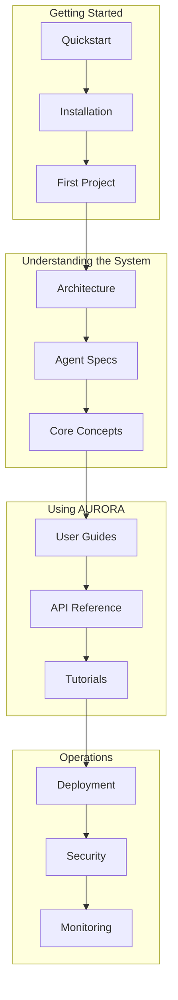

# AURORA-DEV Documentation

Welcome to the complete documentation for AURORA-DEV, a multi-agent autonomous software development system.

**Last Updated:** February 8, 2026  
**Version:** 1.0.0  
**Audience:** Developers, Operators, Business Stakeholders

> **Before Reading This**
>
> AURORA-DEV is a production-ready system with 13 specialized AI agents that work together to build software autonomously. Familiarity with Python and basic DevOps concepts will help you get the most from this documentation.

## What AURORA-DEV Does

"Programs must be written for people to read, and only incidentally for machines to execute." Harold Abelson's observation applies perfectly here. AURORA-DEV writes code that humans can understand, maintain, and extend.

The system takes your natural language requirements and produces working software. Not prototypes. Not scaffolding. Production code with tests, documentation, security scanning, and deployment configurations. Thirteen agents collaborate through a hierarchical architecture, each specializing in one aspect of software development.

## Documentation Structure

## Quick Navigation

### New Users
| Document | Purpose |
|----------|---------|
| [Quickstart](./01_getting_started/quickstart.md) | Get running in 5 minutes |
| [First Project](./01_getting_started/first_project.md) | Build your first application |
| [System Requirements](./01_getting_started/system_requirements.md) | Hardware and software needs |

### Developers
| Document | Purpose |
|----------|---------|
| [System Overview](./02_architecture/system_overview.md) | High-level architecture |
| [Agent Specifications](./03_agent_specifications/) | How each agent works |
| [Development Setup](./06_developer_guides/development_setup.md) | Local environment configuration |

### Operators
| Document | Purpose |
|----------|---------|
| [Docker Deployment](./08_deployment/docker_deployment.md) | Container deployment |
| [Kubernetes Deployment](./08_deployment/kubernetes_deployment.md) | K8s orchestration |
| [Monitoring Setup](./09_operations/monitoring_setup.md) | Prometheus and Grafana |

### Security Teams
| Document | Purpose |
|----------|---------|
| [Security Model](./10_security/security_model.md) | Overall security architecture |
| [SOC2 Compliance](./11_compliance/soc2_compliance.md) | Compliance requirements |
| [Secrets Management](./10_security/secrets_management.md) | Vault integration |

## Section Overview

### 01. Getting Started
Everything you need to install AURORA-DEV and run your first project. Covers system requirements, installation steps, and a complete walkthrough of creating a simple application.

### 02. Architecture
Detailed technical architecture covering all five tiers: orchestration, planning, implementation, quality assurance, and DevOps. Includes data flow diagrams and the LangGraph state machine.

### 03. Agent Specifications
Complete documentation for each of the 13 specialized agents. Covers responsibilities, capabilities, input/output formats, and configuration options.

### 04. Core Concepts
Fundamental concepts including task decomposition, reflexion loops, the pattern library, and quality gates. Essential reading for understanding how the system works.

### 05-06. User and Developer Guides
Practical guides for using AURORA-DEV and extending it. Covers everything from creating projects to building custom agents.

### 07. API Reference
Complete REST API, WebSocket API, and Python SDK documentation. Includes authentication, rate limits, and error codes.

### 08-09. Deployment and Operations
Production deployment guides for Docker, Kubernetes, and major cloud providers. Operational runbooks and monitoring setup.

### 10-11. Security and Compliance
Security architecture, authentication, secrets management, and compliance guides for SOC2, GDPR, and HIPAA.

### 12-13. Integration and Configuration
Third-party integrations (GitHub, Slack, Stripe) and comprehensive configuration reference.

### 14-15. Troubleshooting and Case Studies
Common problems with solutions. Real-world examples showing AURORA-DEV building e-commerce platforms, microservices, and more.

### 16-17. Performance and Advanced Topics
Optimization techniques, benchmarks, and advanced patterns like custom agent development and multi-region deployment.

### 18-19. Business and Reference
ROI analysis, licensing information, glossary, FAQ, and architecture decision records.

### 20-24. Tutorials, Diagrams, Templates, Research, Appendices
Step-by-step tutorials, Mermaid diagram sources, project templates, academic references, and complete command reference.

## Getting Help

- **GitHub Issues**: Bug reports and feature requests
- **Discord**: Real-time community support
- **Stack Overflow**: Tag questions with `aurora-dev`
- **Enterprise Support**: Contact sales@aurora-dev.io

## Contributing

AURORA-DEV is open source under the MIT license. See [Contributing](./06_developer_guides/contributing.md) for guidelines on submitting code, documentation, and bug reports.

## What's Next

Start with [Quickstart](./01_getting_started/quickstart.md) to get AURORA-DEV running on your machine. The entire process takes about five minutes.
