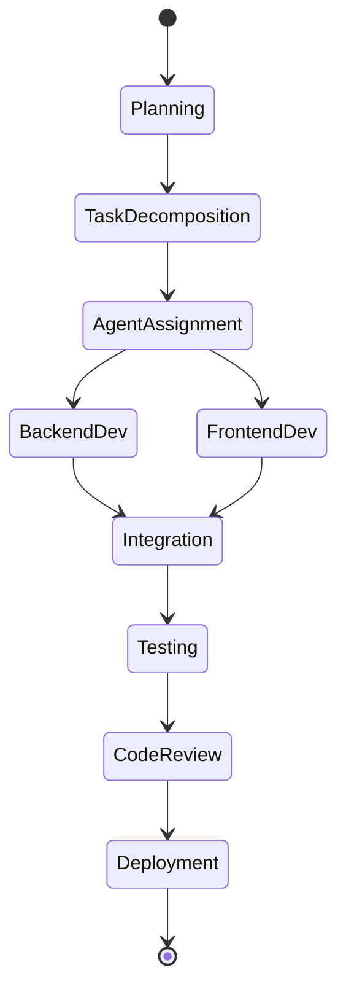

# Your First AURORA Project

A complete walkthrough of building a task management application with AURORA-DEV.

**Last Updated:** February 8, 2026  
**Audience:** New Users, Developers

> **Before Reading This**
>
> You should have completed:
> - [Quickstart](./quickstart.md) - Basic setup and verification
> - [Installation](./installation.md) - Full installation if not using Docker

## What We're Building

A task management API with a React frontend. Users can create projects, add tasks, set priorities, and track completion. The finished application includes:

- REST API with authentication
- React frontend with real-time updates
- PostgreSQL database
- Full test suite (80%+ coverage)
- Docker deployment configuration

"First, solve the problem. Then, write the code." John Johnson's advice is exactly what AURORA-DEV follows. You describe the problem. The agents write the code.

## Step 1: Define Your Project

Create a project specification file or use the CLI directly:

```bash
python aurora.py create-project \
  --name "taskmaster" \
  --type "fullstack" \
  --tech-stack "react,fastapi,postgresql" \
  --description "Task management application with projects, tasks, priorities, due dates, and user authentication. Users can create projects, add tasks to projects, set task priorities (low/medium/high), assign due dates, and mark tasks complete. Include a dashboard showing overdue tasks and completion statistics."
```

AURORA-DEV parses this description and begins planning.

## Step 2: Watch the Planning Phase

```bash
python aurora.py monitor taskmaster
```



The Maestro agent orchestrates the entire process:

1. **Requirement Parsing** (2 minutes)
   - Extracts functional requirements from your description
   - Identifies non-functional requirements (authentication implies security)
   - Creates acceptance criteria

2. **Architecture Design** (5 minutes)
   - Architect agent designs the system
   - Produces API specification (OpenAPI)
   - Defines database schema
   - Plans component structure

3. **Task Decomposition** (3 minutes)
   - Breaks work into atomic tasks
   - Creates dependency graph
   - Estimates effort per task

You'll see output like:

```
[Maestro] Parsed 12 functional requirements
[Architect] Designed 15 API endpoints
[Architect] Created 6 database tables
[Maestro] Decomposed into 47 tasks
[Maestro] Estimated total: 4.5 hours
```

## Step 3: Monitor Implementation

The implementation phase runs largely in parallel:

```
[Backend] Creating user authentication...
[Database] Generating migrations...
[Frontend] Setting up React project...
[Backend] Implementing project CRUD endpoints...
[Frontend] Building authentication components...
```

Track real-time progress:

```bash
python aurora.py status taskmaster
```

Output shows agent activity:

```
Project: taskmaster
Status: In Progress (68% complete)
Phase: Implementation

Active Agents:
  Backend Agent     - Implementing task endpoints    [████████░░] 80%
  Frontend Agent    - Building task list component   [██████░░░░] 60%
  Database Agent    - Creating indexes              [██████████] 100%

Completed Tasks: 32/47
Estimated Remaining: 1.2 hours
Cost So Far: $12.45
```

## Step 4: Review Quality Assurance

Once implementation completes, QA agents activate:

```
[TestEngineer] Running test suite...
[TestEngineer] Coverage: 87%
[SecurityAuditor] Scanning for vulnerabilities...
[SecurityAuditor] No critical issues found
[CodeReviewer] Reviewing code quality...
[CodeReviewer] 3 suggestions, no blocking issues
```

If tests fail, the reflexion loop kicks in:

```
[Backend] Test failed: test_create_task_unauthorized
[Backend] Reflexion: Missing authorization check on POST /tasks
[Backend] Fix applied, re-running tests...
[Backend] All tests passing
```

## Step 5: Access Your Project

When complete, AURORA-DEV notifies you:

```
Project taskmaster completed successfully!

Location: ./projects/taskmaster/
Duration: 3 hours 42 minutes
Total Cost: $18.75

To run locally:
  cd projects/taskmaster
  docker-compose up -d
  
Frontend: http://localhost:3000
API Docs: http://localhost:8000/docs
```

## Exploring the Generated Code

The project structure follows best practices:

```
taskmaster/
├── backend/
│   ├── app/
│   │   ├── api/           # FastAPI routes
│   │   ├── models/        # SQLAlchemy models
│   │   ├── schemas/       # Pydantic schemas
│   │   └── services/      # Business logic
│   ├── tests/             # Pytest test suite
│   └── Dockerfile
├── frontend/
│   ├── src/
│   │   ├── components/    # React components
│   │   ├── pages/         # Route pages
│   │   ├── hooks/         # Custom hooks
│   │   └── api/           # API client
│   ├── tests/             # Vitest/Playwright tests
│   └── Dockerfile
├── docker-compose.yml
├── README.md              # Project documentation
└── .github/
    └── workflows/         # CI/CD pipelines
```

## Customizing the Output

Want changes? Tell AURORA-DEV:

```bash
python aurora.py modify taskmaster \
  --description "Add task comments feature. Users can add comments to tasks with timestamps."
```

The system identifies affected components and makes targeted changes.

## Cost Breakdown

AURORA-DEV tracks costs transparently:

```bash
python aurora.py cost-report taskmaster
```

```
Cost Report: taskmaster
-----------------------
Planning Phase:      $2.15 (Sonnet)
Backend Development: $6.80 (Sonnet)
Frontend Development: $5.20 (Sonnet)
Testing:             $2.40 (Haiku)
Documentation:       $1.20 (Haiku)
Code Review:         $1.00 (Haiku)
-----------------------
Total:               $18.75
```

## Related Reading

- [Monitoring Progress](../05_user_guides/monitoring_progress.md) - Dashboard deep-dive
- [Customizing Agents](../05_user_guides/customizing_agents.md) - Change agent behavior
- [Managing Costs](../05_user_guides/managing_costs.md) - Budget controls

## What's Next

- [System Overview](../02_architecture/system_overview.md) - Understand the architecture
