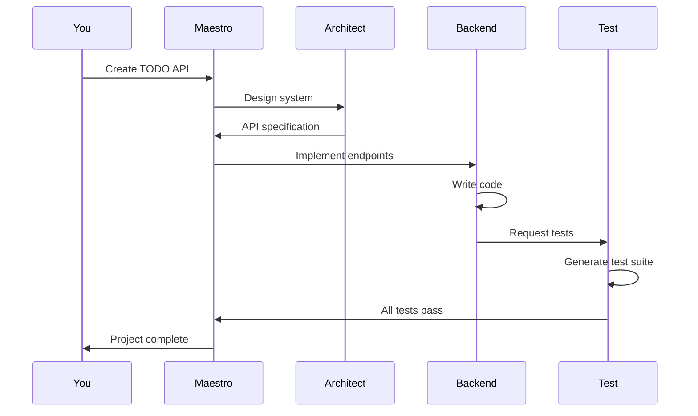

# Quickstart Guide

Get AURORA-DEV running and build your first project in five minutes.

**Last Updated:** February 8, 2026  
**Audience:** New Users

> **Before Reading This**
>
> You should have:
> - [Docker](https://docs.docker.com/get-docker/) installed and running
> - An Anthropic API key (get one at [console.anthropic.com](https://console.anthropic.com))
> - Basic command-line familiarity

## The 5-Minute Setup

"Simplicity is prerequisite for reliability." Dijkstra knew what he was talking about. AURORA-DEV keeps setup simple because complex setup procedures breed configuration errors.

### Step 1: Clone and Configure (1 minute)

```bash
git clone https://github.com/aurora-dev/aurora-dev.git
cd aurora-dev
cp .env.example .env
```

Edit `.env` and add your Anthropic API key:

```bash
ANTHROPIC_API_KEY=sk-ant-your-key-here
```

That's the only required configuration. Everything else has sensible defaults.

### Step 2: Start Services (2 minutes)

```bash
docker-compose up -d
```

This starts PostgreSQL, Redis, and the AURORA-DEV services. First run pulls images, which takes a couple minutes. Subsequent starts are nearly instant.

Verify everything is running:

```bash
docker-compose ps
```

You should see all services in the "Up" state.

### Step 3: Create Your First Project (2 minutes)

```bash
python aurora.py create-project \
  --name "todo-api" \
  --type "backend" \
  --description "REST API for todo list management with CRUD operations"
```

AURORA-DEV starts working immediately. Watch the agents collaborate:

```bash
python aurora.py monitor todo-api
```



Within 30 minutes, you'll have a complete API with:
- Five REST endpoints (CRUD + list)
- PostgreSQL database schema
- Unit and integration tests
- API documentation (OpenAPI)
- Docker deployment configuration

### Step 4: Access Your Code

The generated project lives in `./projects/todo-api/`. Run it locally:

```bash
cd projects/todo-api
docker-compose up -d
curl http://localhost:8000/api/todos
```

## What Just Happened?

AURORA-DEV orchestrated 13 agents to build your application:

1. **Maestro** parsed your requirements and created a task graph
2. **Architect** designed the API specification and database schema
3. **Backend Agent** implemented the FastAPI endpoints
4. **Database Agent** created migrations and optimized queries
5. **Test Engineer** wrote comprehensive test suites
6. **Security Auditor** scanned for vulnerabilities
7. **Code Reviewer** checked quality and style
8. **DevOps Agent** created Docker and deployment configurations

Each agent specializes in one domain. They communicate through a shared memory system and coordinate through the Maestro.

## Next Steps

You've seen the basics. Here's where to go next:

| Goal | Document |
|------|----------|
| Understand how it works | [System Overview](../02_architecture/system_overview.md) |
| Build a full-stack app | [First Project Walkthrough](./first_project.md) |
| Deploy to production | [Docker Deployment](../08_deployment/docker_deployment.md) |
| Customize agent behavior | [Agent Configuration](../13_configuration/agent_configuration.md) |

## Common Issues

**Docker not running**
```
Cannot connect to Docker daemon
```
Start Docker Desktop or the Docker service before running docker-compose.

**API key invalid**
```
Error: Invalid API key
```
Check that `ANTHROPIC_API_KEY` in `.env` starts with `sk-ant-` and has no trailing whitespace.

**Port conflicts**
```
Bind for 0.0.0.0:5432 failed: port is already allocated
```
Another service is using PostgreSQL's default port. Either stop that service or edit `docker-compose.yml` to use a different port.

For more issues, see [Troubleshooting Setup](./troubleshooting_setup.md).

## Related Reading

- [Installation](./installation.md) - Detailed installation options
- [System Requirements](./system_requirements.md) - Hardware and software needs
- [First Project](./first_project.md) - Complete project walkthrough

## What's Next

- [First Project Walkthrough](./first_project.md) - Build a complete full-stack application
