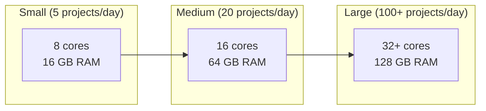

# System Requirements

Hardware and software requirements for running AURORA-DEV in development and production environments.

**Last Updated:** February 8, 2026  
**Audience:** Developers, Operators

> **Before Reading This**
>
> This guide helps you ensure your environment meets AURORA-DEV's requirements before installation.

## Hardware Requirements

"Premature optimization is the root of all evil." Knuth's famous quote applies to hardware too. Start with minimum requirements. Scale up when you hit actual limits.

### Development Environment

| Component | Minimum | Recommended |
|-----------|---------|-------------|
| CPU | 4 cores | 8+ cores |
| RAM | 8 GB | 16 GB |
| Storage | 20 GB SSD | 50 GB NVMe SSD |
| Network | 10 Mbps | 100 Mbps |

Minimum specs run AURORA-DEV with reduced parallelism. Recommended specs enable full parallel agent execution.

### Production Environment

| Component | Small | Medium | Large |
|-----------|-------|--------|-------|
| CPU | 8 cores | 16 cores | 32+ cores |
| RAM | 16 GB | 64 GB | 128 GB |
| Storage | 100 GB SSD | 500 GB NVMe | 1 TB NVMe |
| Network | 100 Mbps | 1 Gbps | 10 Gbps |

### GPU Requirements

GPUs are optional. They accelerate local LLM inference if you're running models locally instead of using the Claude API.

| Use Case | GPU Requirement |
|----------|-----------------|
| API-only (Claude) | None |
| Local inference (7B models) | 8 GB VRAM |
| Local inference (32B models) | 24 GB VRAM |

## Software Requirements

### Operating Systems

| OS | Minimum Version | Notes |
|----|-----------------|-------|
| Ubuntu | 22.04 LTS | Recommended for production |
| Debian | 12 (Bookworm) | Fully supported |
| macOS | 13 (Ventura) | Development only |
| Windows | 11 with WSL2 | Development only |
| RHEL/Rocky | 9 | Enterprise production |

### Required Software

| Software | Minimum Version | Purpose |
|----------|-----------------|---------|
| Docker | 24.0 | Container runtime |
| Docker Compose | 2.20 | Service orchestration |
| Python | 3.11 | CLI and extensions |
| Git | 2.40 | Version control |

### Database Requirements

AURORA-DEV requires PostgreSQL 15+ with these extensions:

| Extension | Purpose |
|-----------|---------|
| uuid-ossp | UUID generation |
| pg_trgm | Fuzzy text search |
| pgvector (optional) | Vector similarity for embeddings |

Redis 7+ is required for:
- Task queue (Celery backend)
- Short-term memory cache
- Rate limiting
- Session storage

### Network Requirements

| Endpoint | Port | Protocol | Purpose |
|----------|------|----------|---------|
| api.anthropic.com | 443 | HTTPS | Claude API |
| github.com | 443 | HTTPS | Code repositories |
| pypi.org | 443 | HTTPS | Python packages |
| registry.docker.io | 443 | HTTPS | Docker images |

For air-gapped installations, see [Self-Hosted Deployment](../08_deployment/self_hosted.md).

## Resource Estimation

### Memory per Agent

Each active agent consumes approximately:

| Agent Type | Memory | Notes |
|------------|--------|-------|
| Maestro | 512 MB | Always running |
| Memory Coordinator | 1 GB | Scales with data |
| Specialist Agents | 256 MB each | 11 agents total |

With all agents active: ~4 GB base memory usage.

### Storage Requirements

| Component | Size | Growth Rate |
|-----------|------|-------------|
| Docker images | 5 GB | Static |
| PostgreSQL data | 1 GB base | ~100 MB/project |
| Redis cache | 500 MB | Capped by config |
| Generated projects | Varies | ~50 MB average |
| Logs | 100 MB/day | With rotation |

### API Token Usage

Estimated tokens per project type:

| Project Type | Input Tokens | Output Tokens | Estimated Cost |
|--------------|--------------|---------------|----------------|
| Simple API | 50K | 20K | $5-15 |
| Full-stack app | 200K | 80K | $20-50 |
| Microservices | 500K | 200K | $100-300 |

## Cloud Instance Recommendations

### AWS

| Workload | Instance Type | vCPU | Memory | Cost/month |
|----------|---------------|------|--------|------------|
| Development | t3.large | 2 | 8 GB | ~$60 |
| Small production | m6i.xlarge | 4 | 16 GB | ~$150 |
| Medium production | m6i.4xlarge | 16 | 64 GB | ~$600 |
| Large production | m6i.8xlarge | 32 | 128 GB | ~$1,200 |

### GCP

| Workload | Machine Type | vCPU | Memory |
|----------|--------------|------|--------|
| Development | e2-standard-2 | 2 | 8 GB |
| Small production | n2-standard-4 | 4 | 16 GB |
| Medium production | n2-standard-16 | 16 | 64 GB |

### Azure

| Workload | VM Size | vCPU | Memory |
|----------|---------|------|--------|
| Development | Standard_D2s_v5 | 2 | 8 GB |
| Small production | Standard_D4s_v5 | 4 | 16 GB |
| Medium production | Standard_D16s_v5 | 16 | 64 GB |

## Scaling Considerations

Horizontal scaling strategies for high-volume environments:

| Component | Scaling Approach |
|-----------|------------------|
| API Gateway | Load balancer + multiple instances |
| Agent workers | Kubernetes replicas |
| PostgreSQL | Read replicas, connection pooler |
| Redis | Redis Cluster or Sentinel |

See [Scaling Guide](../08_deployment/scaling_guide.md) for detailed configuration.

## Related Reading

- [Installation](./installation.md) - Installation procedures
- [Docker Deployment](../08_deployment/docker_deployment.md) - Container configuration
- [Capacity Planning](../09_operations/capacity_planning.md) - Resource estimation

## What's Next

- [Installation](./installation.md) - Install AURORA-DEV on your system
