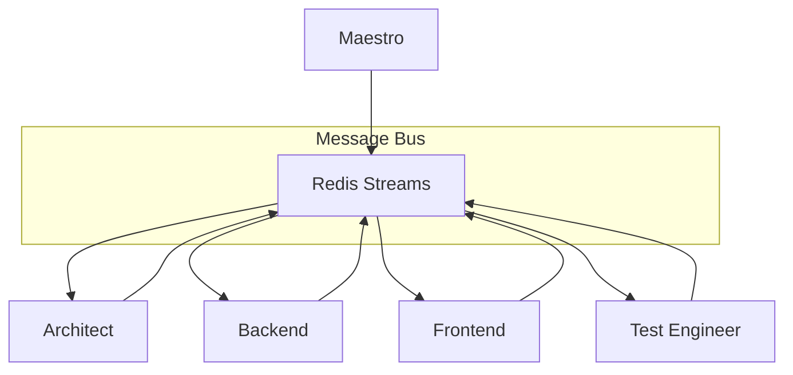
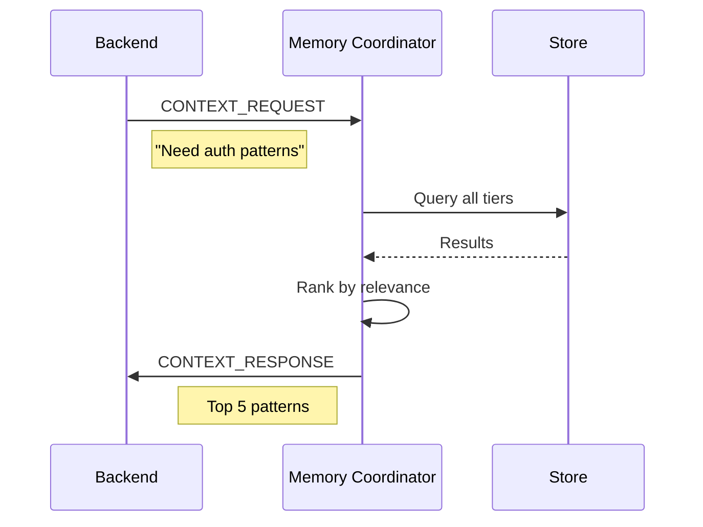

# Agent Communication

Inter-agent messaging protocols and coordination patterns.

**Last Updated:** February 8, 2026  
**Audience:** Developers, Architects

> **Before Reading This**
>
> You should understand:
> - [System Overview](./system_overview.md) - Architecture basics
> - [Orchestration Layer](./orchestration_layer.md) - Maestro's role

## Communication Philosophy

"The best communication isn't memorable; it just works." This principle guides agent communication. Messages are structured, versioned, and traceable, but the complexity stays hidden from agents themselves.



## Message Types

### Core Messages

| Type | Direction | Purpose |
|------|-----------|---------|
| `TASK_ASSIGN` | Maestro → Agent | New task assignment |
| `TASK_PROGRESS` | Agent → Maestro | Status update |
| `TASK_COMPLETE` | Agent → Maestro | Task finished |
| `TASK_FAILED` | Agent → Maestro | Task failed |
| `CONTEXT_REQUEST` | Agent → Memory | Request context |
| `CONTEXT_RESPONSE` | Memory → Agent | Provide context |
| `HANDOFF` | Agent → Agent | Transfer work |

### Message Schema

```python
@dataclass
class AgentMessage:
    id: UUID
    version: str = "1.0"
    timestamp: datetime
    correlation_id: UUID
    
    sender: AgentRole
    recipient: AgentRole
    message_type: MessageType
    
    payload: dict
    metadata: dict
    
    priority: int = 5  # 1=highest, 10=lowest
    ttl_seconds: int = 3600
```

## Task Assignment

### Request

```json
{
  "id": "msg-001",
  "message_type": "TASK_ASSIGN",
  "sender": "maestro",
  "recipient": "backend",
  "correlation_id": "proj-123",
  "payload": {
    "task_id": "task-456",
    "title": "Implement user registration endpoint",
    "specification": {
      "endpoint": "POST /api/auth/register",
      "request_body": {"email": "string", "password": "string"},
      "response": {"user_id": "uuid", "token": "string"}
    },
    "dependencies": ["task-455"],
    "deadline": "2024-02-08T15:00:00Z"
  }
}
```

### Response

```json
{
  "id": "msg-002",
  "message_type": "TASK_COMPLETE",
  "sender": "backend",
  "recipient": "maestro",
  "correlation_id": "proj-123",
  "payload": {
    "task_id": "task-456",
    "status": "success",
    "artifacts": {
      "files": ["api/routes/auth.py", "api/schemas/auth.py"],
      "commit": "abc123",
      "branch": "feature/user-registration"
    },
    "metrics": {
      "duration_ms": 45000,
      "tokens_used": 2500
    }
  }
}
```

## Context Sharing

### Request Context



### Context Message

```json
{
  "message_type": "CONTEXT_REQUEST",
  "sender": "backend",
  "recipient": "memory_coordinator",
  "payload": {
    "query": "JWT authentication implementation",
    "project_id": "proj-123",
    "max_results": 5,
    "required_tags": ["python", "fastapi"]
  }
}
```

## Agent Handoff

When one agent needs to transfer work to another:

```python
@dataclass
class HandoffMessage:
    from_agent: AgentRole
    to_agent: AgentRole
    reason: str
    context: dict
    artifacts: list[str]
    recommendations: list[str]
```

### Example Handoff

```json
{
  "message_type": "HANDOFF",
  "sender": "architect",
  "recipient": "backend",
  "payload": {
    "reason": "Architecture design complete",
    "context": {
      "api_spec": "/specs/openapi.yaml",
      "design_decisions": ["Use repository pattern", "Async handlers"]
    },
    "artifacts": ["docs/architecture.md", "specs/openapi.yaml"],
    "recommendations": [
      "Start with User model",
      "Auth endpoints before CRUD",
      "Use Pydantic v2 validators"
    ]
  }
}
```

## Broadcast Messages

Some messages go to all agents:

| Event | Recipients | Purpose |
|-------|------------|---------|
| `PROJECT_START` | All | New project beginning |
| `PHASE_CHANGE` | All | Moving to next phase |
| `EMERGENCY_STOP` | All | Halt all work |
| `CONFIG_UPDATE` | All | Configuration changed |

## Message Queue Implementation

### Redis Streams

```python
class MessageBus:
    async def publish(self, message: AgentMessage) -> None:
        stream = f"agent:{message.recipient}"
        await self.redis.xadd(
            stream,
            {
                "data": message.model_dump_json(),
                "type": message.message_type.value
            },
            maxlen=10000
        )
    
    async def subscribe(self, agent: AgentRole) -> AsyncIterator[AgentMessage]:
        stream = f"agent:{agent.value}"
        last_id = "0"
        
        while True:
            messages = await self.redis.xread(
                {stream: last_id},
                block=5000
            )
            for _, entries in messages:
                for entry_id, data in entries:
                    last_id = entry_id
                    yield AgentMessage.model_validate_json(data["data"])
```

## Error Handling

### Retry Policy

| Error Type | Action | Max Retries |
|------------|--------|-------------|
| Network timeout | Retry with backoff | 3 |
| Agent busy | Requeue with delay | 5 |
| Invalid message | Dead-letter queue | 0 |
| Agent crash | Reassign task | 1 |

### Dead Letter Queue

Failed messages go to DLQ for investigation:

```python
async def handle_failed_message(message: AgentMessage, error: Exception):
    await redis.xadd(
        "dlq:messages",
        {
            "original": message.model_dump_json(),
            "error": str(error),
            "timestamp": datetime.now().isoformat()
        }
    )
```

## Monitoring

Messages expose metrics:

| Metric | Type | Description |
|--------|------|-------------|
| `aurora_messages_sent` | Counter | Total messages sent |
| `aurora_messages_received` | Counter | Total messages received |
| `aurora_message_latency` | Histogram | Processing time |
| `aurora_dlq_size` | Gauge | Dead-letter queue size |

## Related Reading

- [Maestro Agent](../03_agent_specifications/01_maestro_agent.md) - Orchestration details
- [Data Flow](./data_flow.md) - Overall data movement
- [Queue Configuration](../13_configuration/queue_configuration.md) - Settings

## What's Next

- [Technology Stack](./technology_stack.md) - All technologies and versions
