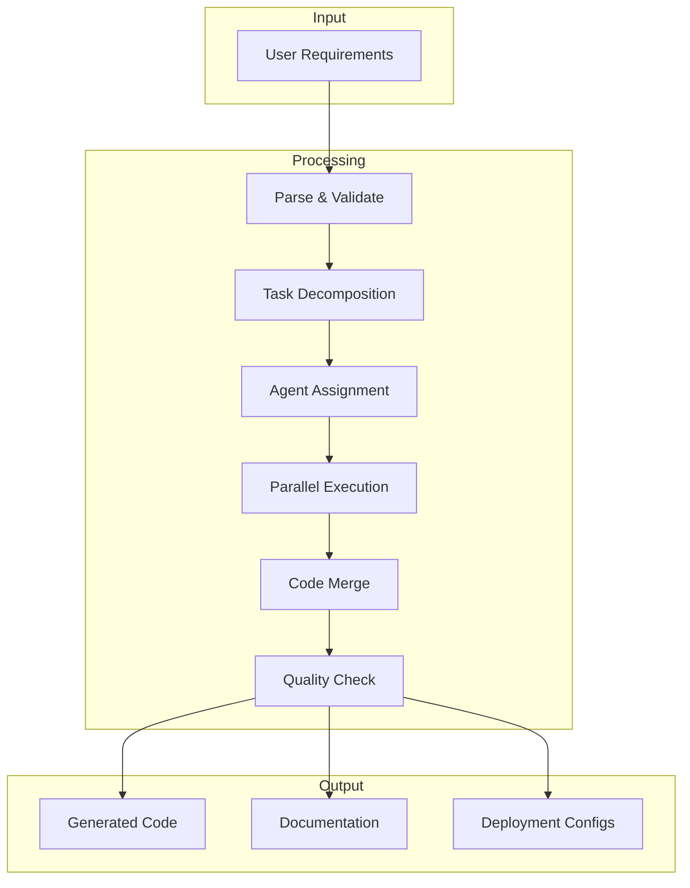
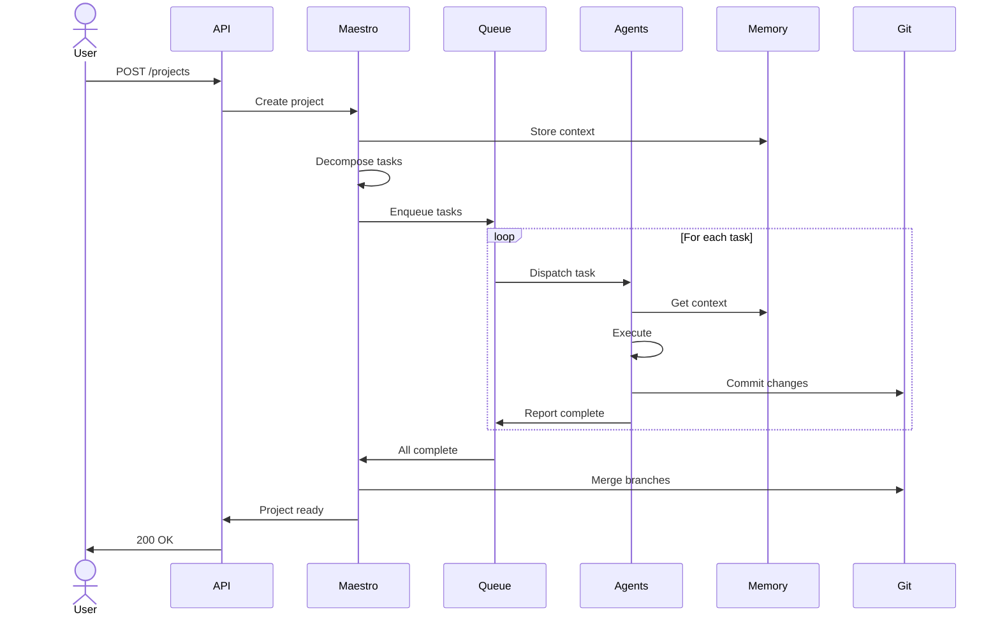
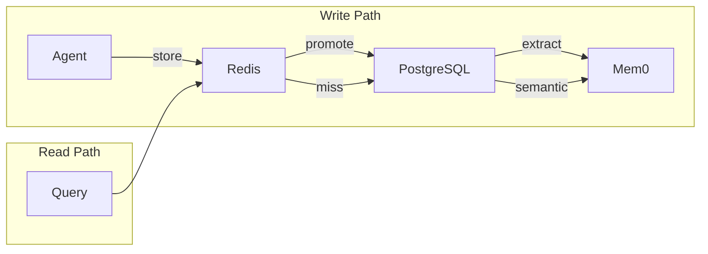
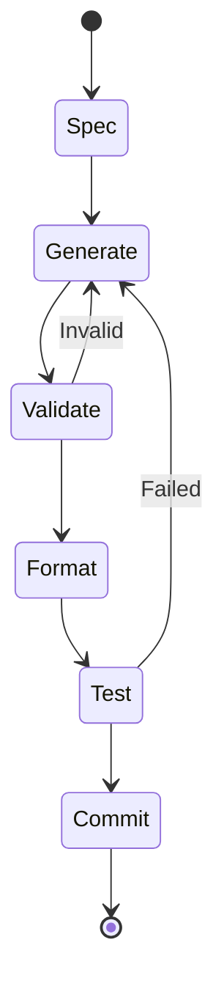
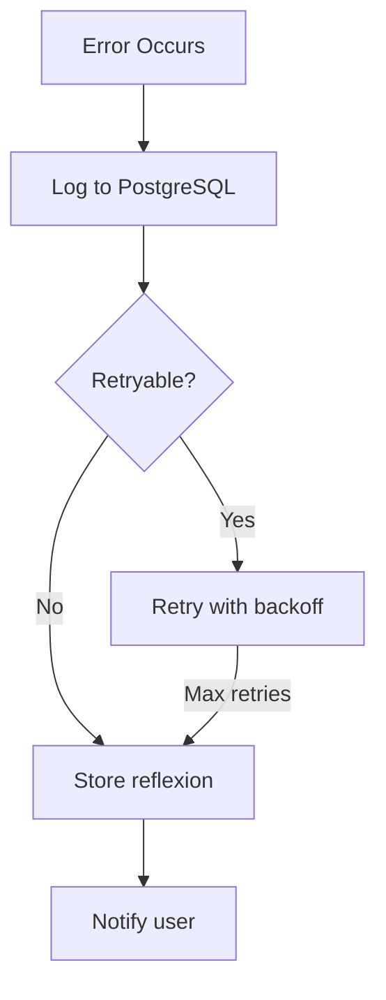

# Data Flow

How data moves through AURORA-DEV from user input to deployed application.

**Last Updated:** February 8, 2026  
**Audience:** Developers, Architects

> **Before Reading This**
>
> You should understand:
> - [System Overview](./system_overview.md) - Architecture basics
> - [Orchestration Layer](./orchestration_layer.md) - How Maestro coordinates

## Following the Data

"Data is a precious thing and will last longer than the systems themselves." Tim Berners-Lee's observation explains why understanding data flow matters. AURORA-DEV processes several distinct data streams.



## Data Types

### User Input

Natural language descriptions transformed into structured specifications.

| Stage | Format | Example |
|-------|--------|---------|
| Raw input | String | "Build a todo app with user auth" |
| Parsed | Requirements list | [REQ-001: Authentication, REQ-002: Task CRUD] |
| Structured | JSON schema | `{requirements: [{id, title, criteria}]}` |

### Task Data

Work units flowing through the system.

```python
@dataclass
class Task:
    id: UUID
    project_id: UUID
    title: str
    description: str
    assigned_agent: AgentRole
    dependencies: list[UUID]
    status: TaskStatus
    priority: int
    created_at: datetime
    started_at: datetime | None
    completed_at: datetime | None
    result: TaskResult | None
```

### Agent Messages

Inter-agent communication protocol.

```python
@dataclass
class AgentMessage:
    id: UUID
    sender: AgentRole
    recipient: AgentRole
    message_type: MessageType  # TASK, RESULT, CONTEXT, ERROR
    payload: dict
    timestamp: datetime
    correlation_id: UUID  # Links related messages
```

### Generated Artifacts

Code and configuration output.

| Artifact Type | Storage | Retention |
|---------------|---------|-----------|
| Source code | Git repository | Permanent |
| Test results | PostgreSQL | 90 days |
| Build logs | File system | 30 days |
| Metrics | Prometheus | 15 days |

## Request Flow



## Memory Data Flow

Three-tier memory serves different access patterns.



| Tier | Write Latency | Read Latency | Capacity |
|------|---------------|--------------|----------|
| Short-term (Redis) | < 1ms | < 1ms | 1 GB |
| Working (PostgreSQL) | 5-10ms | 2-5ms | 100 GB |
| Long-term (Mem0) | 50-100ms | 20-50ms | Unlimited |

## Code Generation Flow

From specification to committed code.



### Validation Checkpoints

| Checkpoint | Validation | Action on Failure |
|------------|------------|-------------------|
| Syntax | Parseable code | Regenerate |
| Types | Type checker passes | Fix errors |
| Lint | Style compliance | Auto-format |
| Tests | All tests pass | Reflexion loop |

## Error Data Flow

Errors trigger specific handling paths.

```python
@dataclass
class AgentError:
    task_id: UUID
    agent: AgentRole
    error_type: ErrorType
    message: str
    stack_trace: str | None
    timestamp: datetime
    retry_count: int
    max_retries: int
```



## Metrics Data Flow

Observability data collected throughout execution.

| Metric | Collection Point | Destination |
|--------|------------------|-------------|
| Task duration | Agent completion | Prometheus |
| Token usage | API response | PostgreSQL |
| Error rate | Error handler | Prometheus |
| Memory hits | Memory coordinator | Prometheus |

## Data Retention

| Data Type | Retention | Reason |
|-----------|-----------|--------|
| Project code | Permanent | User data |
| Task history | 1 year | Debugging |
| Agent logs | 30 days | Troubleshooting |
| Metrics | 15 days | Dashboards |
| Session cache | 1 hour | Performance |

## Related Reading

- [State Machine](./state_machine.md) - LangGraph workflow states
- [Memory Architecture](./memory_architecture.md) - Storage details
- [Agent Communication](./agent_communication.md) - Message protocols

## What's Next

- [State Machine](./state_machine.md) - LangGraph workflow implementation
