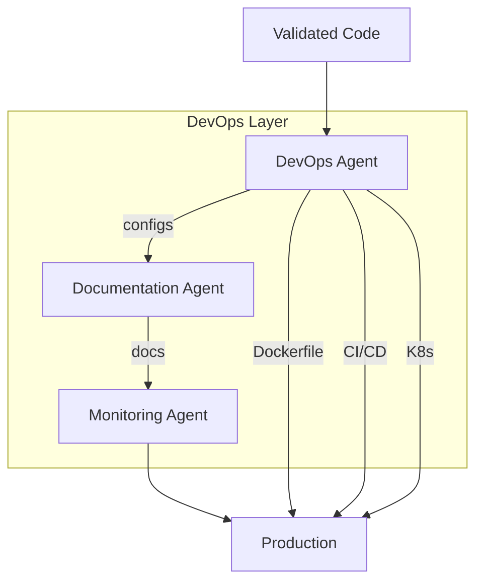

# DevOps Layer

DevOps, Documentation, and Monitoring agents that deploy and maintain production systems.

**Last Updated:** February 8, 2026  
**Audience:** DevOps Engineers, Operators

> **Before Reading This**
>
> You should understand:
> - [System Overview](./system_overview.md) - Architecture basics
> - [Quality Layer](./quality_layer.md) - How code gets validated

## From Code to Production

"It worked on my machine." Famous last words. The DevOps layer ensures code works everywhere by automating deployment, documentation, and monitoring setup.



## DevOps Agent

### Responsibilities

| Task | Output |
|------|--------|
| Containerization | Dockerfile, docker-compose.yml |
| CI/CD | GitHub Actions, GitLab CI |
| Orchestration | Kubernetes manifests |
| Infrastructure | Terraform, Pulumi |

### Dockerfile Generation

```dockerfile
# DevOps Agent generates optimized multi-stage builds
FROM python:3.11-slim as builder

WORKDIR /app
RUN pip install --no-cache-dir poetry

COPY pyproject.toml poetry.lock ./
RUN poetry export -f requirements.txt --output requirements.txt

COPY . .
RUN poetry build --format wheel

# Production image
FROM python:3.11-slim

WORKDIR /app
RUN useradd --create-home appuser

COPY --from=builder /app/requirements.txt .
RUN pip install --no-cache-dir -r requirements.txt

COPY --from=builder /app/dist/*.whl .
RUN pip install --no-cache-dir *.whl && rm *.whl

USER appuser
EXPOSE 8000

CMD ["uvicorn", "app.main:app", "--host", "0.0.0.0", "--port", "8000"]
```

### CI/CD Pipeline Generation

```yaml
# GitHub Actions workflow
name: CI/CD Pipeline

on:
  push:
    branches: [main, develop]
  pull_request:
    branches: [main]

jobs:
  test:
    runs-on: ubuntu-latest
    services:
      postgres:
        image: postgres:15
        env:
          POSTGRES_PASSWORD: test
        options: >-
          --health-cmd pg_isready
          --health-interval 10s
    
    steps:
      - uses: actions/checkout@v4
      - uses: actions/setup-python@v5
        with:
          python-version: "3.11"
      
      - name: Install dependencies
        run: pip install -r requirements.txt
      
      - name: Run tests
        run: pytest --cov=app --cov-report=xml
      
      - name: Upload coverage
        uses: codecov/codecov-action@v3

  deploy:
    needs: test
    if: github.ref == 'refs/heads/main'
    runs-on: ubuntu-latest
    
    steps:
      - uses: actions/checkout@v4
      
      - name: Build and push image
        run: |
          docker build -t ${{ secrets.REGISTRY }}/app:${{ github.sha }} .
          docker push ${{ secrets.REGISTRY }}/app:${{ github.sha }}
      
      - name: Deploy to Kubernetes
        run: |
          kubectl set image deployment/app app=${{ secrets.REGISTRY }}/app:${{ github.sha }}
```

### Kubernetes Manifests

```yaml
# Deployment manifest
apiVersion: apps/v1
kind: Deployment
metadata:
  name: taskmaster-api
spec:
  replicas: 3
  selector:
    matchLabels:
      app: taskmaster-api
  template:
    spec:
      containers:
        - name: api
          image: registry/taskmaster:latest
          ports:
            - containerPort: 8000
          resources:
            requests:
              memory: "256Mi"
              cpu: "250m"
            limits:
              memory: "512Mi"
              cpu: "500m"
          livenessProbe:
            httpGet:
              path: /health
              port: 8000
          readinessProbe:
            httpGet:
              path: /ready
              port: 8000
```

## Documentation Agent

### Generated Artifacts

| Document | Purpose |
|----------|---------|
| README.md | Project overview and setup |
| API docs | OpenAPI/Swagger |
| Architecture | System design docs |
| Runbooks | Operational procedures |

### README Generation

```markdown
# Taskmaster

Task management API built with FastAPI.

## Quick Start

```bash
docker-compose up -d
open http://localhost:8000/docs
```

## Features

- User authentication with JWT
- Task CRUD operations
- Project organization
- Priority and due date tracking

## API Documentation

Interactive docs at `/docs` when running locally.

## Development

```bash
# Setup
python -m venv venv
source venv/bin/activate
pip install -r requirements-dev.txt

# Run tests
pytest

# Run locally
uvicorn app.main:app --reload
```
```

## Monitoring Agent

### Generated Configurations

| Component | Output |
|-----------|--------|
| Prometheus | Scrape configs, recording rules |
| Grafana | Dashboards JSON |
| Alertmanager | Alert rules, routes |

### Prometheus Configuration

```yaml
# prometheus.yml
global:
  scrape_interval: 15s

scrape_configs:
  - job_name: 'taskmaster-api'
    static_configs:
      - targets: ['api:8000']
    metrics_path: /metrics

rule_files:
  - 'alerts/*.yml'
```

### Alert Rules

```yaml
# alerts/api.yml
groups:
  - name: api
    rules:
      - alert: HighErrorRate
        expr: rate(http_requests_total{status=~"5.."}[5m]) / rate(http_requests_total[5m]) > 0.05
        for: 5m
        labels:
          severity: critical
        annotations:
          summary: High error rate on API
          
      - alert: HighLatency
        expr: histogram_quantile(0.95, rate(http_request_duration_seconds_bucket[5m])) > 1
        for: 5m
        labels:
          severity: warning
        annotations:
          summary: P95 latency above 1 second
```

### Grafana Dashboard

```json
{
  "title": "Taskmaster API",
  "panels": [
    {
      "title": "Request Rate",
      "type": "graph",
      "targets": [
        {
          "expr": "rate(http_requests_total[5m])"
        }
      ]
    },
    {
      "title": "P95 Latency",
      "type": "gauge",
      "targets": [
        {
          "expr": "histogram_quantile(0.95, rate(http_request_duration_seconds_bucket[5m]))"
        }
      ]
    }
  ]
}
```

## Output Checklist

Every project includes:

- [ ] Dockerfile (multi-stage, minimal)
- [ ] docker-compose.yml (local development)
- [ ] docker-compose.prod.yml (production)
- [ ] CI/CD pipeline (GitHub Actions or GitLab CI)
- [ ] Kubernetes manifests (if requested)
- [ ] README.md with setup instructions
- [ ] API documentation (OpenAPI spec)
- [ ] Prometheus metrics endpoint
- [ ] Grafana dashboard JSON
- [ ] Alert rules for critical metrics

## Related Reading

- [Docker Deployment](../08_deployment/docker_deployment.md) - Container details
- [Monitoring Setup](../09_operations/monitoring_setup.md) - Prometheus and Grafana
- [DevOps Agent](../03_agent_specifications/14_devops_agent.md) - Full specification

## What's Next

- [Data Flow](./data_flow.md) - How data moves through the system
