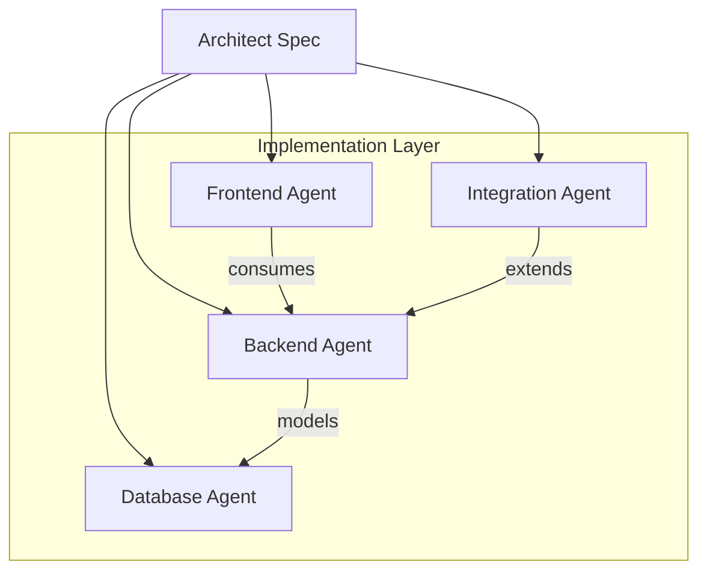
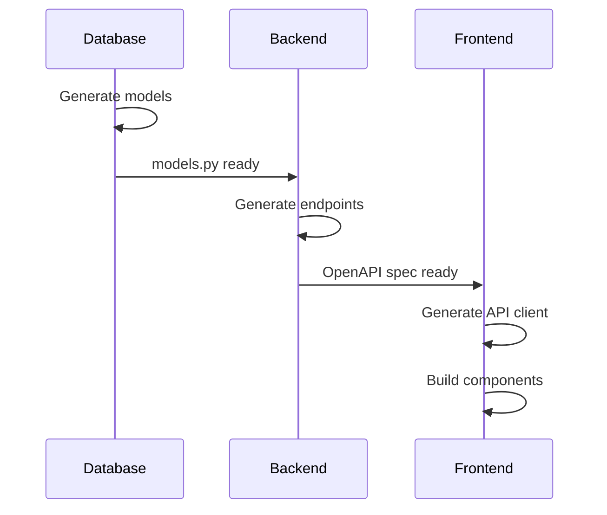

# Implementation Layer

Backend, Frontend, Database, and Integration agents that transform designs into working code.

**Last Updated:** February 8, 2026  
**Audience:** Developers

> **Before Reading This**
>
> You should understand:
> - [System Overview](./system_overview.md) - Architecture basics
> - [Planning Layer](./planning_layer.md) - How designs are created

## From Design to Code

"First, solve the problem. Then, write the code." John Johnson's advice is exactly what happens here. By the time implementation agents start, the problem's already solved. They execute the Architect's blueprint.



## Parallel Execution

Implementation agents work concurrently using Git worktrees:

```bash
aurora-project/
├── .git/
├── main/                 # Main branch
├── worktrees/
│   ├── backend/         # Backend agent workspace
│   ├── frontend/        # Frontend agent workspace
│   ├── database/        # Database agent workspace
│   └── integration/     # Integration agent workspace
```

Each agent commits to its branch. Maestro orchestrates merges.

## Backend Agent

### Responsibilities

| Task | Output |
|------|--------|
| API endpoints | FastAPI routes with validation |
| Business logic | Service layer classes |
| Data access | Repository pattern implementation |
| Error handling | Consistent error responses |

### Code Generation Pattern

```python
# Backend Agent generates FastAPI endpoints
@router.post("/tasks", response_model=TaskResponse, status_code=201)
async def create_task(
    task: TaskCreate,
    db: AsyncSession = Depends(get_db),
    current_user: User = Depends(get_current_user)
) -> TaskResponse:
    """Create a new task for the authenticated user."""
    service = TaskService(db)
    return await service.create(task, owner_id=current_user.id)
```

### Technology Stack

| Component | Technology |
|-----------|------------|
| Framework | FastAPI |
| ORM | SQLAlchemy 2.0 |
| Validation | Pydantic v2 |
| Testing | pytest + httpx |

## Frontend Agent

### Responsibilities

| Task | Output |
|------|--------|
| Components | React/Vue components |
| State | Zustand/Pinia stores |
| API client | Typed fetch wrappers |
| Styling | CSS modules or Tailwind |

### Component Generation Pattern

```tsx
// Frontend Agent generates React components
interface TaskCardProps {
  task: Task;
  onComplete: (id: string) => void;
  onDelete: (id: string) => void;
}

export function TaskCard({ task, onComplete, onDelete }: TaskCardProps) {
  return (
    <div className={styles.card}>
      <h3>{task.title}</h3>
      <span className={styles.priority}>{task.priority}</span>
      <div className={styles.actions}>
        <button onClick={() => onComplete(task.id)}>Complete</button>
        <button onClick={() => onDelete(task.id)}>Delete</button>
      </div>
    </div>
  );
}
```

### Technology Stack

| Component | Technology |
|-----------|------------|
| Framework | React 18 or Vue 3 |
| Build | Vite |
| State | Zustand or Pinia |
| Testing | Vitest + Testing Library |

## Database Agent

### Responsibilities

| Task | Output |
|------|--------|
| Schema design | SQLAlchemy models |
| Migrations | Alembic scripts |
| Indexes | Performance optimization |
| Seeds | Development data |

### Schema Generation Pattern

```python
# Database Agent generates SQLAlchemy models
class Task(Base):
    __tablename__ = "tasks"
    
    id: Mapped[uuid.UUID] = mapped_column(primary_key=True, default=uuid.uuid4)
    title: Mapped[str] = mapped_column(String(200), nullable=False)
    description: Mapped[str | None] = mapped_column(Text)
    priority: Mapped[TaskPriority] = mapped_column(default=TaskPriority.MEDIUM)
    due_date: Mapped[datetime | None] = mapped_column()
    completed_at: Mapped[datetime | None] = mapped_column()
    
    # Relationships
    owner_id: Mapped[uuid.UUID] = mapped_column(ForeignKey("users.id"))
    owner: Mapped["User"] = relationship(back_populates="tasks")
    
    # Indexes for common queries
    __table_args__ = (
        Index("ix_tasks_owner_priority", "owner_id", "priority"),
        Index("ix_tasks_due_date", "due_date", postgresql_where=text("completed_at IS NULL")),
    )
```

## Integration Agent

### Responsibilities

| Task | Output |
|------|--------|
| API clients | Typed HTTP wrappers |
| Authentication | OAuth, API keys |
| Webhooks | Inbound handlers |
| Circuit breakers | Resilience patterns |

### Integration Pattern

```python
# Integration Agent generates API clients
class StripeClient:
    def __init__(self, api_key: str):
        self.session = httpx.AsyncClient(
            base_url="https://api.stripe.com/v1",
            headers={"Authorization": f"Bearer {api_key}"}
        )
        self.breaker = CircuitBreaker(failure_threshold=5, recovery_timeout=60)
    
    @retry(max_attempts=3, backoff=exponential(base=1))
    async def create_customer(self, email: str, name: str) -> Customer:
        async with self.breaker:
            response = await self.session.post(
                "/customers",
                data={"email": email, "name": name}
            )
            response.raise_for_status()
            return Customer.model_validate(response.json())
```

## Coordination Between Agents

Agents share interfaces through contracts:



## Code Quality Standards

All generated code must meet:

| Standard | Requirement |
|----------|-------------|
| Type hints | 100% coverage |
| Docstrings | All public functions |
| Test coverage | Minimum 80% |
| Linting | Black + Ruff (Python), ESLint + Prettier (JS) |

## Related Reading

- [Quality Layer](./quality_layer.md) - How code gets validated
- [Backend Agent](../03_agent_specifications/06_backend_agent.md) - Full specification
- [Parallel Execution](../04_core_concepts/parallel_execution.md) - Git worktrees

## What's Next

- [Quality Layer](./quality_layer.md) - Testing and review
