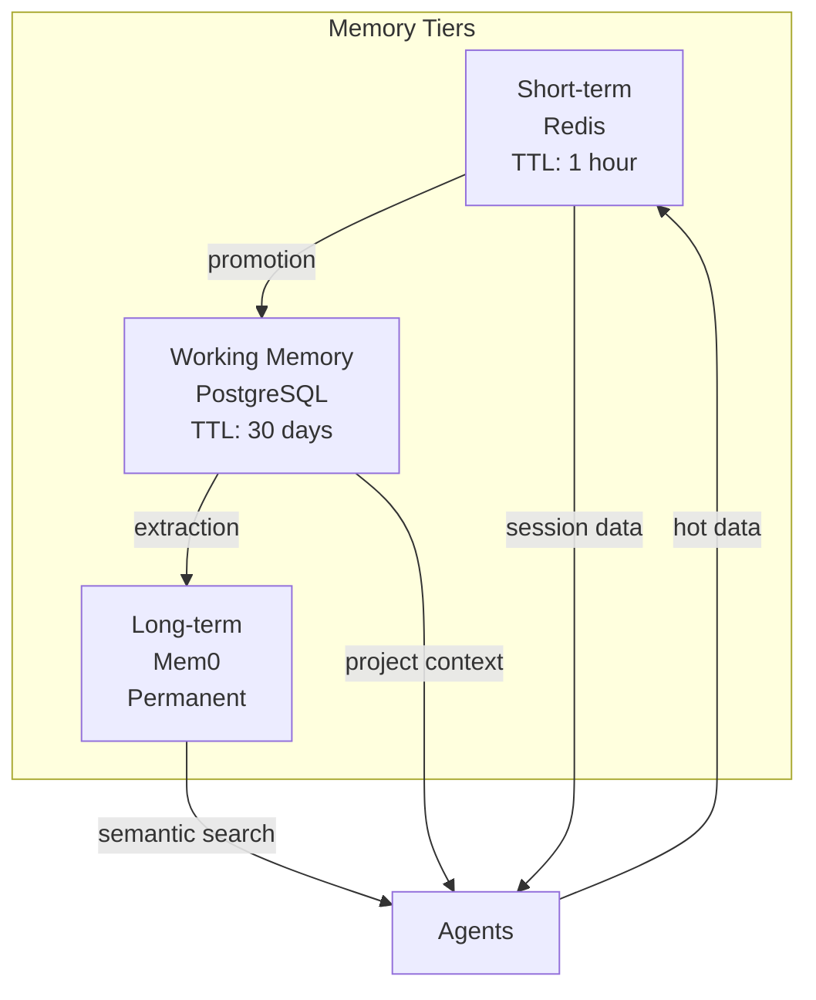
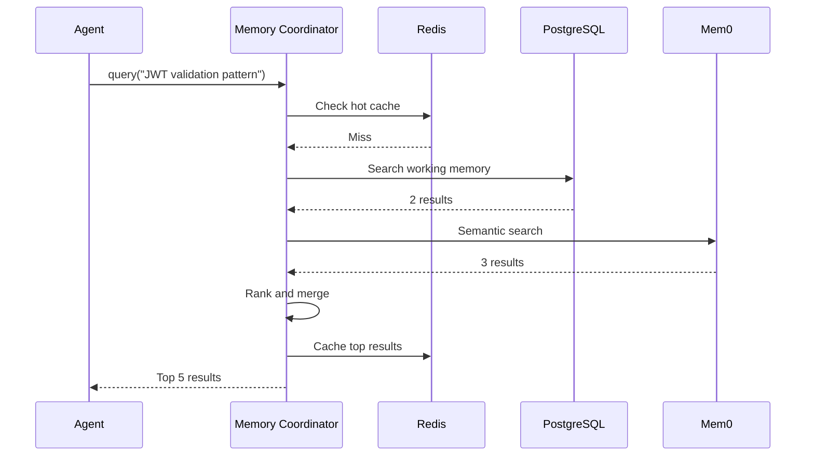

# Memory Architecture

Three-tier memory system enabling persistent learning and context management.

**Last Updated:** February 8, 2026  
**Audience:** Developers, Architects

> **Before Reading This**
>
> You should understand:
> - [System Overview](./system_overview.md) - Architecture basics
> - [Orchestration Layer](./orchestration_layer.md) - Memory Coordinator role

## Why Three Tiers?

"The function of good software is to make the complex appear simple." Grady Booch's principle drives our memory architecture. Different data has different access patterns. Forcing everything into one tier creates unnecessary complexity.



## Tier Specifications

| Tier | Storage | Latency | Capacity | TTL |
|------|---------|---------|----------|-----|
| Short-term | Redis | < 1ms | 1 GB | 1 hour |
| Working | PostgreSQL | 5ms | 100 GB | 30 days |
| Long-term | Mem0 | 50ms | Unlimited | Permanent |

## Short-term Memory (Redis)

### Purpose

Immediate context for active sessions:
- Current task input/output
- Recent agent messages
- Active file contents
- Session state

### Data Structures

```python
# Session context
session:{session_id}:context -> Hash
session:{session_id}:messages -> List (capped at 100)
session:{session_id}:files -> Set

# Task state
task:{task_id}:state -> String (JSON)
task:{task_id}:output -> String

# Agent coordination
agent:{agent_id}:status -> String
agent:{agent_id}:current_task -> String
```

### Access Patterns

```python
class ShortTermMemory:
    async def store_context(
        self, 
        session_id: str, 
        key: str, 
        value: str,
        ttl: int = 3600
    ) -> None:
        await self.redis.hset(f"session:{session_id}:context", key, value)
        await self.redis.expire(f"session:{session_id}:context", ttl)
    
    async def get_context(self, session_id: str) -> dict:
        return await self.redis.hgetall(f"session:{session_id}:context")
```

### RedisMemoryStore Implementation

The `RedisMemoryStore` class in `aurora_dev/core/memory/redis_store.py` provides persistent storage for the `MemoryCoordinator` agent:

```python
from aurora_dev.core.memory.redis_store import RedisMemoryStore

# Initialize store for a project
store = RedisMemoryStore(project_id="my-project")

# Store a memory item
store.store(
    memory_id="mem-123",
    memory_type="short",  # short, long, or episodic
    data={"content": "...", "tags": ["api", "auth"]},
    ttl_seconds=3600  # 1 hour for short-term
)

# Retrieve
item = store.retrieve("mem-123", "short")

# List all IDs of a type
ids = store.list_ids("short")
```

Key format: `aurora:memory:{project_id}:{type}:{memory_id}`

## Working Memory (PostgreSQL)

### Purpose

Project-specific patterns and decisions:
- Architecture decisions
- Resolved conflicts
- Successful approaches
- Project-scoped reflexions

### Schema

```sql
CREATE TABLE working_memory (
    id UUID PRIMARY KEY DEFAULT gen_random_uuid(),
    project_id UUID NOT NULL REFERENCES projects(id),
    memory_type VARCHAR(50) NOT NULL,
    content TEXT NOT NULL,
    embedding vector(1536),
    metadata JSONB DEFAULT '{}',
    created_at TIMESTAMP DEFAULT now(),
    accessed_at TIMESTAMP DEFAULT now(),
    access_count INTEGER DEFAULT 0,
    ttl_days INTEGER DEFAULT 30
);

CREATE INDEX idx_working_memory_project ON working_memory(project_id);
CREATE INDEX idx_working_memory_embedding ON working_memory 
    USING ivfflat (embedding vector_cosine_ops);
```

### Memory Types

| Type | Content | Example |
|------|---------|---------|
| DECISION | Architecture choice | "Using Redis for sessions" |
| PATTERN | Successful code pattern | "JWT refresh token flow" |
| REFLEXION | Learned from failure | "Always validate input types" |
| CONFLICT | Resolved merge conflict | "Frontend takes precedence for UI" |

### Promotion Logic

Content promotes from short-term when:
1. Accessed more than 3 times in a session
2. Referenced by multiple agents
3. Explicitly marked as valuable

```python
async def maybe_promote(self, content: str, access_count: int):
    if access_count >= 3:
        await self.working_memory.store(
            content=content,
            memory_type=MemoryType.PATTERN,
            project_id=self.current_project
        )
```

## Long-term Memory (Mem0)

### Purpose

Cross-project learnings that persist beyond individual projects:
- Universal patterns
- Technology insights
- Error patterns
- Best practices

### Integration

```python
from mem0 import Memory

class LongTermMemory:
    def __init__(self, config: MemoryConfig):
        self.memory = Memory(
            api_key=config.mem0_api_key,
            organization_id=config.mem0_org_id
        )
    
    async def store(self, content: str, metadata: dict) -> str:
        result = await self.memory.add(
            content,
            user_id="aurora-system",
            metadata=metadata
        )
        return result["id"]
    
    async def search(self, query: str, limit: int = 5) -> list[dict]:
        return await self.memory.search(
            query,
            user_id="aurora-system",
            limit=limit
        )
```

### Extraction Logic

Content extracts to long-term when:
1. Successfully used in multiple projects
2. Reduces error rates
3. Manually curated by operators

## Query Flow



## Relevance Scoring

Combined scoring considers:

```python
def calculate_relevance(
    semantic_score: float,
    recency_score: float,
    access_count: int,
    project_match: bool
) -> float:
    base = semantic_score * 0.5
    recency = recency_score * 0.2
    popularity = min(access_count / 10, 1.0) * 0.15
    project = 0.15 if project_match else 0
    
    return base + recency + popularity + project
```

## Configuration

```yaml
memory:
  short_term:
    redis_url: "redis://localhost:6379"
    max_memory: "1gb"
    default_ttl: 3600
    
  working:
    database_url: "postgresql://..."
    embedding_model: "text-embedding-3-small"
    promotion_threshold: 3
    default_ttl_days: 30
    
  long_term:
    mem0_api_key: "${MEM0_API_KEY}"
    extraction_threshold: 5
```

## Cleanup Jobs

Scheduled maintenance:

| Job | Frequency | Action |
|-----|-----------|--------|
| Redis cleanup | Automatic | TTL expiration |
| Working memory prune | Daily | Delete expired, archive accessed |
| Long-term consolidation | Weekly | Merge similar entries |

## Related Reading

- [Memory Coordinator](../03_agent_specifications/02_memory_coordinator.md) - Agent specification
- [Context Management](../04_core_concepts/context_management.md) - Token limits
- [Memory Configuration](../13_configuration/memory_configuration.md) - Settings

## What's Next

- [Agent Communication](./agent_communication.md) - Inter-agent messaging
