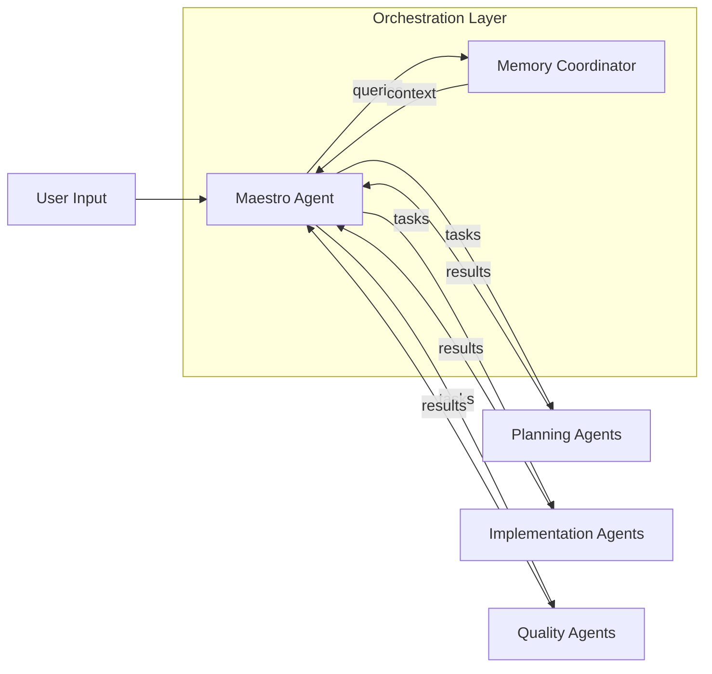
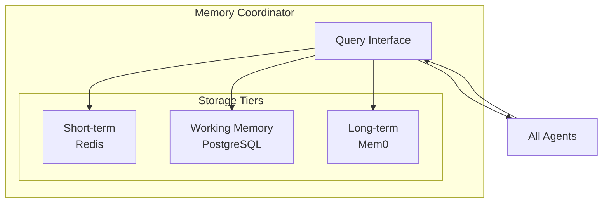

# Orchestration Layer

Deep dive into Maestro Agent and Memory Coordinator, the command center of AURORA-DEV.

**Last Updated:** February 8, 2026  
**Audience:** Developers, Architects

> **Before Reading This**
>
> You should understand:
> - [System Overview](./system_overview.md) - High-level architecture
> - Basic concepts of task orchestration

## The Command Center

"A good manager doesn't make decisions. A good manager creates an environment where good decisions get made." The Maestro Agent embodies this principle. It coordinates but never implements directly.



## Maestro Agent

### Core Responsibilities

1. **Requirement Parsing**: Extracts functional and non-functional requirements from natural language
2. **Task Decomposition**: Breaks requirements into atomic, assignable tasks
3. **Dependency Analysis**: Builds directed acyclic graphs (DAGs) of task dependencies
4. **Agent Assignment**: Routes tasks to appropriate agents using weighted round-robin
5. **Progress Tracking**: Monitors completion, handles failures, triggers retries
6. **Conflict Resolution**: Coordinates merge conflicts between parallel workers

### Implementation Details

```python
class MaestroAgent(BaseAgent):
    role = AgentRole.MAESTRO
    
    def decompose_requirements(self, user_input: str) -> TaskGraph:
        """Parse requirements into task dependency graph."""
        
    def assign_task(self, task: Task) -> Agent:
        """Select optimal agent for task execution."""
        
    def handle_failure(self, task: Task, error: str) -> RetryStrategy:
        """Determine retry or escalation strategy."""
```

### Task Decomposition Process

Maestro uses a structured approach to break down work:

| Phase | Output | Example |
|-------|--------|---------|
| Parse | Requirements list | "Users can login" becomes `REQ-001: User authentication` |
| Expand | Subtasks | Login → [Form, Validation, Session, Tokens] |
| Depend | Task DAG | Form → Validation → Session → Tokens |
| Assign | Agent mapping | Form → Frontend, Session → Backend |

### Assignment Algorithm

Maestro uses weighted round-robin with capability matching:

```
For each task T:
    1. Filter agents by required capabilities
    2. Score agents by: availability, recent success rate, current load
    3. Assign to highest-scoring agent
    4. Update agent load metrics
```

## Memory Coordinator

### Three-Tier Memory Architecture

| Tier | Storage | TTL | Purpose |
|------|---------|-----|---------|
| Short-term | Redis | 1 hour | Current session context |
| Working | PostgreSQL | 30 days | Project-specific patterns |
| Long-term | Mem0 | Permanent | Cross-project learnings |



### Core Responsibilities

1. **Context Retrieval**: Fetches relevant context for agent tasks
2. **Pattern Storage**: Saves successful solutions for reuse
3. **Reflexion Integration**: Records failures and learned fixes
4. **Cross-Agent Sharing**: Enables agents to share discoveries

### Usage Patterns

**Writing to Memory:**
```python
await memory_coordinator.store(
    content="Use Pydantic v2 model_validator for complex validation",
    memory_type=MemoryType.PATTERN,
    project_id="proj_123",
    tags=["python", "validation", "pydantic"]
)
```

**Reading from Memory:**
```python
context = await memory_coordinator.retrieve(
    query="How to validate nested objects in FastAPI",
    project_id="proj_123",
    limit=5
)
```

### Reflexion Integration

When an agent fails, Memory Coordinator captures the learning:

```python
reflexion = Reflexion(
    task_id="task_456",
    original_approach="Used plain dict for request body",
    failure_reason="Type validation failed at runtime",
    improved_approach="Use Pydantic models with strict validation",
    tags=["fastapi", "validation", "runtime-error"]
)
await memory_coordinator.store_reflexion(reflexion)
```

Future similar tasks automatically receive this context.

## Communication Protocol

Maestro and Memory Coordinator communicate through structured messages:

| Message Type | Direction | Purpose |
|--------------|-----------|---------|
| `TASK_CREATED` | Maestro → Agents | New task assignment |
| `TASK_PROGRESS` | Agents → Maestro | Status updates |
| `TASK_COMPLETE` | Agents → Maestro | Successful completion |
| `TASK_FAILED` | Agents → Maestro | Failure with details |
| `CONTEXT_REQUEST` | Agents → Memory | Need relevant context |
| `CONTEXT_RESPONSE` | Memory → Agents | Retrieved context |
| `PATTERN_STORE` | Agents → Memory | Save learned pattern |

## Failure Handling

Maestro implements exponential backoff with jitter:

```
retry_delay = min(base_delay * (2 ^ attempt) + random_jitter, max_delay)
```

| Attempt | Base Delay | Max Delay | With Jitter |
|---------|------------|-----------|-------------|
| 1 | 1s | 60s | 1-2s |
| 2 | 2s | 60s | 2-4s |
| 3 | 4s | 60s | 4-8s |
| 4 | 8s | 60s | 8-16s |
| 5 | 16s | 60s | 16-32s |

After max retries, Maestro escalates to human intervention or alternative strategy.

## Metrics and Monitoring

Orchestration layer exposes Prometheus metrics:

| Metric | Type | Description |
|--------|------|-------------|
| `aurora_tasks_total` | Counter | Total tasks created |
| `aurora_tasks_completed` | Counter | Successfully completed |
| `aurora_tasks_failed` | Counter | Failed after retries |
| `aurora_agent_utilization` | Gauge | Per-agent load |
| `aurora_memory_queries` | Counter | Memory retrievals |

## Related Reading

- [Agent Communication](./agent_communication.md) - Message protocols
- [Memory Architecture](./memory_architecture.md) - Storage details
- [Maestro Agent](../03_agent_specifications/01_maestro_agent.md) - Full specification

## What's Next

- [Planning Layer](./planning_layer.md) - Architect, Research, Product Analyst
