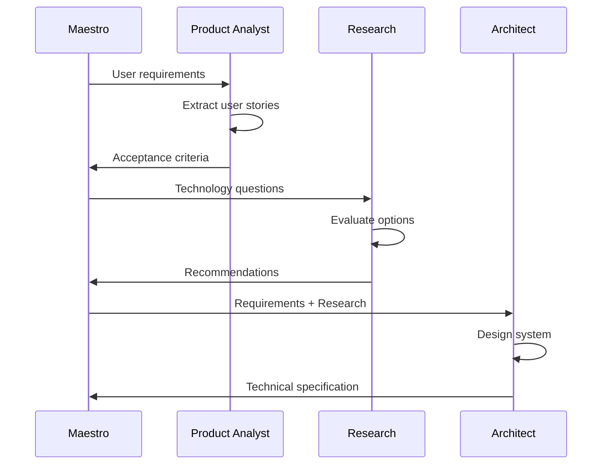
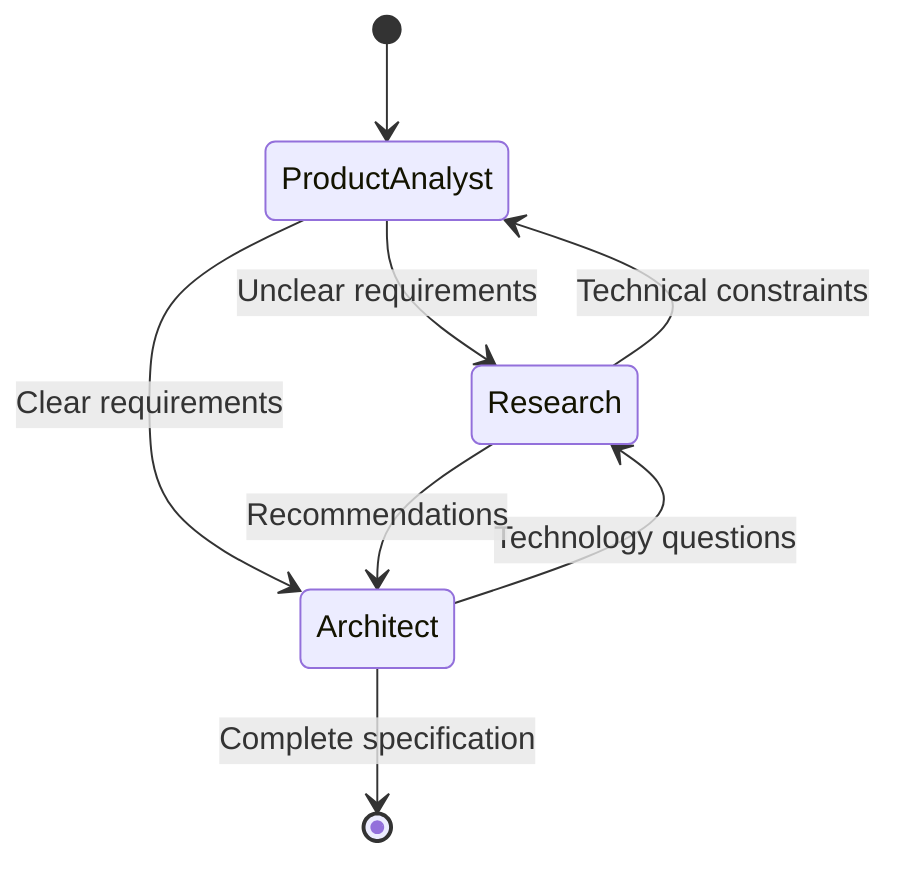

# Planning Layer

How Architect, Research, and Product Analyst agents design your software before implementation begins.

**Last Updated:** February 8, 2026  
**Audience:** Developers, Architects

> **Before Reading This**
>
> You should understand:
> - [System Overview](./system_overview.md) - Architecture basics
> - [Orchestration Layer](./orchestration_layer.md) - How Maestro coordinates

## Planning Before Building

"Weeks of coding can save you hours of planning." The old joke contains real wisdom. AURORA-DEV invests heavily in planning because fixing design mistakes costs far more than getting them right initially.

The planning layer consists of three specialized agents that collaborate to transform user requirements into detailed technical specifications.



## Product Analyst Agent

### Responsibilities

Translates ambiguous user descriptions into precise, testable requirements.

| Input | Output |
|-------|--------|
| "Users can log in" | User story with acceptance criteria |
| "Fast search" | Performance requirements with metrics |
| "Mobile friendly" | Responsive design specifications |

### User Story Template

```markdown
**As a** [user type]
**I want** [functionality]
**So that** [benefit]

**Acceptance Criteria:**
- [ ] Specific, measurable condition 1
- [ ] Specific, measurable condition 2
- [ ] Edge case handling
```

### Example Transformation

**User Input:**
> Build a task management app where users can create and track tasks

**Product Analyst Output:**
```yaml
stories:
  - id: US-001
    title: User Registration
    actor: new_user
    action: create account with email
    benefit: access personalized task list
    criteria:
      - Email validation with feedback
      - Password strength requirements shown
      - Confirmation email sent within 30 seconds
      
  - id: US-002
    title: Task Creation
    actor: authenticated_user
    action: create task with title and optional due date
    benefit: track work to be done
    criteria:
      - Title required, 1-200 characters
      - Due date optional, must be future
      - Task appears in list immediately
```

## Research Agent

### Responsibilities

Evaluates technology choices and discovers best practices.

| Question Type | Research Approach |
|---------------|-------------------|
| "Which database?" | Compare options against requirements |
| "Best auth pattern?" | Review industry standards |
| "How to handle X?" | Search patterns, evaluate libraries |

### Research Report Format

```yaml
question: "Best approach for real-time updates?"

options:
  - name: WebSockets
    pros: ["True bidirectional", "Low latency"]
    cons: ["Connection management", "Scaling complexity"]
    fit_score: 8/10
    
  - name: Server-Sent Events
    pros: ["Simple", "HTTP/2 efficient"]
    cons: ["Unidirectional", "Browser limits"]
    fit_score: 6/10
    
  - name: Polling
    pros: ["Simple implementation"]
    cons: ["Latency", "Server load"]
    fit_score: 3/10

recommendation: WebSockets
rationale: "Real-time requirements justify complexity"
```

### Context Sources

Research Agent draws from:
1. **Memory Coordinator**: Past project decisions
2. **Pattern Library**: Proven solutions
3. **External Knowledge**: Best practices, documentation

## Architect Agent

### Responsibilities

Creates the technical blueprint that implementation agents follow.

| Artifact | Purpose |
|----------|---------|
| Component Diagram | High-level structure |
| API Specification | Endpoint contracts |
| Database Schema | Data model |
| Sequence Diagrams | Interaction flows |

### Architecture Document Structure

```yaml
project: taskmaster
version: 1.0.0

components:
  - name: api-gateway
    type: service
    technology: FastAPI
    responsibilities:
      - Request routing
      - Authentication
      - Rate limiting
      
  - name: task-service
    type: service
    technology: Python
    responsibilities:
      - Task CRUD
      - Business logic
      
  - name: notification-service
    type: service
    technology: Python + Celery
    responsibilities:
      - Email notifications
      - WebSocket updates

databases:
  - name: primary
    type: PostgreSQL
    tables: [users, tasks, projects, comments]
    
  - name: cache
    type: Redis
    usage: [sessions, rate_limits, pubsub]

api_specification:
  openapi: "3.1.0"
  paths:
    /tasks:
      post:
        summary: Create task
        requestBody:
          content:
            application/json:
              schema:
                $ref: "#/components/schemas/TaskCreate"
```

### Design Decisions

Architect records important decisions for future reference:

```markdown
## ADR-001: Use PostgreSQL over MongoDB

**Context:** Need persistent storage for tasks and users.

**Decision:** Use PostgreSQL with SQLAlchemy ORM.

**Rationale:**
- Relational model fits task/project/user relationships
- ACID guarantees prevent data corruption
- Team has PostgreSQL experience

**Consequences:**
- Schema migrations required for changes
- Join performance needs monitoring
```

## Layer Coordination

The three agents iterate until requirements are fully specified:



Typical planning phase: 5-15 minutes depending on project complexity.

## Quality Gates

Planning layer output must pass validation:

| Check | Requirement |
|-------|-------------|
| Coverage | Every user story has acceptance criteria |
| Consistency | API matches database schema |
| Completeness | All endpoints defined |
| Testability | Criteria are measurable |

## Related Reading

- [Implementation Layer](./implementation_layer.md) - How designs become code
- [Architect Agent](../03_agent_specifications/03_architect_agent.md) - Full specification
- [Task Decomposition](../04_core_concepts/task_decomposition.md) - How requirements become tasks

## What's Next

- [Implementation Layer](./implementation_layer.md) - Building the software
