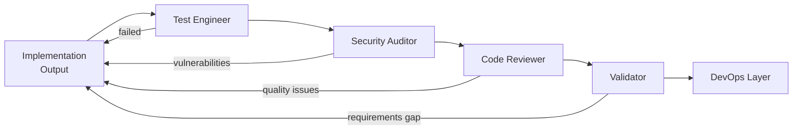
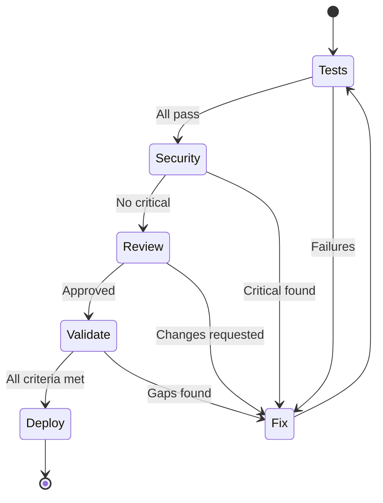

# Quality Layer

Test Engineer, Security Auditor, Code Reviewer, and Validator agents that ensure code quality.

**Last Updated:** February 8, 2026  
**Audience:** Developers, QA Engineers

> **Before Reading This**
>
> You should understand:
> - [System Overview](./system_overview.md) - Architecture basics
> - [Implementation Layer](./implementation_layer.md) - How code is generated

## No Shortcuts on Quality

"Quality is free, but only to those willing to pay heavily for it." DeMarco and Lister understood the paradox. AURORA-DEV invests in quality agents because fixing bugs in production costs 100x more than catching them early.



## Test Engineer Agent

### Responsibilities

| Test Type | Purpose | Tools |
|-----------|---------|-------|
| Unit | Individual functions | pytest, vitest |
| Integration | Component interactions | pytest, Testing Library |
| E2E | Full user flows | Playwright |
| Performance | Response times | Locust, k6 |

### Test Generation Pattern

```python
# Test Engineer generates comprehensive test suites
class TestTaskService:
    @pytest.fixture
    async def service(self, db_session: AsyncSession) -> TaskService:
        return TaskService(db_session)
    
    async def test_create_task_success(self, service: TaskService, user: User):
        task = await service.create(
            TaskCreate(title="Test task", priority=Priority.HIGH),
            owner_id=user.id
        )
        
        assert task.id is not None
        assert task.title == "Test task"
        assert task.priority == Priority.HIGH
        assert task.owner_id == user.id
    
    async def test_create_task_empty_title_fails(self, service: TaskService, user: User):
        with pytest.raises(ValidationError) as exc:
            await service.create(TaskCreate(title=""), owner_id=user.id)
        
        assert "title" in str(exc.value)
    
    @pytest.mark.parametrize("priority", list(Priority))
    async def test_create_task_all_priorities(
        self, service: TaskService, user: User, priority: Priority
    ):
        task = await service.create(
            TaskCreate(title="Test", priority=priority),
            owner_id=user.id
        )
        assert task.priority == priority
```

### Coverage Requirements

| Component | Minimum Coverage |
|-----------|-----------------|
| Business logic | 90% |
| API endpoints | 85% |
| Database operations | 80% |
| Utilities | 70% |

## Security Auditor Agent

### Scan Types

| Scan | Focus | Tool |
|------|-------|------|
| SAST | Source code vulnerabilities | Bandit, Semgrep |
| DAST | Runtime vulnerabilities | OWASP ZAP |
| Dependencies | Known CVEs | Safety, npm audit |
| Secrets | Leaked credentials | detect-secrets |

### OWASP Top 10 Checks

```yaml
security_audit:
  injection:
    check: Parameterized queries only
    status: PASS
    
  broken_auth:
    check: JWT with proper expiration
    status: PASS
    
  sensitive_data:
    check: Passwords hashed with bcrypt
    status: PASS
    
  xxe:
    check: XML parsing disabled
    status: N/A
    
  broken_access:
    check: Role-based access enforced
    status: PASS
    
  security_misconfig:
    check: Debug mode disabled in production
    status: PASS
    
  xss:
    check: Output encoding enabled
    status: PASS
    
  insecure_deserialization:
    check: Only JSON accepted
    status: PASS
    
  vulnerable_components:
    check: No known CVEs in dependencies
    status: PASS
    
  logging:
    check: Security events logged
    status: PASS
```

### Vulnerability Response

| Severity | Action | SLA |
|----------|--------|-----|
| Critical | Block deployment, immediate fix | Same task |
| High | Flag for fix before release | 24 hours |
| Medium | Track in backlog | 7 days |
| Low | Document, optional fix | 30 days |

## Code Reviewer Agent

### Review Dimensions

| Dimension | Checks |
|-----------|--------|
| Correctness | Logic errors, edge cases |
| Style | PEP 8, naming conventions |
| Performance | N+1 queries, unnecessary loops |
| Maintainability | Complexity, documentation |
| Security | Input validation, error handling |

### Review Output Format

```markdown
## Code Review: TaskService

### Summary
Overall quality: **Good** (8/10)
Blocking issues: 0
Suggestions: 3

### Findings

#### 🟡 Medium: Consider pagination for task list
**File:** `services/task_service.py:45`
**Issue:** `get_all_tasks()` returns unbounded results
**Suggestion:** Add pagination with default limit

```python
# Before
async def get_all_tasks(self, user_id: UUID) -> list[Task]:
    return await self.repo.find_by_owner(user_id)

# After
async def get_all_tasks(
    self, user_id: UUID, limit: int = 100, offset: int = 0
) -> list[Task]:
    return await self.repo.find_by_owner(user_id, limit=limit, offset=offset)
```

#### 🟢 Low: Add docstring to public method
**File:** `services/task_service.py:52`
**Issue:** Missing docstring on `update_task`
```

## Validator Agent (Oracle)

### Responsibilities

The Validator acts as an independent oracle, verifying that implementation matches requirements.

| Check | Method |
|-------|--------|
| Requirement coverage | Match features to acceptance criteria |
| API contract | Compare implementation to OpenAPI spec |
| Database integrity | Verify schema matches design |
| UI completeness | Check all specified components exist |

### Validation Report

```yaml
validation_report:
  project: taskmaster
  requirements_coverage: 100%
  
  user_stories:
    - id: US-001
      title: User Registration
      status: PASS
      evidence:
        - Endpoint: POST /auth/register
        - Tests: 5 passing
        - Criteria met: 3/3
    
    - id: US-002
      title: Task Creation
      status: PASS
      evidence:
        - Endpoint: POST /tasks
        - Tests: 8 passing
        - Criteria met: 3/3

  gaps: []
  
  recommendation: APPROVE_FOR_DEPLOYMENT
```

## Quality Gate Pipeline



All gates must pass before code proceeds to DevOps layer.

## Related Reading

- [DevOps Layer](./devops_layer.md) - Deployment automation
- [Test Engineer](../03_agent_specifications/10_test_engineer.md) - Full specification
- [Quality Gates](../04_core_concepts/quality_gates.md) - Gate configuration

## What's Next

- [DevOps Layer](./devops_layer.md) - CI/CD and deployment
