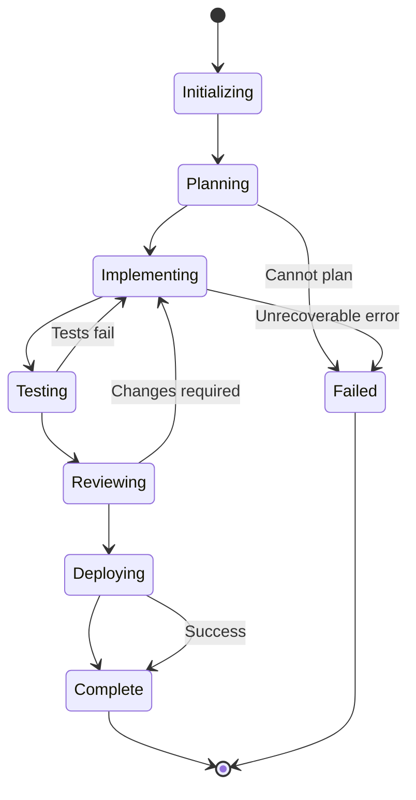
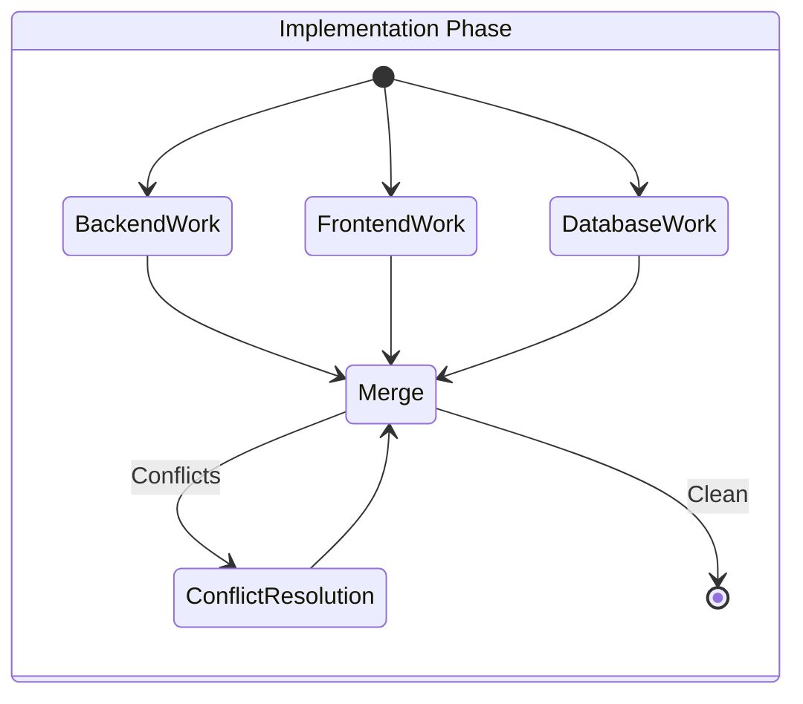

# State Machine

LangGraph workflow states that drive AURORA-DEV's agent orchestration.

**Last Updated:** February 8, 2026  
**Audience:** Developers, Architects

> **Before Reading This**
>
> You should understand:
> - [System Overview](./system_overview.md) - Architecture basics
> - [Data Flow](./data_flow.md) - How data moves through the system

## Why a State Machine?

"State machines are underrated. Most bugs come from unexpected state transitions." This wisdom from game developers applies perfectly to agent orchestration. LangGraph provides the state machine foundations that keep AURORA-DEV's complex workflows predictable.



## Core States

### Project States

| State | Description | Valid Transitions |
|-------|-------------|-------------------|
| INITIALIZING | Project created, parsing requirements | PLANNING, FAILED |
| PLANNING | Architects designing system | IMPLEMENTING, FAILED |
| IMPLEMENTING | Agents writing code | TESTING, FAILED |
| TESTING | Running test suites | REVIEWING, IMPLEMENTING |
| REVIEWING | Code review and security scan | DEPLOYING, IMPLEMENTING |
| DEPLOYING | Generating deployment configs | COMPLETE, FAILED |
| COMPLETE | Project finished successfully | (terminal) |
| FAILED | Unrecoverable failure | (terminal) |

### Task States

```python
class TaskState(Enum):
    PENDING = "pending"       # Waiting for dependencies
    READY = "ready"          # Dependencies met, awaiting agent
    ASSIGNED = "assigned"    # Agent picked up task
    RUNNING = "running"      # Agent actively working
    BLOCKED = "blocked"      # Waiting on external input
    COMPLETED = "completed"  # Successfully finished
    FAILED = "failed"        # Failed after retries
    CANCELLED = "cancelled"  # Cancelled by user or system
```

## LangGraph Implementation

### Graph Definition

```python
from langgraph.graph import StateGraph, END

class ProjectState(TypedDict):
    project_id: str
    requirements: list[Requirement]
    tasks: list[Task]
    current_phase: str
    errors: list[str]
    artifacts: dict[str, str]

def create_project_graph() -> StateGraph:
    graph = StateGraph(ProjectState)
    
    # Add nodes for each phase
    graph.add_node("initialize", initialize_project)
    graph.add_node("plan", plan_architecture)
    graph.add_node("implement", implement_features)
    graph.add_node("test", run_tests)
    graph.add_node("review", review_code)
    graph.add_node("deploy", generate_deployment)
    
    # Define edges (transitions)
    graph.add_edge("initialize", "plan")
    graph.add_conditional_edges(
        "plan",
        check_planning_status,
        {"success": "implement", "failure": END}
    )
    graph.add_conditional_edges(
        "test",
        check_test_status,
        {"pass": "review", "fail": "implement"}
    )
    
    graph.set_entry_point("initialize")
    return graph.compile()
```

### State Transitions

```python
def check_test_status(state: ProjectState) -> str:
    """Determine next state based on test results."""
    test_results = state.get("test_results", {})
    
    if test_results.get("all_passed"):
        return "pass"
    
    if test_results.get("retry_count", 0) >= MAX_RETRIES:
        return "fail_permanent"
    
    return "fail"
```

## Nested State Machines

Each phase contains its own state machine:



### Agent Work States

```python
class AgentWorkState(Enum):
    IDLE = "idle"
    FETCHING_CONTEXT = "fetching_context"
    GENERATING = "generating"
    VALIDATING = "validating"
    COMMITTING = "committing"
    REPORTING = "reporting"
```

## Checkpointing

LangGraph automatically checkpoints state for recovery:

```python
from langgraph.checkpoint import PostgresSaver

checkpointer = PostgresSaver(connection_string=DATABASE_URL)

graph = create_project_graph()
compiled = graph.compile(checkpointer=checkpointer)

# State persisted after each node execution
result = compiled.invoke(
    initial_state,
    config={"configurable": {"thread_id": project_id}}
)
```

### Recovery

```python
async def resume_project(project_id: str) -> ProjectState:
    """Resume a project from its last checkpoint."""
    config = {"configurable": {"thread_id": project_id}}
    
    # Load last checkpoint
    state = await compiled.aget_state(config)
    
    if state.values.get("current_phase") in TERMINAL_STATES:
        raise ProjectAlreadyComplete(project_id)
    
    # Resume execution
    return await compiled.ainvoke(None, config)
```

## Transition Guards

State transitions are guarded by conditions:

```python
def can_transition_to_testing(state: ProjectState) -> bool:
    """Check if implementation is ready for testing."""
    return all([
        state["implementation_complete"],
        len(state["pending_tasks"]) == 0,
        state["build_status"] == "success"
    ])

def can_transition_to_deploying(state: ProjectState) -> bool:
    """Check if review passed all gates."""
    return all([
        state["test_coverage"] >= 0.8,
        state["security_scan_passed"],
        state["code_review_approved"]
    ])
```

## Event Hooks

Monitor state changes with hooks:

```python
@graph.on_enter("testing")
async def on_enter_testing(state: ProjectState):
    """Called when entering testing phase."""
    await notify_webhook("phase_changed", {
        "project_id": state["project_id"],
        "phase": "testing"
    })
    await metrics.increment("phase_transitions", labels={"to": "testing"})
```

## Visualization

Export graph for documentation:

```python
from langgraph.graph import draw_mermaid

mermaid_code = draw_mermaid(compiled)
print(mermaid_code)
```

## Related Reading

- [Memory Architecture](./memory_architecture.md) - State persistence
- [Parallel Execution](../04_core_concepts/parallel_execution.md) - Concurrent workflows
- [Reflexion Loops](../04_core_concepts/reflexion_loops.md) - Error handling

## What's Next

- [Memory Architecture](./memory_architecture.md) - Three-tier storage system
