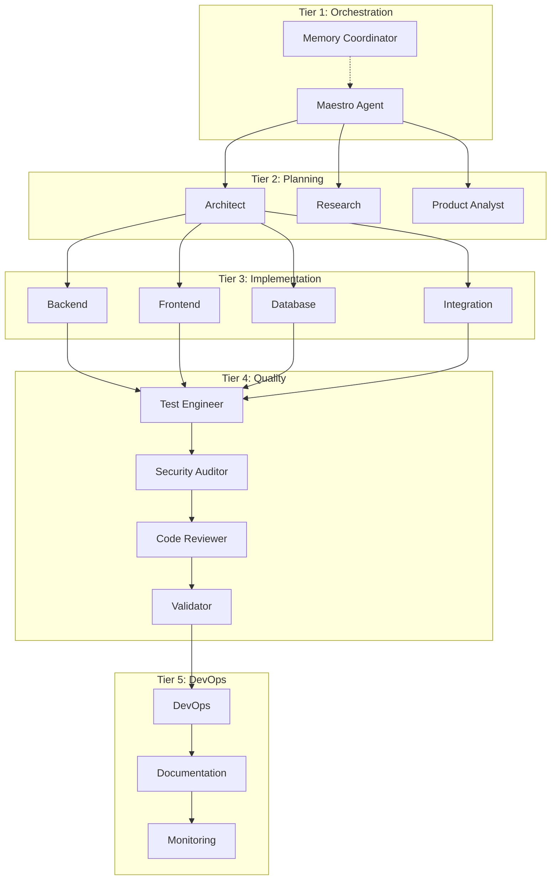

# System Overview

High-level architecture of AURORA-DEV's multi-agent autonomous software development system.

**Last Updated:** February 8, 2026  
**Audience:** Developers, Architects

> **Before Reading This**
>
> Familiarity with:
> - [Quickstart](../01_getting_started/quickstart.md) - Basic system usage
> - Multi-agent systems concepts

## Architecture Philosophy

"The purpose of abstraction is not to be vague, but to create a new semantic level in which one can be absolutely precise." Dijkstra's insight drives AURORA-DEV's architecture. Each layer handles exactly one concern. No more, no less.

AURORA-DEV organizes 13 specialized agents across five hierarchical tiers. This isn't arbitrary. The hierarchy reflects natural dependencies in software development: you can't implement before designing, can't test before implementing, can't deploy before testing.

## Five-Tier Architecture

### Tier 1: Orchestration Layer

The command center. Maestro receives user requirements and coordinates all downstream work.

| Agent | Responsibility |
|-------|----------------|
| Maestro | Task decomposition, agent assignment, progress tracking |
| Memory Coordinator | Cross-agent context, pattern storage, reflexion learning |

Maestro operates as the "CEO" of the development process. It never writes code directly but decides which agents work on what, in what order, and with what dependencies.

### Tier 2: Planning Layer

Before writing a single line of code, these agents define what to build.

| Agent | Responsibility |
|-------|----------------|
| Architect | System design, API specifications, component structure |
| Research | Technology evaluation, best practices, library selection |
| Product Analyst | Requirement clarification, user stories, acceptance criteria |

### Tier 3: Implementation Layer

The builders. These agents produce actual code.

| Agent | Responsibility |
|-------|----------------|
| Backend | API endpoints, business logic, data processing |
| Frontend | UI components, state management, user interactions |
| Database | Schema design, migrations, query optimization |
| Integration | Third-party APIs, authentication, webhooks |

### Tier 4: Quality Layer

No code ships without passing through quality gates.

| Agent | Responsibility |
|-------|----------------|
| Test Engineer | Unit tests, integration tests, E2E tests |
| Security Auditor | Vulnerability scanning, OWASP compliance |
| Code Reviewer | Style, patterns, maintainability |
| Validator | Oracle validation, requirement verification |

### Tier 5: DevOps Layer

Get the code into production and keep it running.

| Agent | Responsibility |
|-------|----------------|
| DevOps | Docker, Kubernetes, CI/CD pipelines |
| Documentation | API docs, README, user guides |
| Monitoring | Prometheus configs, Grafana dashboards, alerts |

## Core Technologies

| Component | Technology | Purpose |
|-----------|------------|---------|
| LLM | Claude (Opus/Sonnet/Haiku) | Agent intelligence |
| Orchestration | LangGraph | Workflow state machine |
| Memory | Mem0 + Redis + PostgreSQL | Three-tier storage |
| Queue | Celery + Redis | Async task processing |
| API | FastAPI | REST/WebSocket interface |

## Data Flow

User input flows top-down through the tiers. Results bubble up.

1. **Input**: User describes what they want to build
2. **Orchestration**: Maestro creates a task graph
3. **Planning**: Architects design, researchers investigate
4. **Implementation**: Agents write code in parallel (via Git worktrees)
5. **Quality**: Tests run, security scans, code reviews
6. **Deployment**: Configurations generated, documentation created
7. **Output**: Complete, tested, documented project

## Design Principles

### Separation of Concerns
Each agent handles one domain. The Backend Agent doesn't write CSS. The Frontend Agent doesn't touch database schemas.

### Parallel Execution
Agents work concurrently using Git worktrees. Backend and Frontend develop simultaneously, merging through structured conflict resolution.

### Self-Improvement
Failed approaches feed the reflexion loop. The system learns from mistakes and applies lessons to future tasks.

### Cost Awareness
Different tasks use different models. Planning uses Sonnet for quality. Test generation uses Haiku for speed. Complex debugging uses Opus.

## Scalability

AURORA-DEV scales horizontally. Multiple instances of each agent can run concurrently, limited only by:
- Claude API rate limits
- Available compute resources
- PostgreSQL connection pool

See [Scaling Guide](../08_deployment/scaling_guide.md) for production scaling patterns.

## Related Reading

- [Orchestration Layer](./orchestration_layer.md) - Maestro and Memory Coordinator details
- [Agent Communication](./agent_communication.md) - Inter-agent messaging
- [Memory Architecture](./memory_architecture.md) - Three-tier memory system

## What's Next

- [Orchestration Layer](./orchestration_layer.md) - Deep dive into Maestro
