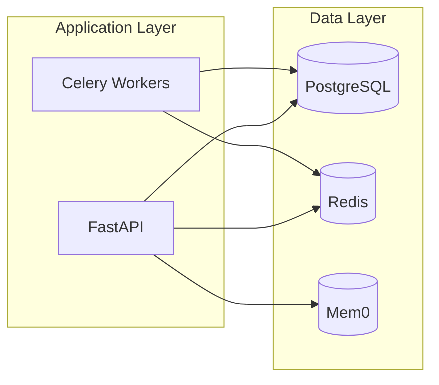
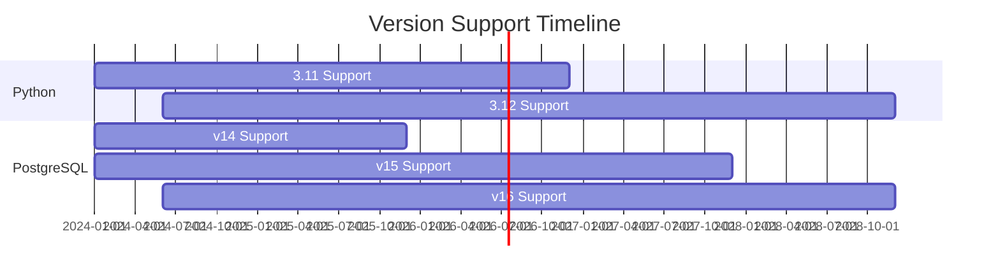

# Technology Stack

Complete list of technologies, frameworks, and versions powering AURORA-DEV.

**Last Updated:** February 8, 2026  
**Audience:** Developers, Operators

> **Before Reading This**
>
> This is a reference document. Use it to verify compatibility and plan infrastructure.

## Core Technologies

"The right tool for the right job." AURORA-DEV selects technologies based on proven reliability, performance, and developer experience.

### Runtime

| Component | Technology | Version | Purpose |
|-----------|------------|---------|---------|
| Language | Python | 3.11+ | Core runtime |
| API Framework | FastAPI | 0.109+ | REST/WebSocket |
| ASGI Server | Uvicorn | 0.27+ | Production server |
| Task Queue | Celery | 5.3+ | Background processing |

### AI/ML

| Component | Technology | Version | Purpose |
|-----------|------------|---------|---------|
| LLM Provider | Anthropic Claude | API v1 | Agent intelligence |
| LLM Models | Opus/Sonnet/Haiku | 2024-02 | Tiered model selection |
| Orchestration | LangGraph | 0.0.26+ | Workflow state machine |
| Embeddings | OpenAI | text-embedding-3-small | Semantic search |
| Memory | Mem0 | 0.0.8+ | Long-term storage |

### Data Storage

| Component | Technology | Version | Purpose |
|-----------|------------|---------|---------|
| Primary DB | PostgreSQL | 15+ | Persistent storage |
| ORM | SQLAlchemy | 2.0+ | Database abstraction |
| Migrations | Alembic | 1.13+ | Schema management |
| Cache | Redis | 7+ | Short-term memory, queues |
| Vector Store | pgvector | 0.5+ | Embedding similarity |



### Infrastructure

| Component | Technology | Version | Purpose |
|-----------|------------|---------|---------|
| Containers | Docker | 24+ | Packaging |
| Orchestration | Kubernetes | 1.28+ | Production deployment |
| Reverse Proxy | Nginx | 1.25+ | Load balancing |
| Secrets | HashiCorp Vault | 1.15+ | Secrets management |

### Monitoring

| Component | Technology | Version | Purpose |
|-----------|------------|---------|---------|
| Metrics | Prometheus | 2.48+ | Time series data |
| Dashboards | Grafana | 10+ | Visualization |
| Logging | ELK Stack | 8.11+ | Log aggregation |
| Tracing | Jaeger | 1.52+ | Distributed tracing |
| APM | Sentry | Latest | Error tracking |

## Python Dependencies

### Core

```
anthropic>=0.18.0
langgraph>=0.0.26
langchain>=0.1.0
langchain-anthropic>=0.1.0
langchain-community>=0.0.24
```

### Web Framework

```
fastapi>=0.109.0
uvicorn[standard]>=0.27.0
pydantic>=2.6.0
python-multipart>=0.0.9
python-jose[cryptography]>=3.3.0
```

### Database

```
sqlalchemy>=2.0.25
alembic>=1.13.0
asyncpg>=0.29.0
psycopg2-binary>=2.9.9
pgvector>=0.2.4
```

### Task Queue

```
celery>=5.3.6
redis>=5.0.1
flower>=2.0.1
```

### Testing

```
pytest>=8.0.0
pytest-asyncio>=0.23.0
pytest-cov>=4.1.0
httpx>=0.26.0
factory-boy>=3.3.0
```

### Development

```
black>=24.1.0
ruff>=0.2.0
mypy>=1.8.0
pre-commit>=3.6.0
```

## Generated Project Technologies

AURORA-DEV generates projects using:

### Backend Options

| Stack | Framework | ORM | Validation |
|-------|-----------|-----|------------|
| Python | FastAPI | SQLAlchemy | Pydantic |
| Python | Django | Django ORM | DRF Serializers |
| Node.js | Express | Prisma | Zod |
| Node.js | NestJS | TypeORM | class-validator |

### Frontend Options

| Stack | Framework | State | Styling |
|-------|-----------|-------|---------|
| React | React 18 | Zustand | Tailwind/CSS Modules |
| Vue | Vue 3 | Pinia | Tailwind/SCSS |
| Next.js | Next 14 | Zustand | Tailwind |
| Nuxt | Nuxt 3 | Pinia | Tailwind |

### Database Options

| Type | Options | Use Case |
|------|---------|----------|
| Relational | PostgreSQL, MySQL | Structured data |
| Document | MongoDB | Flexible schemas |
| Key-Value | Redis | Caching, sessions |
| Vector | pgvector, Pinecone | Embeddings |

## Version Compatibility

### Minimum Requirements

| Component | Minimum | Recommended |
|-----------|---------|-------------|
| Python | 3.11 | 3.12 |
| PostgreSQL | 14 | 15+ |
| Redis | 6 | 7+ |
| Docker | 24 | Latest |
| Kubernetes | 1.26 | 1.28+ |

### Upgrade Path



## Third-Party Services

### Required

| Service | Purpose | Alternative |
|---------|---------|-------------|
| Anthropic Claude | LLM intelligence | None (core dependency) |

### Optional

| Service | Purpose | Alternative |
|---------|---------|-------------|
| OpenAI | Embeddings | Local models |
| Mem0 | Long-term memory | PostgreSQL only |
| Sentry | Error tracking | Self-hosted |
| GitHub | Version control | GitLab |

## Related Reading

- [System Requirements](../01_getting_started/system_requirements.md) - Hardware needs
- [Installation](../01_getting_started/installation.md) - Setup guide
- [Environment Variables](../13_configuration/environment_variables.md) - Configuration

## What's Next

- [Base Agent](../03_agent_specifications/00_base_agent.md) - Agent implementation details
