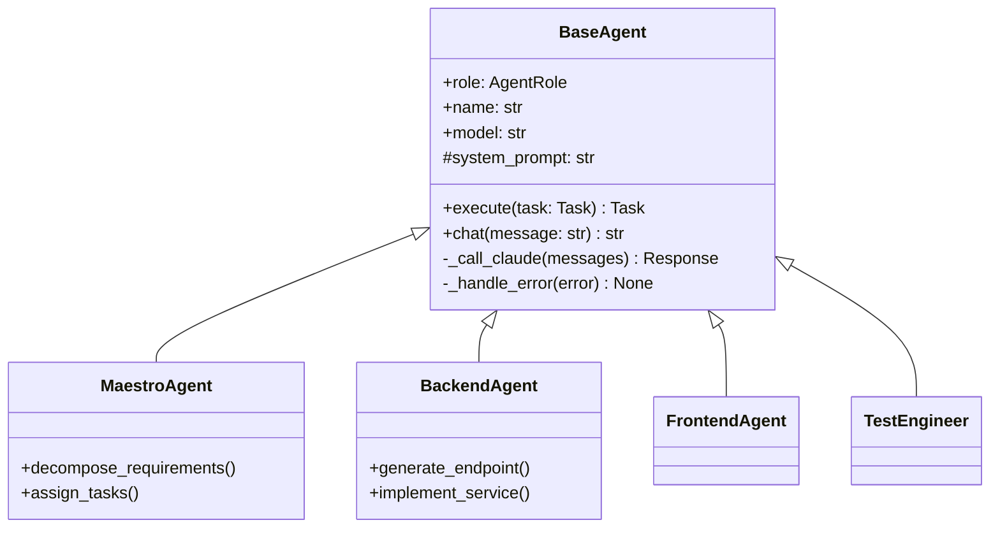

# Base Agent

The foundational class that all AURORA-DEV agents inherit from.

**Last Updated:** February 8, 2026  
**Audience:** Developers

> **Before Reading This**
>
> You should understand:
> - [System Overview](../02_architecture/system_overview.md) - Architecture basics
> - Python class inheritance and async patterns

## The Foundation

"Good abstractions hide unnecessary complexity while exposing essential capabilities." The BaseAgent class provides a consistent interface that all 13 specialized agents inherit from, handling Claude API integration, error recovery, and metrics automatically.



## Class Structure

### Core Properties

```python
class BaseAgent(ABC):
    """Abstract base class for all AURORA-DEV agents."""
    
    @property
    @abstractmethod
    def role(self) -> AgentRole:
        """Return the agent's role identifier."""
        pass
    
    @property
    @abstractmethod
    def system_prompt(self) -> str:
        """Return the agent's system prompt."""
        pass
    
    def __init__(
        self,
        name: str | None = None,
        model: str | None = None,
        project_id: str | None = None,
        session_id: str | None = None,
        enable_cache: bool = True,
    ):
        self._name = name or self.role.value
        self._model = model or settings.default_model
        self._project_id = project_id
        self._session_id = session_id or str(uuid.uuid4())
        self._cache = ResponseCache() if enable_cache else None
        self._client = Anthropic(api_key=settings.anthropic_api_key)
        self._token_usage = TokenUsage()
```

### Execution Interface

```python
async def execute(self, task: Task) -> TaskResult:
    """Execute a task and return results."""
    self.logger.info(f"Starting task: {task.title}")
    start_time = time.monotonic()
    
    try:
        # Get relevant context
        context = await self.memory.get_context(task)
        
        # Build messages
        messages = self._build_messages(task, context)
        
        # Call Claude
        response = await self._call_claude(messages)
        
        # Parse and validate output
        result = self._parse_output(response)
        
        return TaskResult(
            task_id=task.id,
            status=TaskStatus.COMPLETED,
            output=result,
            duration_ms=(time.monotonic() - start_time) * 1000,
            token_usage=self._token_usage
        )
    except Exception as e:
        return await self._handle_failure(task, e)
```

## API Integration

### Claude API Wrapper

```python
async def _call_claude(
    self,
    messages: list[dict],
    max_tokens: int = 4096,
    temperature: float = 0.7,
) -> AgentResponse:
    """Call Claude API with retry logic."""
    
    # Check cache first
    if self._cache:
        cached = self._cache.get(messages, self.system_prompt, self._model)
        if cached:
            return cached
    
    for attempt in range(self.max_retries):
        try:
            response = await self._client.messages.create(
                model=self._model,
                max_tokens=max_tokens,
                temperature=temperature,
                system=self.system_prompt,
                messages=messages
            )
            
            result = AgentResponse(
                content=response.content[0].text,
                token_usage=TokenUsage(
                    input_tokens=response.usage.input_tokens,
                    output_tokens=response.usage.output_tokens
                ),
                model=self._model,
                stop_reason=response.stop_reason
            )
            
            # Cache successful responses
            if self._cache:
                self._cache.set(messages, self.system_prompt, self._model, result)
            
            return result
            
        except RateLimitError:
            wait = self._calculate_backoff(attempt)
            await asyncio.sleep(wait)
        except APIError as e:
            if not self._is_retryable(e):
                raise
            await asyncio.sleep(self._calculate_backoff(attempt))
    
    raise MaxRetriesExceeded(self.max_retries)
```

### Retry Logic

| Attempt | Delay | With Jitter |
|---------|-------|-------------|
| 1 | 1s | 1-1.5s |
| 2 | 2s | 2-3s |
| 3 | 4s | 4-6s |
| 4 | 8s | 8-12s |
| 5 | 16s | 16-24s |

## Token Tracking

```python
@dataclass
class TokenUsage:
    input_tokens: int = 0
    output_tokens: int = 0
    cache_creation_tokens: int = 0
    cache_read_tokens: int = 0
    
    @property
    def total_tokens(self) -> int:
        return self.input_tokens + self.output_tokens
    
    def estimated_cost(self, model: str) -> float:
        rates = MODEL_RATES.get(model, DEFAULT_RATES)
        return (
            self.input_tokens * rates["input"] +
            self.output_tokens * rates["output"]
        ) / 1_000_000
```

## Response Caching

Deterministic queries cache responses:

```python
class ResponseCache:
    def __init__(self, max_size: int = 1000, ttl_seconds: int = 3600):
        self._cache: dict[str, tuple[AgentResponse, float]] = {}
        self._max_size = max_size
        self._ttl = ttl_seconds
    
    def _generate_key(self, messages: list, system: str, model: str) -> str:
        content = json.dumps({"messages": messages, "system": system, "model": model})
        return hashlib.sha256(content.encode()).hexdigest()
```

## Error Handling

```python
async def _handle_failure(self, task: Task, error: Exception) -> TaskResult:
    """Handle task failure with reflexion."""
    self.logger.error(f"Task failed: {error}")
    
    # Store reflexion for future improvement
    reflexion = Reflexion(
        task_id=task.id,
        error_type=type(error).__name__,
        error_message=str(error),
        agent_role=self.role,
        context=task.context
    )
    await self.memory.store_reflexion(reflexion)
    
    return TaskResult(
        task_id=task.id,
        status=TaskStatus.FAILED,
        error=str(error)
    )
```

## Creating Custom Agents

Extend BaseAgent for custom functionality:

```python
class CustomAgent(BaseAgent):
    @property
    def role(self) -> AgentRole:
        return AgentRole.CUSTOM
    
    @property
    def system_prompt(self) -> str:
        return """You are a specialized agent for...
        
        Follow these guidelines:
        1. ...
        2. ...
        """
    
    async def custom_method(self, input: str) -> str:
        """Custom agent-specific method."""
        response = await self.chat(f"Process this: {input}")
        return self._parse_custom_output(response)
```

## Configuration

Per-agent settings in config:

```yaml
agents:
  base:
    max_retries: 5
    default_temperature: 0.7
    cache_enabled: true
    cache_ttl: 3600
  
  backend:
    model: claude-3-sonnet-20240229
    temperature: 0.3
  
  architect:
    model: claude-3-opus-20240229
    temperature: 0.5
```

## Related Reading

- [Maestro Agent](./01_maestro_agent.md) - Orchestration specialist
- [Adding Agents](../06_developer_guides/adding_agents.md) - Creating custom agents
- [Agent Configuration](../13_configuration/agent_configuration.md) - Settings

## What's Next

- [Maestro Agent](./01_maestro_agent.md) - Task orchestration
