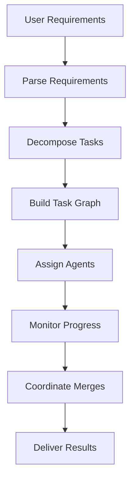

# Maestro Agent

The central orchestrator that coordinates all agent activities and manages project execution.

**Last Updated:** February 8, 2026  
**Audience:** Developers, Architects

> **Before Reading This**
>
> You should understand:
> - [Base Agent](./00_base_agent.md) - Foundation class
> - [Orchestration Layer](../02_architecture/orchestration_layer.md) - Architecture context

## Role Overview

"The conductor doesn't make a sound, yet the orchestra would be silent without them." Maestro embodies this principle. It writes no code but enables all other agents to produce their best work.

| Attribute | Value |
|-----------|-------|
| Role | `AgentRole.MAESTRO` |
| Tier | 1 (Orchestration) |
| Model | Claude Sonnet (default) |
| Responsibilities | Task decomposition, agent assignment, progress tracking |

## Core Responsibilities



### 1. Requirement Parsing

Converts natural language into structured requirements:

```python
async def parse_requirements(self, user_input: str) -> list[Requirement]:
    prompt = f"""Analyze this project description and extract requirements:

{user_input}

For each requirement, provide:
- ID (REQ-001 format)
- Title (short description)
- Type (functional/non-functional)
- Priority (high/medium/low)
- Acceptance criteria (testable conditions)
"""
    response = await self.chat(prompt)
    return self._parse_requirements(response)
```

### 2. Task Decomposition

Breaks requirements into atomic tasks:

```python
async def decompose_requirements(
    self, requirements: list[Requirement]
) -> TaskGraph:
    tasks = []
    
    for req in requirements:
        subtasks = await self._decompose_single(req)
        tasks.extend(subtasks)
    
    # Build dependency graph
    graph = TaskGraph()
    for task in tasks:
        graph.add_task(task)
        for dep in task.dependencies:
            graph.add_edge(dep, task.id)
    
    return graph
```

### 3. Agent Assignment

Routes tasks to optimal agents:

```python
async def assign_task(self, task: Task) -> AgentRole:
    """Select the best agent for this task."""
    
    # Determine required capabilities
    capabilities = self._analyze_requirements(task)
    
    # Find matching agents
    candidates = [
        agent for agent in self.registry.agents
        if self._matches_capabilities(agent, capabilities)
    ]
    
    # Score by availability and recent performance
    scored = [
        (agent, self._calculate_score(agent, task))
        for agent in candidates
    ]
    
    # Assign to highest scorer
    best_agent = max(scored, key=lambda x: x[1])[0]
    return best_agent.role
```

Assignment factors:

| Factor | Weight | Description |
|--------|--------|-------------|
| Capability match | 40% | Agent has required skills |
| Availability | 25% | Agent not overloaded |
| Recent success | 20% | Low recent failure rate |
| Task affinity | 15% | Similar recent tasks |

### 4. Progress Monitoring

Tracks execution and handles issues:

```python
async def monitor_project(self, project_id: str) -> None:
    """Continuously monitor project progress."""
    
    while True:
        status = await self.get_project_status(project_id)
        
        if status.phase == ProjectPhase.COMPLETE:
            break
        
        if status.phase == ProjectPhase.FAILED:
            await self._handle_project_failure(status)
            break
        
        # Check for stuck tasks
        for task in status.tasks:
            if self._is_stuck(task):
                await self._handle_stuck_task(task)
        
        await asyncio.sleep(5)
```

### 5. Conflict Resolution

Coordinates parallel work merges:

```python
async def resolve_conflicts(
    self, 
    branches: list[str], 
    target: str
) -> MergeResult:
    """Resolve Git merge conflicts between agent branches."""
    
    # Attempt automatic merge
    result = await self.git.merge(branches, target)
    
    if result.conflicts:
        # Analyze conflicts
        for conflict in result.conflicts:
            resolution = await self._decide_resolution(conflict)
            await self.git.resolve(conflict, resolution)
        
        result = await self.git.merge(branches, target)
    
    return result
```

## System Prompt

```
You are Maestro, the orchestration agent for AURORA-DEV.

Your responsibilities:
1. Parse user requirements into clear, actionable items
2. Decompose requirements into atomic tasks
3. Assign tasks to appropriate specialist agents
4. Monitor progress and handle failures
5. Coordinate merging of parallel work

Guidelines:
- Never implement code directly
- Focus on coordination and communication
- Escalate blocking issues promptly
- Maintain clear audit trails

Output format: Always use structured JSON for task definitions.
```

## Input/Output Formats

### Task Creation Output

```json
{
  "task_id": "task-001",
  "title": "Implement user authentication endpoint",
  "description": "Create POST /auth/login endpoint with JWT",
  "assigned_to": "backend",
  "priority": 1,
  "dependencies": [],
  "acceptance_criteria": [
    "Accepts email and password",
    "Returns JWT on success",
    "Returns 401 on failure",
    "Rate limited to 5 attempts per minute"
  ],
  "estimated_duration_minutes": 30
}
```

### Progress Report

```json
{
  "project_id": "proj-123",
  "phase": "implementing",
  "progress_percent": 65,
  "active_tasks": 3,
  "completed_tasks": 12,
  "failed_tasks": 0,
  "blocked_tasks": 1,
  "estimated_remaining_minutes": 45,
  "cost_so_far_usd": 8.50
}
```

## Configuration

```yaml
agents:
  maestro:
    model: claude-3-sonnet-20240229
    temperature: 0.3
    max_parallel_tasks: 8
    task_timeout_minutes: 60
    retry_policy:
      max_attempts: 3
      backoff_multiplier: 2
```

## Metrics

| Metric | Description |
|--------|-------------|
| `maestro_tasks_created` | Total tasks decomposed |
| `maestro_assignments` | Tasks assigned to agents |
| `maestro_conflicts_resolved` | Merge conflicts handled |
| `maestro_escalations` | Issues requiring human intervention |

## Related Reading

- [Memory Coordinator](./02_memory_coordinator.md) - Context management
- [Task Decomposition](../04_core_concepts/task_decomposition.md) - Decomposition details
- [Conflict Resolution](../04_core_concepts/conflict_resolution.md) - Merge handling

## What's Next

- [Memory Coordinator](./02_memory_coordinator.md) - Context and learning
