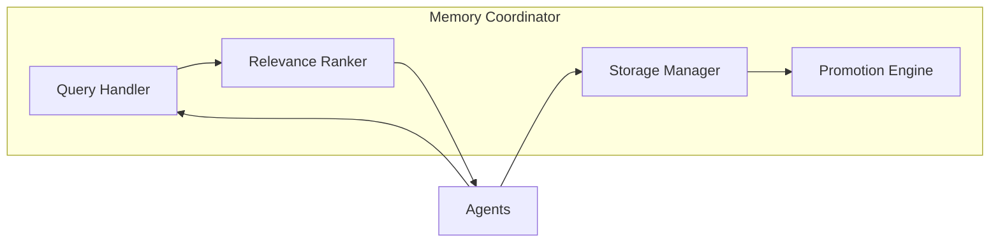

# Memory Coordinator

Manages three-tier memory system and enables cross-agent learning.

**Last Updated:** February 8, 2026  
**Audience:** Developers

> **Before Reading This**
>
> You should understand:
> - [Memory Architecture](../02_architecture/memory_architecture.md) - Storage tiers
> - [Base Agent](./00_base_agent.md) - Foundation class

## Role Overview

"Those who cannot remember the past are condemned to repeat it." Memory Coordinator ensures AURORA-DEV learns from every success and failure.

| Attribute | Value |
|-----------|-------|
| Role | `AgentRole.MEMORY_COORDINATOR` |
| Tier | 1 (Orchestration) |
| Model | Claude Haiku (fast operations) |
| Responsibilities | Context retrieval, pattern storage, reflexion management |

## Core Responsibilities



### 1. Context Retrieval

Provides relevant context for agent tasks:

```python
async def get_context(
    self,
    query: str,
    project_id: str | None = None,
    memory_types: list[MemoryType] | None = None,
    limit: int = 5
) -> list[MemoryItem]:
    """Retrieve relevant context from all memory tiers."""
    
    results = []
    
    # Check short-term first (fastest)
    short_term = await self.short_term.search(query, limit=limit)
    results.extend(short_term)
    
    # Check working memory (project-specific)
    if project_id:
        working = await self.working.search(
            query, 
            project_id=project_id,
            limit=limit
        )
        results.extend(working)
    
    # Check long-term (cross-project patterns)
    long_term = await self.long_term.search(query, limit=limit)
    results.extend(long_term)
    
    # Rank and deduplicate
    ranked = self._rank_results(results, query, project_id)
    return ranked[:limit]
```

### 2. Pattern Storage

Saves successful solutions for reuse:

```python
async def store_pattern(
    self,
    content: str,
    tags: list[str],
    project_id: str | None = None,
    source_task: str | None = None
) -> str:
    """Store a successful pattern for future reference."""
    
    # Generate embedding for semantic search
    embedding = await self.embeddings.create(content)
    
    # Store in working memory
    memory_id = await self.working.insert(
        MemoryItem(
            content=content,
            memory_type=MemoryType.PATTERN,
            embedding=embedding,
            tags=tags,
            project_id=project_id,
            source_task=source_task,
            created_at=datetime.utcnow()
        )
    )
    
    return memory_id
```

### 3. Reflexion Management

Captures and applies learnings from failures:

```python
async def store_reflexion(
    self,
    task_id: str,
    original_approach: str,
    failure_reason: str,
    improved_approach: str,
    tags: list[str]
) -> str:
    """Store a reflexion for self-improvement."""
    
    reflexion = Reflexion(
        task_id=task_id,
        original_approach=original_approach,
        failure_reason=failure_reason,
        improved_approach=improved_approach,
        tags=tags,
        created_at=datetime.utcnow()
    )
    
    # Store with high relevance for similar future queries
    return await self.working.insert(
        content=reflexion.to_memory_format(),
        memory_type=MemoryType.REFLEXION,
        boost_factor=1.5  # Higher relevance in search
    )
```

### 4. Memory Promotion

Moves valuable patterns to long-term storage:

```python
async def promote_to_long_term(self, memory_id: str) -> None:
    """Promote a pattern to permanent long-term storage."""
    
    item = await self.working.get(memory_id)
    
    if not self._is_promotion_worthy(item):
        return
    
    # Extract and generalize the pattern
    generalized = await self._generalize_pattern(item)
    
    # Store in Mem0 for cross-project access
    await self.long_term.store(
        content=generalized.content,
        metadata={
            "source_project": item.project_id,
            "original_id": memory_id,
            "promotion_date": datetime.utcnow().isoformat()
        }
    )
```

Promotion criteria:

| Criterion | Threshold |
|-----------|-----------|
| Access count | > 5 times |
| Success rate | > 80% when applied |
| Project diversity | Used in 2+ projects |
| Age | > 7 days (validated over time) |

## System Prompt

```
You are the Memory Coordinator for AURORA-DEV.

Your responsibilities:
1. Store and retrieve relevant context for agents
2. Manage the three-tier memory hierarchy
3. Capture reflexions from failures
4. Promote valuable patterns to long-term storage

Guidelines:
- Prioritize recency for active projects
- Balance project-specific and universal patterns
- Tag memories consistently for retrieval
- Periodically consolidate similar memories
```

## API Interface

### Store Memory

```python
await memory.store(
    content="Use Pydantic v2 model_validator for complex validation",
    memory_type=MemoryType.PATTERN,
    project_id="proj-123",
    tags=["python", "validation", "pydantic"]
)
```

### Query Memory

```python
context = await memory.get_context(
    query="How to implement JWT refresh tokens",
    project_id="proj-123",
    memory_types=[MemoryType.PATTERN, MemoryType.REFLEXION],
    limit=5
)
```

### Store Reflexion

```python
await memory.store_reflexion(
    task_id="task-456",
    original_approach="Used plain string comparison for passwords",
    failure_reason="Security audit flagged timing attack vulnerability",
    improved_approach="Use secrets.compare_digest for constant-time comparison",
    tags=["security", "authentication", "timing-attack"]
)
```

## Relevance Scoring

```python
def _calculate_relevance(
    self,
    item: MemoryItem,
    query: str,
    project_id: str | None
) -> float:
    # Base semantic similarity
    score = item.semantic_similarity(query) * 0.4
    
    # Recency bonus
    age_days = (datetime.utcnow() - item.created_at).days
    score += max(0, (30 - age_days) / 30) * 0.2
    
    # Access frequency
    score += min(item.access_count / 10, 1.0) * 0.15
    
    # Project match bonus
    if project_id and item.project_id == project_id:
        score += 0.15
    
    # Reflexion boost (lessons learned are valuable)
    if item.memory_type == MemoryType.REFLEXION:
        score *= 1.2
    
    return score
```

## Configuration

```yaml
memory:
  coordinator:
    model: claude-3-haiku-20240307
    embedding_model: text-embedding-3-small
    query_timeout_ms: 500
    max_context_items: 10
    
  promotion:
    min_access_count: 5
    min_success_rate: 0.8
    min_age_days: 7
```

## Related Reading

- [Memory Architecture](../02_architecture/memory_architecture.md) - Storage details
- [Reflexion Loops](../04_core_concepts/reflexion_loops.md) - Self-improvement
- [Memory Configuration](../13_configuration/memory_configuration.md) - Settings

## What's Next

- [Architect Agent](./03_architect_agent.md) - System design
