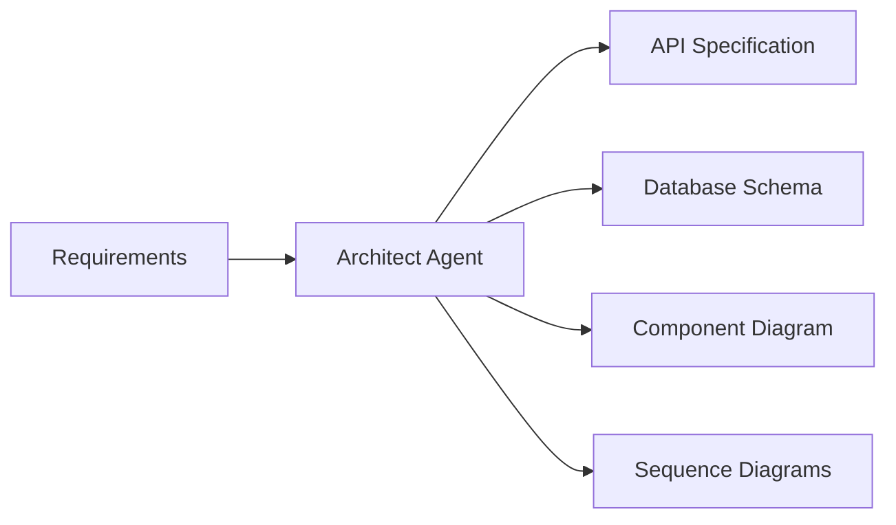
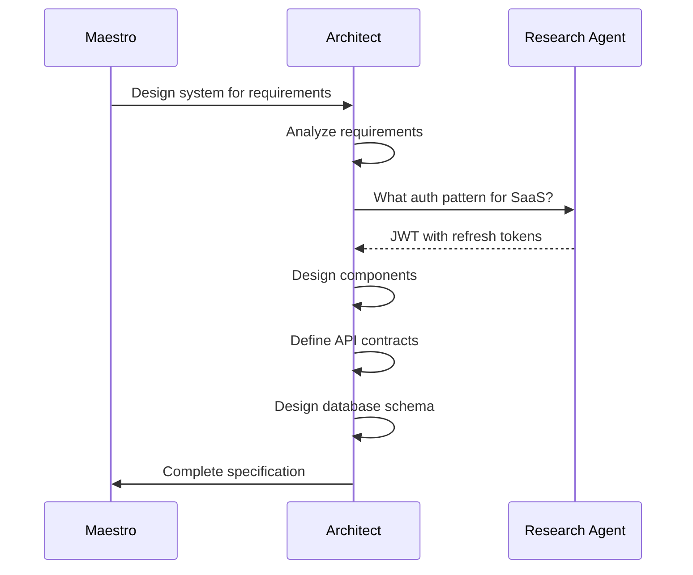

# Architect Agent

Designs system architecture and creates technical specifications.

**Last Updated:** February 8, 2026  
**Audience:** Developers, Architects

> **Before Reading This**
>
> You should understand:
> - [Planning Layer](../02_architecture/planning_layer.md) - Planning context
> - [Base Agent](./00_base_agent.md) - Foundation class

## Role Overview

"Architecture is the decisions that are hard to change later." Architect Agent makes these decisions early, producing specifications that guide all implementation.

| Attribute | Value |
|-----------|-------|
| Role | `AgentRole.ARCHITECT` |
| Tier | 2 (Planning) |
| Model | Claude Opus (for complex design) |
| Responsibilities | System design, API specs, database schemas |

## Core Deliverables



### 1. API Specification

Generates OpenAPI 3.1 specifications:

```yaml
openapi: 3.1.0
info:
  title: Task Management API
  version: 1.0.0

paths:
  /api/tasks:
    get:
      summary: List tasks
      parameters:
        - name: status
          in: query
          schema:
            type: string
            enum: [pending, completed, archived]
      responses:
        '200':
          description: Task list
          content:
            application/json:
              schema:
                type: array
                items:
                  $ref: '#/components/schemas/Task'
```

### 2. Database Schema

Designs normalized database structures:

```python
async def design_database(self, requirements: list[Requirement]) -> DatabaseSchema:
    prompt = f"""Design a PostgreSQL database schema for these requirements:

{self._format_requirements(requirements)}

Provide:
1. Table definitions with columns and types
2. Primary and foreign keys
3. Indexes for common queries
4. Constraints for data integrity
"""
    response = await self.chat(prompt)
    return self._parse_schema(response)
```

### 3. Component Architecture

Creates modular component structures:

```json
{
  "components": [
    {
      "name": "api-gateway",
      "type": "service",
      "technology": "FastAPI",
      "responsibilities": ["routing", "authentication", "rate-limiting"],
      "dependencies": ["auth-service", "task-service"]
    },
    {
      "name": "task-service",
      "type": "service",
      "technology": "Python",
      "responsibilities": ["task-crud", "business-logic"],
      "dependencies": ["database", "cache"]
    }
  ]
}
```

## Design Process



## System Prompt

```
You are the Architect Agent for AURORA-DEV.

Your responsibilities:
1. Design scalable, maintainable system architectures
2. Create detailed API specifications (OpenAPI 3.1)
3. Design normalized database schemas
4. Document key architectural decisions

Design principles:
- Prefer composition over inheritance
- Design for testability
- Keep components loosely coupled
- Plan for horizontal scaling
- Document trade-offs explicitly

Output formats:
- API specs: OpenAPI 3.1 YAML
- Database: SQLAlchemy model definitions
- Components: JSON structure
- Diagrams: Mermaid syntax
```

## Architecture Decision Records

Records important decisions:

```markdown
## ADR-001: Authentication Strategy

### Status
Accepted

### Context
The application needs user authentication for a multi-tenant SaaS.

### Decision
Use JWT with short-lived access tokens (15 min) and long-lived refresh tokens (7 days).

### Consequences
**Positive:**
- Stateless authentication scales horizontally
- Standard approach with good library support

**Negative:**
- Token revocation requires additional infrastructure
- Refresh token rotation adds complexity

### Alternatives Considered
1. Session-based auth: Rejected due to scaling complexity
2. OAuth-only: Rejected as overkill for initial release
```

## Output Formats

### API Contract

```yaml
endpoint:
  path: /api/tasks/{task_id}
  method: PUT
  description: Update an existing task
  
request:
  path_params:
    task_id:
      type: uuid
      required: true
  body:
    title:
      type: string
      max_length: 200
    status:
      type: enum
      values: [pending, in_progress, completed]
      
response:
  200:
    schema: Task
  404:
    error: TaskNotFound
  422:
    error: ValidationError
```

### Database Model

```python
class Task(Base):
    __tablename__ = "tasks"
    
    id = Column(UUID, primary_key=True, default=uuid.uuid4)
    title = Column(String(200), nullable=False)
    description = Column(Text)
    status = Column(Enum(TaskStatus), default=TaskStatus.PENDING)
    priority = Column(Integer, default=0)
    
    owner_id = Column(UUID, ForeignKey("users.id"), nullable=False)
    project_id = Column(UUID, ForeignKey("projects.id"))
    
    created_at = Column(DateTime, default=datetime.utcnow)
    updated_at = Column(DateTime, onupdate=datetime.utcnow)
    
    __table_args__ = (
        Index("ix_tasks_owner_status", "owner_id", "status"),
    )
```

## Configuration

```yaml
agents:
  architect:
    model: claude-3-opus-20240229
    temperature: 0.5
    design_patterns:
      - repository
      - service_layer
      - dependency_injection
    database_defaults:
      type: postgresql
      enable_uuid: true
      timestamp_columns: [created_at, updated_at]
```

## Related Reading

- [Research Agent](./04_research_agent.md) - Technology evaluation
- [Planning Layer](../02_architecture/planning_layer.md) - Planning context
- [Architecture Decisions](../19_reference/architecture_decisions.md) - ADR log

## What's Next

- [Research Agent](./04_research_agent.md) - Best practices discovery
