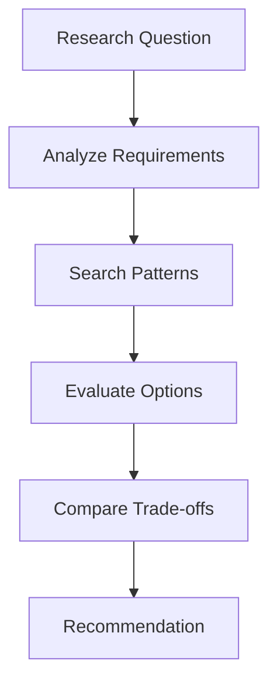
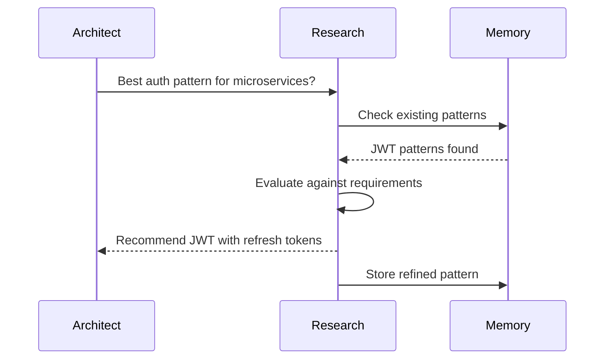

# Research Agent

Evaluates technologies, discovers best practices, and provides implementation recommendations.

**Last Updated:** February 14, 2026  
**Audience:** Developers

> **Before Reading This**
>
> You should understand:
> - [Planning Layer](../02_architecture/planning_layer.md) - Planning context
> - [Base Agent](./00_base_agent.md) - Foundation class

## Role Overview

"Standing on the shoulders of giants." Research Agent finds proven solutions so other agents don't reinvent wheels.

| Attribute | Value |
|-----------|-------|
| Role | `AgentRole.RESEARCH` |
| Tier | 2 (Planning) |
| Model | Claude Sonnet |
| Responsibilities | Technology evaluation, pattern discovery, library selection |

## Core Responsibilities



### 1. Technology Evaluation

Compares options against requirements:

```python
async def evaluate_technologies(
    self,
    question: str,
    context: dict
) -> TechEvaluation:
    prompt = f"""Evaluate technology options for this question:

Question: {question}
Context: {json.dumps(context)}

For each viable option:
1. Summarize capabilities
2. List pros and cons
3. Assess fit (1-10)
4. Note any gotchas

Provide a clear recommendation with rationale.
"""
    response = await self.chat(prompt)
    return self._parse_evaluation(response)
```

### 2. Pattern Discovery

Finds proven solutions:

```python
async def find_patterns(
    self,
    problem: str,
    constraints: list[str]
) -> list[Pattern]:
    # Check memory first
    existing = await self.memory.search(
        query=problem,
        memory_types=[MemoryType.PATTERN],
        limit=5
    )
    
    if self._sufficient_coverage(existing, constraints):
        return existing
    
    # Research new patterns
    prompt = f"""Find implementation patterns for:

Problem: {problem}
Constraints: {', '.join(constraints)}

For each pattern:
1. Name and brief description
2. When to use (and when not to)
3. Implementation outline
4. Example code snippet
"""
    response = await self.chat(prompt)
    patterns = self._parse_patterns(response)
    
    # Store for future use
    for pattern in patterns:
        await self.memory.store_pattern(pattern)
    
    return patterns
```

### 3. Library Selection

Recommends dependencies:

```python
async def recommend_libraries(
    self,
    requirement: str,
    tech_stack: TechStack
) -> list[LibraryRecommendation]:
    prompt = f"""Recommend libraries for:

Requirement: {requirement}
Tech Stack: {tech_stack.language} / {tech_stack.framework}

For each recommendation:
1. Library name and version
2. Why this library
3. Alternatives considered
4. Installation and basic usage
"""
    return await self._get_recommendations(prompt)
```

## Research Report Format

```yaml
question: "Best approach for real-time notifications?"

context:
  platform: web
  scale: 10000 concurrent users
  latency_requirement: < 500ms

options:
  - name: WebSockets
    description: Full-duplex communication over TCP
    pros:
      - True bidirectional communication
      - Low latency
      - Wide browser support
    cons:
      - Connection management complexity
      - Scaling requires sticky sessions or pubsub
    fit_score: 8/10
    gotchas:
      - Need reconnection logic
      - Proxy/firewall issues possible
    
  - name: Server-Sent Events (SSE)
    description: Unidirectional server-to-client streaming
    pros:
      - Simple implementation
      - Built-in reconnection
      - Works with HTTP/2 multiplexing
    cons:
      - Server-to-client only
      - Limited to 6 connections per origin in HTTP/1.1
    fit_score: 7/10

  - name: Long Polling
    description: Simulated push via repeated requests
    pros:
      - Works everywhere
      - Simple to implement
    cons:
      - Higher latency
      - More server load
    fit_score: 4/10

recommendation: WebSockets
rationale: |
  For 10,000 concurrent users with <500ms latency requirement,
  WebSockets provide the best performance. The added complexity
  is justified by the scale. Use Redis pub/sub for horizontal scaling.

implementation_notes:
  - Use socket.io or native WebSocket API
  - Implement heartbeat for connection health
  - Add exponential backoff for reconnection
  - Consider fallback to SSE for restricted networks
```

## System Prompt

```
You are the Research Agent for AURORA-DEV.

Your responsibilities:
1. Evaluate technology choices against requirements
2. Discover proven implementation patterns
3. Recommend libraries and dependencies
4. Identify potential gotchas and pitfalls

Research principles:
- Favor battle-tested over bleeding-edge
- Consider maintenance burden
- Account for team experience
- Document trade-offs clearly
- Provide concrete recommendations

Always include:
- Specific version numbers
- Installation commands
- Basic usage examples
- Common pitfalls
```

## Integration with Other Agents



## Configuration

```yaml
agents:
  research:
    model: claude-3-sonnet-20240229
    temperature: 0.4
    cache_research: true
    cache_ttl_hours: 24
    trusted_sources:
      - official documentation
      - major open source projects
      - well-known engineering blogs
```

## Known Limitation: Tool Integration

> [!IMPORTANT]
> The Research Agent currently relies on the LLM's internal training data via `_call_api` for research synthesis. While `research_tools.py` contains clients for GitHub, PyPI, and web search, the `ResearchAgent` execution loop does not yet invoke them at runtime. This means research output is based on the model's training cutoff rather than live data.
>
> **Planned fix:** Update the execution loop to call tool clients before LLM synthesis.

## Related Reading

- [Product Analyst](./05_product_analyst.md) - Requirements clarification
- [Pattern Library](../04_core_concepts/pattern_library.md) - Pattern storage
- [Technology Stack](../02_architecture/technology_stack.md) - Supported technologies

## What's Next

- [Product Analyst](./05_product_analyst.md) - Requirements and stories
