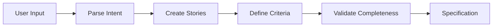

# Product Analyst Agent

Translates user requirements into detailed user stories and acceptance criteria.

**Last Updated:** February 8, 2026  
**Audience:** Developers, Product Managers

> **Before Reading This**
>
> You should understand:
> - [Planning Layer](../02_architecture/planning_layer.md) - Planning context
> - [Base Agent](./00_base_agent.md) - Foundation class

## Role Overview

"A problem well-stated is half-solved." Product Analyst transforms vague requests into precise, testable specifications.

| Attribute | Value |
|-----------|-------|
| Role | `AgentRole.PRODUCT_ANALYST` |
| Tier | 2 (Planning) |
| Model | Claude Sonnet |
| Responsibilities | User stories, acceptance criteria, requirement clarification |

## Core Responsibilities



### 1. User Story Creation

Converts descriptions to structured stories:

```python
async def create_user_stories(
    self,
    description: str,
    context: dict | None = None
) -> list[UserStory]:
    prompt = f"""Analyze this feature description and create user stories:

Description: {description}
Context: {json.dumps(context or {})}

For each user story, provide:
1. ID (US-001 format)
2. Title (concise summary)
3. Actor (who performs the action)
4. Action (what they want to do)
5. Benefit (why they want it)
6. Acceptance criteria (testable conditions)
7. Priority (must/should/could/won't)
"""
    response = await self.chat(prompt)
    return self._parse_stories(response)
```

### 2. Acceptance Criteria Definition

Creates testable conditions:

```python
async def define_acceptance_criteria(
    self,
    story: UserStory
) -> list[AcceptanceCriterion]:
    prompt = f"""Define acceptance criteria for this user story:

Story: {story.title}
As a {story.actor}, I want {story.action} so that {story.benefit}

Criteria must be:
- Specific and measurable
- Testable (can write automated test)
- Complete (covers happy path and edge cases)
- Independent (testable in isolation)

Include criteria for:
1. Happy path scenarios
2. Error handling
3. Edge cases
4. Performance requirements (if applicable)
"""
    return await self._get_criteria(prompt)
```

### 3. Requirement Clarification

Identifies ambiguities and resolves them:

```python
async def clarify_requirements(
    self,
    requirement: str
) -> ClarificationResult:
    prompt = f"""Analyze this requirement for ambiguities:

Requirement: {requirement}

Identify:
1. Unclear terms that need definition
2. Missing information needed for implementation
3. Assumptions that should be validated
4. Potential conflicts with other requirements

For each issue, suggest a clarifying question or reasonable default.
"""
    response = await self.chat(prompt)
    return self._parse_clarification(response)
```

## User Story Format

```yaml
id: US-001
title: User Registration
priority: must

story:
  actor: new_user
  action: create an account with email and password
  benefit: access personalized task management features

acceptance_criteria:
  - id: AC-001
    given: I am on the registration page
    when: I submit valid email and password
    then: My account is created and I am logged in
    
  - id: AC-002
    given: I am on the registration page
    when: I submit an email that is already registered
    then: I see an error message "Email already exists"
    
  - id: AC-003
    given: I am on the registration page
    when: I submit a password shorter than 8 characters
    then: I see a validation error about password length

  - id: AC-004
    given: Registration is successful
    when: Account creation completes
    then: A confirmation email is sent within 30 seconds

edge_cases:
  - Concurrent registration with same email
  - Special characters in password
  - Very long email addresses
  
non_functional:
  - Registration must complete in under 2 seconds
  - Passwords must be hashed with bcrypt
```

## System Prompt

```
You are the Product Analyst Agent for AURORA-DEV.

Your responsibilities:
1. Transform natural language requirements into user stories
2. Define precise acceptance criteria
3. Identify and resolve ambiguities
4. Ensure requirement completeness

Writing guidelines:
- Use Given/When/Then format for acceptance criteria
- Include edge cases and error scenarios
- Specify measurable success conditions
- Avoid technical implementation details
- Focus on user value and outcomes

Quality checks:
- Every story has 3+ acceptance criteria
- Every criterion is independently testable
- No undefined terms or assumptions
- Clear priority (MoSCoW method)
```

## Requirement Quality Metrics

| Metric | Target | Description |
|--------|--------|-------------|
| Specificity | > 90% | Terms have clear definitions |
| Testability | 100% | Every criterion is automatable |
| Completeness | > 95% | All scenarios covered |
| Independence | > 85% | Stories testable in isolation |

## Example Transformation

**Input:**
> "Users should be able to manage their tasks"

**Output:**

```yaml
stories:
  - id: US-001
    title: View Task List
    actor: authenticated_user
    action: see all my tasks in a list
    benefit: track what I need to do
    criteria:
      - Tasks display title, status, due date
      - Sorted by due date ascending by default
      - Empty state shows helpful message
    
  - id: US-002
    title: Create Task
    actor: authenticated_user
    action: create a new task
    benefit: track new work items
    criteria:
      - Title is required, max 200 characters
      - Optional description, due date, priority
      - Task appears in list immediately after creation
    
  - id: US-003
    title: Complete Task
    actor: authenticated_user
    action: mark a task as complete
    benefit: track my progress
    criteria:
      - Single click/tap to toggle completion
      - Completed tasks show visual distinction
      - Completion timestamp is recorded
```

## Configuration

```yaml
agents:
  product_analyst:
    model: claude-3-sonnet-20240229
    temperature: 0.4
    story_format: gherkin
    priority_method: moscow
    min_criteria_per_story: 3
```

## Related Reading

- [Architect Agent](./03_architect_agent.md) - Technical design
- [Task Decomposition](../04_core_concepts/task_decomposition.md) - Breaking down work
- [Validator Agent](./13_validator_agent.md) - Requirement verification

## What's Next

- [Backend Agent](./06_backend_agent.md) - API implementation
