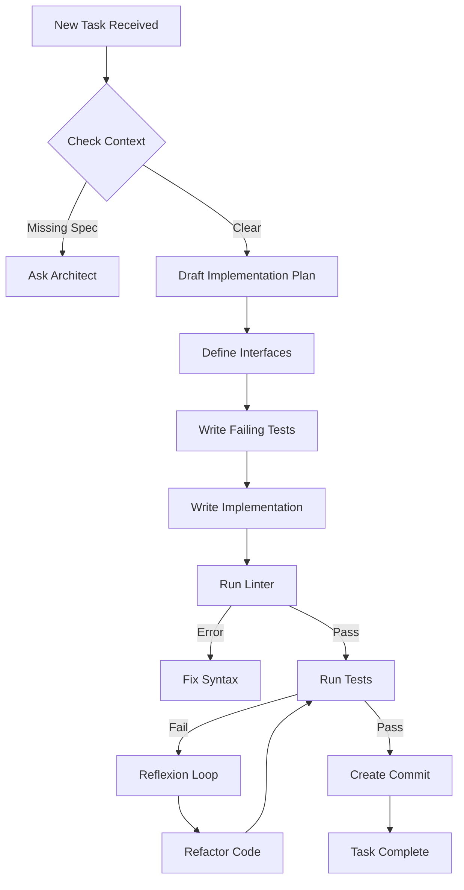

# Backend Agent

The engine room of the application.

**Last Updated:** February 8, 2026
**Audience:** Developers, Architects

> **Before Reading This**
>
> You should understand:
> - [Implementation Layer](../02_architecture/implementation_layer.md)
> - [Coding Standards](../06_developer_guides/coding_standards.md)
> - [Base Agent](./00_base_agent.md)

## The Heavy Lifter

If the Architect is the dreamer, the Backend Agent is the builder. It doesn't care about "user delight" or "visual hierarchy." It cares about latency, concurrency, and data integrity.

This agent is responsible for translating high-level technical specifications into working, tested, production-grade code. It lives in the `src/backend` directory and speaks Python (FastAPI/Django) or TypeScript (Node.js) fluently.

Unlike a junior developer who might copy-paste from StackOverflow, the Backend Agent understands the *implications* of its code. It knows that a synchronous database call inside an async loop will kill performance. It knows that `SELECT *` is a crime.

"Civilization advances by extending the number of important operations which we can perform without thinking about them." — Alfred North Whitehead. The Backend Agent handles the operations so you don't have to.

## Core Responsibilities

### 1. API Implementation
It generates RESTful endpoints or GraphQL resolvers. It adheres strictly to the OpenAPI specification provided into its context.
- **Input:** "Create a `POST /users` endpoint."
- **Output:** A Router function, a Pydantic model for validation, and a Service layer function for logic.

### 2. Business Logic
This is where the complexity lives. The agent implements the core algorithms—calculating shipping costs, processing payments, or ranking search results. It isolates this logic from the transport layer (HTTP) to keep it testable.

### 3. Unit Testing
The definition of "Done" for this agent includes passing unit tests. It generates the tests *before* or *simultaneously* with the code (TDD-lite).

## Logic Flow

Here is how the Backend Agent approaches a new feature request.



## Tools and Configuration

The Backend Agent is equipped with a specific set of tools designed for server-side manipulation.

```yaml
# aurora.yaml configuration
agents:
  backend:
    model: claude-3-sonnet-20240229
    temperature: 0.2  # Low creativity, high precision
    tools:
      - read_file
      - write_file
      - run_pytest    # Specialized test runner
      - run_linter    # ruff/black
    context_window:
      include:
        - "src/backend/core/**/*.py"
        - "src/backend/api/**/*.py"
      exclude:
        - "**/__pycache__"
        - "frontend/**"
```

You'll notice we explicitly exclude the frontend code. This reduces token usage and prevents the agent from getting confused by similarly named files in the UI layer.

## Best Practices

### "Service Layer Pattern"
The agent is instructed (via system prompt) to never put business logic in the API route handler.
**Bad:**
```python
@app.post("/order")
def create_order(order: Order):
    # Logic inside controller
    db.add(order)
    email.send(...)
```
**Good:**
```python
@app.post("/order")
def create_order(order: Order):
    OrderService.process(order)
```

### "Defensive Coding"
The agent assumes input is malicious. It adds validation checks even if the frontend says it validated the data. In the age of AI injection attacks, trust nothing.

## Common Failure Modes

### 1. Circular Imports
Python hates circular imports. The agent sometimes introduces them when splitting code into too many files.
*Fix:* The `Reflexion Loop` usually catches `ImportError` and refactors the code to use dependency injection or move the import inside the function.

### 2. Hallucinated Libraries
"I'll just use `fastapi-users-db-sqlalchemy-async-magic`."
*Fix:* We restrict the agent to a "Bill of Materials." If it tries to import a package not in `pyproject.toml`, the environment blocks the edit.

## Related Reading

- [Implementation Layer](../02_architecture/implementation_layer.md)
- [Coding Standards](../06_developer_guides/coding_standards.md)
- [Test Engineer](./10_test_engineer.md) - The agent's best friend (and worst critic).

## What's Next

- [Frontend Agent](./07_frontend_agent.md)
