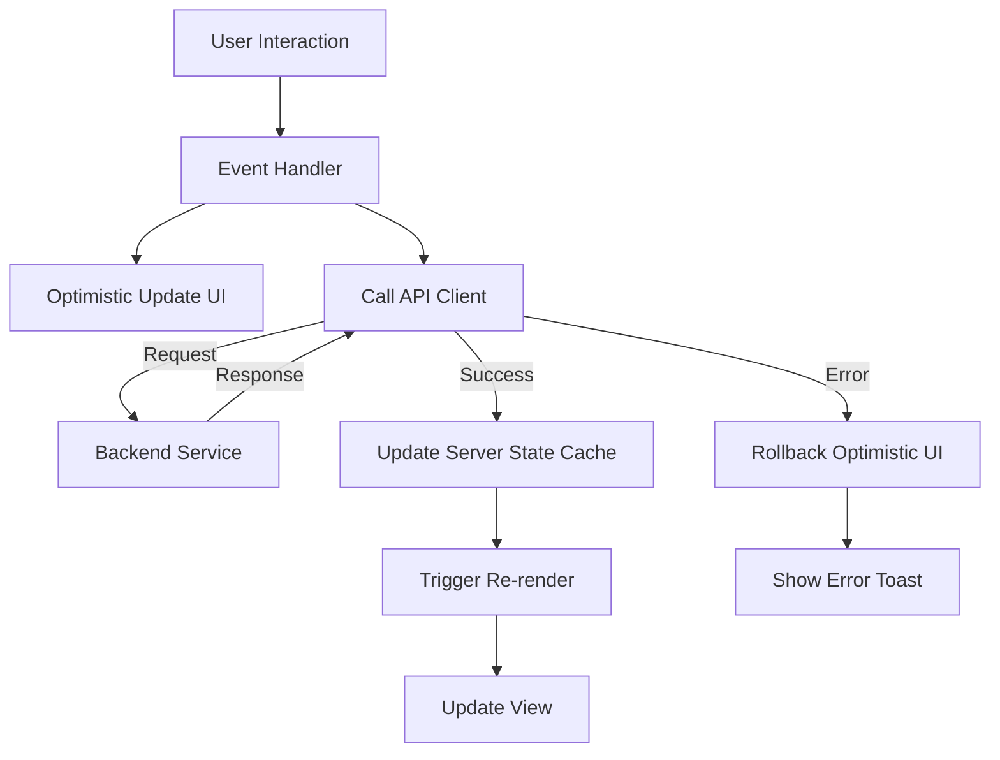

# Frontend Agent

The pixel-perfect implementation of the user experience.

**Last Updated:** February 8, 2026
**Audience:** Developers, Designers

> **Before Reading This**
>
> You should understand:
> - [Implementation Layer](../02_architecture/implementation_layer.md)
> - [Component Library](../04_core_concepts/pattern_library.md)
> - [Base Agent](./00_base_agent.md)

## The Face of the Machine

The backend can be perfect, but if the button doesn't click, the product is broken. The Frontend Agent handles the messy, subjective, state-filled world of the browser.

It primarily works with React (Next.js/Vite), TypeScript, and Tailwind CSS. Unlike the Backend Agent, which deals in absolute logic, the Frontend Agent deals in user perception. "Is this loading spinner annoying?" "Does this layout break on mobile?"

It takes the visual requirements from the `Product Analyst` (often described as "Make it look like stripe.com but blue") and converts them into semantic HTML and responsive CSS.

"Design is not just what it looks like and feels like. Design is how it works." — Steve Jobs. This agent embodies that philosophy.

## Core Responsibilities

### 1. Component Architecture
It doesn't just write one giant `App.tsx`. It breaks interfaces down into atomic components: `Button`, `Card`, `Modal`. It follows the "Container/Presentational" pattern separates data fetching from rendering.

### 2. State Management
This is the hardest part of frontend dev. The agent decides when to use local state (`useState`), global state (`Zustand/Redux`), or server state (`TanStack Query`). It knows that putting form input into Redux is usually a bad idea.

### 3. Integration
It connects the UI to the Backend APIs. It generates typed hooks (e.g., `useCreateUser`) based on the OpenAPI spec provided by the Backend Agent. It handles the loading states, error states, and "optimistic updates" that make an app feel snappy.

## Component Flow

Here is how the agent structures a modern React application data flow.



## Tools and Configuration

The Frontend Agent needs visibility into the design system and the API contract.

```yaml
# aurora.yaml
agents:
  frontend:
    model: claude-3-sonnet-20240229
    temperature: 0.4  # Slightly higher for creativity in UI logic
    tools:
      - read_file
      - write_file
      - run_browser_test # Headless chrome
    context_window:
      include:
        - "src/frontend/src/components/**/*.tsx"
        - "src/frontend/tailwind.config.ts"
      exclude:
        - "src/backend/**"
```

## Best Practices

### "Mobile First"
The agent writes CSS for mobile screens first, then adds breakpoints (`md:`, `lg:`) for larger screens. This prevents the "squished desktop site" syndrome on phones.

### "Accessibility (a11y) by Default"
The agent adds `aria-labels`, `role` attributes, and ensures keyboard navigability. If it creates a custom dropdown, it ensures you can close it with the `Escape` key. It treats a11y as a requirement, not a feature.

### "Defensive Rendering"
`{user.name}` is dangerous. The user might be null. The agent writes `{user?.name}` or `{user ? user.name : 'Guest'}`. It assumes data might be missing or malformed during loading states.

## Common Failure Modes

### 1. The "useEffect" Loop
React's dependency array is a common trap. Agents sometimes create infinite render loops by putting an object in the dependency array that gets recreated on every render.
*Fix:* The `Code Reviewer` looks specifically for unstable object references in `useEffect`.

### 2. Div Soup
Nesting 20 `<div>`s to center a button.
*Fix:* The agent is prompted to use Flexbox and Grid layout utilities instead of relying on deep nesting.

## Related Reading

- [Implementation Layer](../02_architecture/implementation_layer.md)
- [Backend Agent](./06_backend_agent.md) - The data provider
- [Design Systems](../19_reference/resource_links.md)

## What's Next

- [Database Agent](./08_database_agent.md)
