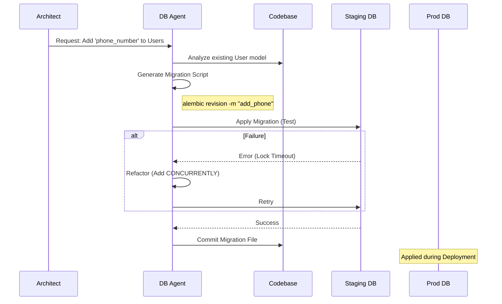

# Database Agent

The custodian of truth and persistence.

**Last Updated:** February 8, 2026
**Audience:** DBAs, Developers

> **Before Reading This**
>
> You should understand:
> - [Database Optimization](../16_performance/database_optimization.md)
> - [Database Schema](../21_diagrams/databases/entity_relationship.mmd)
> - [Base Agent](./00_base_agent.md)

## The Keeper of State

You can redeploy the backend. You can rewrite the frontend. But if you lose the database, you lose the business. The Database Agent treats data with reverence.

It is responsible for designing schemas, writing migrations, and optimizing queries. It speaks SQL (PostgreSQL dialect) better than it speaks English. It understands normalization forms but knows when to break them for performance.

It doesn't just "add a column." It checks if that column usage will require an index. It checks if locking that table will cause downtime during the migration. It thinks about the physical storage of bytes on the disk.

"Data matures like wine; applications mature like fish." — James Governor. This agent ensures the wine cellar is temperature-controlled.

## Core Responsibilities

### 1. Schema Design
It translates object models (from the Backend Agent) into relational tables. It decides on data types (`UUID` vs `Serial`, `JSONB` vs `Text`). It enforces referential integrity with Foreign Keys.

### 2. Migration Management
It uses tools like Alembic or Prisma to version-control the database schema. It generates the `up` and `down` scripts. It ensures that migrations are idempotent—running them twice won't break anything.

### 3. Query Optimization
It reviews the SQL generated by ORMs. If it sees a generic `SELECT *` or an N+1 query problem, it intervenes. It suggests indexes based on query patterns.

## Migration Workflow

Handling database changes safely is a complex dance.



## Tools and Configuration

The Database Agent requires direct access to the schema definition files and a test database instance.

```yaml
# aurora.yaml
agents:
  database:
    model: claude-3-sonnet-20240229
    temperature: 0.1  # Extremely low. Formatting matters.
    tools:
      - read_file
      - write_file
      - run_migration   # alembic upgrade head
      - explain_query   # EXPLAIN ANALYZE ...
    context_window:
      include:
        - "src/backend/app/db/models/*.py"
        - "src/backend/alembic/versions/*.py"
```

## Best Practices

### "Foreign Keys Everywhere"
The agent enforces referential integrity at the database level, not the app level. The app *will* have bugs. The database constraints are the final line of defense against orphaned records.

### "Index Responsibly"
Indexes speed up reads but slow down writes. The agent doesn't just index every column. It looks for columns used in `WHERE`, `JOIN`, and `ORDER BY` clauses.

### "JSONB for Flexibility, Columns for Speed"
It knows when to use a NoSQL-style JSON column (e.g., for user settings) and when to use strict columns (e.g., for financial transactions).

## Common Failure Modes

### 1. The Locking Migration
Adding a column with a `DEFAULT` value to a table with 10M rows can lock the table for minutes. 
*Fix:* The agent splits this into three steps: Add nullable column -> Backfill data in background -> Add Not Null constraint.

### 2. Enum Envy
Using Database Enums makes changing valid values hard later.
*Fix:* The agent often prefers `VARCHAR` with application-level validation or a separate lookup table for flexibility.

## Related Reading

- [Database Migrations](../17_migration/database_migrations.md)
- [Database Configuration](../13_configuration/database_configuration.md)
- [Backend Agent](./06_backend_agent.md)

## What's Next

- [Integration Agent](./09_integration_agent.md)
