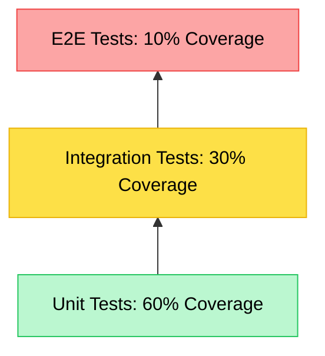

# Test Engineer Agent

The first line of defense against bugs.

**Last Updated:** February 8, 2026
**Audience:** QA Engineers, Developers

> **Before Reading This**
>
> You should understand:
> - [Test Template](../22_templates/test_template.md)
> - [Quality Gates](../04_core_concepts/quality_gates.md)
> - [Base Agent](./00_base_agent.md)

## The Skeptic

If the Backend Agent is the optimist ("This code will work!"), the Test Engineer is the professional pessimist. It assumes everything is broken until proven otherwise.

This agent is responsible for the comprehensive verification of the software. It writes Unit Tests (PyTest/Jest), Integration Tests, and End-to-End (E2E) tests with Playwright.

It doesn't just check "Happy Path" scenarios (user logs in successfully). It checks the "Sad Path" (user enters emoji as password, database is down, network is slow). It tries to break the application so your users don't have to.

"Testing allows us to refactor with confidence." — Martin Fowler. This agent provides that confidence.

## Core Responsibilities

### 1. Test Case Generation
It reads the requirements and generates a Matrix of scenarios:
- Boundary Values (0, -1, MAX_INT)
- Null inputs
- Concurrency race conditions

### 2. E2E Automation
It scripts user journeys. "User types 'buy', clicks checkout, sees confirmation." It handles the tricky parts of browser automation like waiting for elements to appear and handling popups.

### 3. Regression Testing
When a new feature lands, the Test Engineer re-runs the entire suite to ensure no existing functionality was broken (Regression).

## Testing Hierarchy

The agent follows the Testing Pyramid strictly.



## Tools and Configuration

The agent needs to run commands and inspect logs.

```yaml
# aurora.yaml
agents:
  test_engineer:
    model: claude-3-opus-20240229  # High reasoning for edge cases
    temperature: 0.1
    tools:
      - run_test_suite
      - take_screenshot
      - read_file
      - write_file
    context_window:
      include:
        - "tests/**/*.py"
        - "tests/**/*.ts"
        - "src/**/*.py"  # Needs source to know what to test
```

## Best Practices

### "AAA Pattern"
Arrange, Act, Assert. Every test follows this structure to be readable.
```python
def test_login():
    # Arrange
    user = create_user("test")
    # Act
    resp = login(user)
    # Assert
    assert resp.status_code == 200
```

### "Mocks vs Fakes"
The agent prefers Fakes (lightweight implementations) over Mocks (expectation recording) where possible, as Fakes are less brittle to implementation changes.

### "Flake Detection"
If a test fails 1 out of 10 times, the agent marks it as `FLAKY` and investigates. Is it a timing issue? A race condition?

## Common Failure Modes

### 1. The Sleepy Test
"Wait 5 seconds for button."
*Fix:* The agent uses `page.wait_for_selector()` instead of hard sleeps. It waits for the *state* to change, not for the clock to tick.

### 2. The Global State Leak
One test changes a global variable, breaking the next 50 tests.
*Fix:* The agent ensures every test runs in a transaction that rolls back at the end, or uses fresh fixtures for every run.

## Related Reading

- [Test Template](../22_templates/test_template.md)
- [Quality Gates](../04_core_concepts/quality_gates.md)

## What's Next

- [Security Auditor](./11_security_auditor.md)
