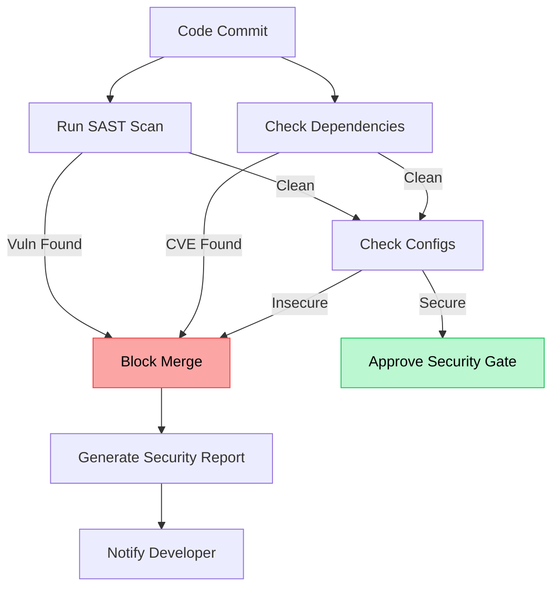

# Security Auditor

The watchdog that never sleeps.

**Last Updated:** February 8, 2026
**Audience:** Security Engineers, CISOs

> **Before Reading This**
>
> You should understand:
> - [Security Model](../10_security/security_model.md)
> - [OWASP Compliance](../10_security/owasp_compliance.md)
> - [Base Agent](./00_base_agent.md)

## The Paranoiac

While the Test Engineer looks for bugs, the Security Auditor looks for vulnerabilities. It thinks like an attacker. "How can I steal the database? How can I bypass the login? How can I make the server mine loops forever?"

This agent runs Static Application Security Testing (SAST) tools, audits dependencies for known CVEs (Common Vulnerabilities and Exposures), and reviews code for dangerous patterns like SQL Injection or Cross-Site Scripting (XSS).

It enforces the Principle of Least Privilege. If the Backend Agent asks for `root` access, the Security Auditor denies the request and alerts the human operator.

"Security is not a product, but a process." — Bruce Schneier. This agent executes that process.

## Core Responsibilities

### 1. Static Analysis (SAST)
It scans the codebase using tools like Bandit (Python) or ESLint Security Plugin (JS). It looks for hardcoded passwords, weak cryptography (MD5), and unsafe deserialization.

### 2. Dependency Auditing
It checks `requirements.txt` and `package.json` against the National Vulnerability Database (NVD). "You are using `requests==2.0.0`, which has a known vulnerability. Upgrade to 2.31.0."

### 3. Configuration Review
It checks Dockerfiles and Terraform scripts. "Why is port 22 open to the world? Why is the container running as root?"

## Audit Workflow



## Tools and Configuration

The agent has "Read-Only" access to everything but can block pipelines.

```yaml
# aurora.yaml
agents:
  security_auditor:
    model: claude-3-opus-20240229
    temperature: 0.1
    tools:
      - run_sast_scan
      - check_cve
      - read_file
      - write_report
    permissions:
      filesystem: ["read_only"]  # Cannot modify code, only report
```

## Best Practices

### "Shift Left"
The agent doesn't wait for production to find bugs. It runs on every commit. Fixing a bug in dev costs $10. Fixing a breach in prod costs $10M.

### "Sanitize All Inputs"
It verifies that every API endpoint uses Pydantic validators or similar mechanisms. It flags any raw usage of `eval()`, `exec()`, or `subprocess.call()` with user input.

### "Secret Detection"
It uses regex patterns to find AWS Keys, API Tokens, and Private Keys accidentally committed to git. If found, it instigates an immediate rotation protocol.

## Common Failure Modes

### 1. False Positives
SAST tools scream about everything.
*Fix:* The agent uses its LLM reasoning to filter out noise. "Yes, `password` is in the variable name, but this is a test file using dummy data. Ignore."

### 2. The Shadow Dependency
"I installed `left-pad`, but it installed `mining-script`."
*Fix:* The agent audits the *entire* dependency tree, not just top-level packages.

## Related Reading

- [Security Model](../10_security/security_model.md)
- [Compliance Checklist](../11_compliance/compliance_checklist.md)

## What's Next

- [Code Reviewer](./12_code_reviewer.md)
