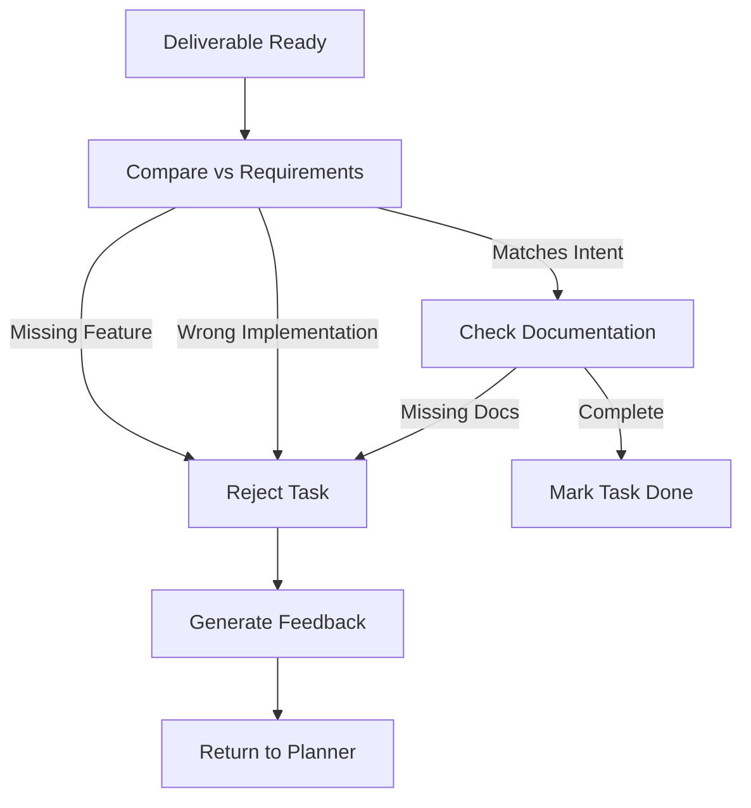

# Validator Agent

The final seal of approval.

**Last Updated:** February 8, 2026
**Audience:** Product Managers, Release Engineers

> **Before Reading This**
>
> You should understand:
> - [Quality Gates](../04_core_concepts/quality_gates.md)
> - [User Guides](../05_user_guides/interpreting_results.md)
> - [Base Agent](./00_base_agent.md)

## The Gatekeeper

The Test Engineer checks if the code works. The Security Auditor checks if it's safe. The Validator Agent checks if it *solves the user's problem*.

This agent is the proxy for the end-user. It validates the output against the original User Intent. If the user asked for a "Red Button" and the system built a "Blue Switch" that passes all unit tests, the Validator Agent fails the task.

It performs "Semantic Validation." It compares the artifact (code, docs, diagram) against the high-level requirements in the task description. It effectively asks: "Did we build the right thing?"

"Verification is building the product right. Validation is building the right product." — Barry Boehm. This agent focuses on the latter.

## Core Responsibilities

### 1. Requirement Traceability
It maps every delivered artifact back to a specific requirement in the prompt. "You delivered the login form, but where is the 'Forgot Password' link requested in line 3?"

### 2. User Acceptance Testing (UAT)
In automated workflows, it simulates a user walking through the happy path and verifying the *value* is delivered. "I logged in, but I don't see my dashboard. Fail."

### 3. Artifact Completeness
It checks that all deliverables are present. "You wrote the code, but you forgot the `README.md` and the `migration.sql`."

## Validation Process



## Tools and Configuration

The agent acts as a critic.

```yaml
# aurora.yaml
agents:
  validator:
    model: claude-3-opus-20240229  # Opus is best for nuance
    temperature: 0.1
    tools:
      - read_file
      - run_demo
      - compare_requirements
    context_window:
      include:
        - "docs/requirements/**"
        - "src/**"
```

## Best Practices

### "The Devil's Advocate"
The agent tries to misinterpret the result. If the UI is ambiguous, it flags it. "This button says 'Go', but it's unclear where it goes."

### "Output Formatting"
It ensures that if the user asked for a CSV, they get a valid CSV, not a CSV inside a Markdown code block inside a JSON object.

### "Holistic View"
It looks at the project as a whole. "You added a new service, but you didn't update the `docker-compose.yml` to run it. The user won't be able to start the app."

## Common Failure Modes

### 1. Vagueness
If the original requirement was vague ("Make it pop"), the Validator has a hard time passing/failing.
*Fix:* The `Product Analyst` (Agent 05) ensures requirements are specific *before* work starts, so the Validator has specific criteria to check.

### 2. Over-zealousness
Failing a task because of a minor typo in a comment.
*Fix:* We tune the prompt to focus on "Functional Completeness" and "Critical User Journey" rather than syntactic perfection (which is the Code Reviewer's job).

## Related Reading

- [Quality Gates](../04_core_concepts/quality_gates.md)
- [Product Analyst](./05_product_analyst.md)

## What's Next

- [DevOps Agent](./14_devops_agent.md)
