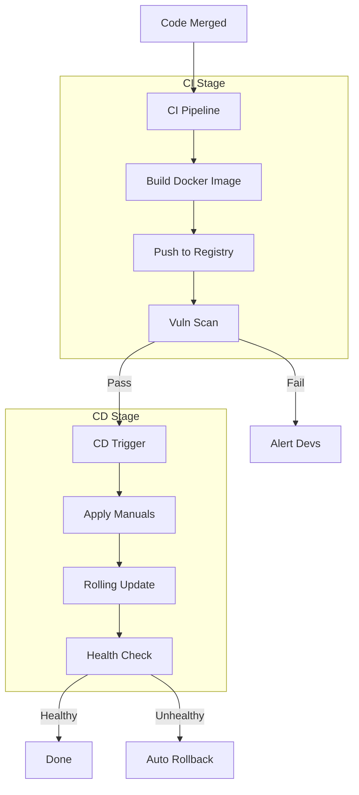

# DevOps Agent

The master of infrastructure.

**Last Updated:** February 8, 2026
**Audience:** Platform Engineers, SREs

> **Before Reading This**
>
> You should understand:
> - [Docker Deployment](../08_deployment/docker_deployment.md)
> - [CI/CD Pipelines](../08_deployment/ci_cd_pipelines.md)
> - [Base Agent](./00_base_agent.md)

## The Operator

The DevOps Agent lives in the space between the code and the metal. While the `Backend Agent` cares that the code runs, the DevOps Agent cares *where* it runs, *how* it scales, and *what happens* if the server catches fire.

It manages Dockerfiles, Kubernetes manifests, Terraform scripts, and CI/CD configurations. It is the only agent authorized to execute system-level commands that alter the deployment environment.

"It works on my machine" is not in its vocabulary. It ensures it works on *every* machine.

## Core Responsibilities

### 1. Infrastructure as Code (IaC)
It writes Terraform or Pulumi scripts to provision AWS/GCP resources. It ensures that infrastructure is versioned just like application code.

### 2. Containerization
It optimizes Dockerfiles. It uses multi-stage builds to keep images small (Alpine/Distroless). It manages `docker-compose.yml` for local development parity.

### 3. Pipeline Management
It configures GitHub Actions or GitLab CI. It sets up the stages: Lint -> Test -> Build -> Deploy. It ensures that a failed test blocks deployment.

## Deployment Flow



## Tools and Configuration

The agent has powerful tools but strict boundaries.

```yaml
# aurora.yaml
agents:
  devops:
    model: claude-3-opus-20240229
    temperature: 0.1
    tools:
      - run_shell_command  # e.g., docker build, kubectl apply
      - read_file
      - write_file
    permissions:
      filesystem: ["/k8s", "/terraform", "/.github"]
      network: ["api.aws.amazon.com", "github.com"]
```

## Best Practices

### "Immutable Infrastructure"
The agent never SSHs into a server to fix a config file. It updates the Terraform script and re-applies it. Servers are cattle, not pets.

### "Secrets Management"
It ensures no API keys are hardcoded in Kubernetes manifests. It uses Secrets Managers (Vault/AWS Secrets Manager) and injects them at runtime.

### "Observability First"
It ensures every container emits JSON logs to stdout and exposes a `/metrics` endpoint for Prometheus. If it can't be measured, it can't be managed.

## Common Failure Modes

### 1. The "Latest" Tag
Using `image: latest` in production.
*Fix:* The agent enforces semantic versioning or SHA pinning for all images to ensure reproducibility.

### 2. Resource Starvation
Deploying containers without memory limits.
*Fix:* The agent adds `resources.requests` and `limits` to every Pod spec to prevent the "Noisy Neighbor" problem.

## Related Reading

- [Docker Deployment](../08_deployment/docker_deployment.md)
- [Monitoring Agent](./16_monitoring_agent.md)

## What's Next

- [Documentation Agent](./15_documentation_agent.md)
