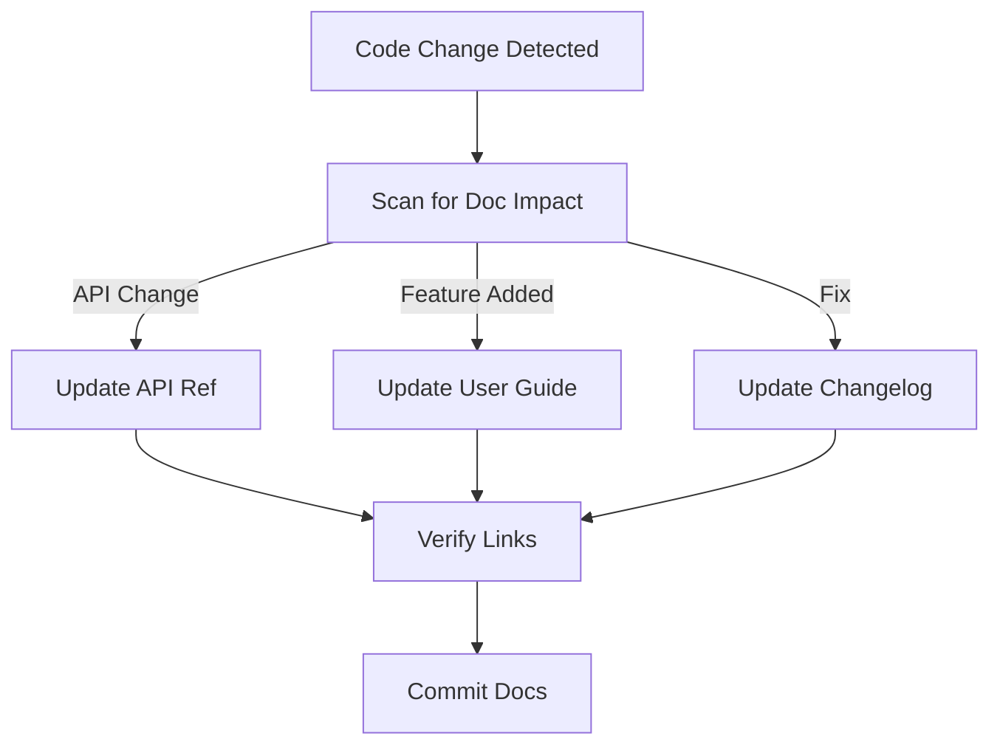

# Documentation Agent

The scribe of the system.

**Last Updated:** February 8, 2026
**Audience:** Technical Writers, Product Managers

> **Before Reading This**
>
> You should understand:
> - [Documentation Strategy](../00_README.md)
> - [Markdown Guide](../19_reference/resource_links.md)
> - [Base Agent](./00_base_agent.md)

## The Historian

Code rots. Documentation rots faster. The Documentation Agent fights this entropy.

It is responsible for keeping the `docs/` folder in sync with the `src/` folder. When the Backend Agent adds a parameter to an API endpoint, the Documentation Agent updates the OpenAPI spec and the usage guide.

It writes for humans. It takes technical jargon and translates it into readable prose. It ensures tone consistency (e.g., "Professional but friendly").

"If it isn't documented, it doesn't exist." — Common Engineering Wisdom. This agent ensures your features exist.

## Core Responsibilities

### 1. Auto-Generation
It parses Docstrings and comments to generate reference manuals. It uses tools like MkDocs or Sphinx.

### 2. Change Tracking
It watches user stories and PR descriptions. If a PR says "Added Dark Mode," the agent creates a draft section in the User Guide explaining how to enable Dark Mode.

### 3. Diagramming
It converts text descriptions into Mermaid.js diagrams. "Draw a flow of the login process" becomes a rendered flowchart.

## Documentation Loop



## Tools and Configuration

```yaml
# aurora.yaml
agents:
  documentation:
    model: claude-3-sonnet-20240229
    temperature: 0.3
    tools:
      - read_file
      - write_file
      - generate_diagram
      - check_links
    context_window:
      include:
        - "docs/**"
        - "src/**/*.md"
```

## Best Practices

### "Don't Repeat Yourself (DRY)"
It uses snippets and includes to avoid copying the same installation instructions into 5 different files.

### "Executable Docs"
It ensures code examples in the documentation actually run. It treats code blocks as testable artifacts.

### "The Grandparent Test"
For User Guides, it aims for simplicity. It avoids acronyms where possible or defines them on first use.

## Common Failure Modes

### 1. Stale Screenshots
The UI changed, but the docs show the old interface.
*Fix:* We are integrating a "Screenshot Tool" that allows the agent to spin up a headless browser, take a screenshot of the new route, and replace the image file.

### 2. Broken Links
"Click here for details" -> 404.
*Fix:* The agent runs a link checker as part of its daily maintenance routine.

## Related Reading

- [Project Template](../22_templates/project_template.md)
- [Release Notes Template](../22_templates/release_notes_template.md)

## What's Next

- [Monitoring Agent](./16_monitoring_agent.md)
