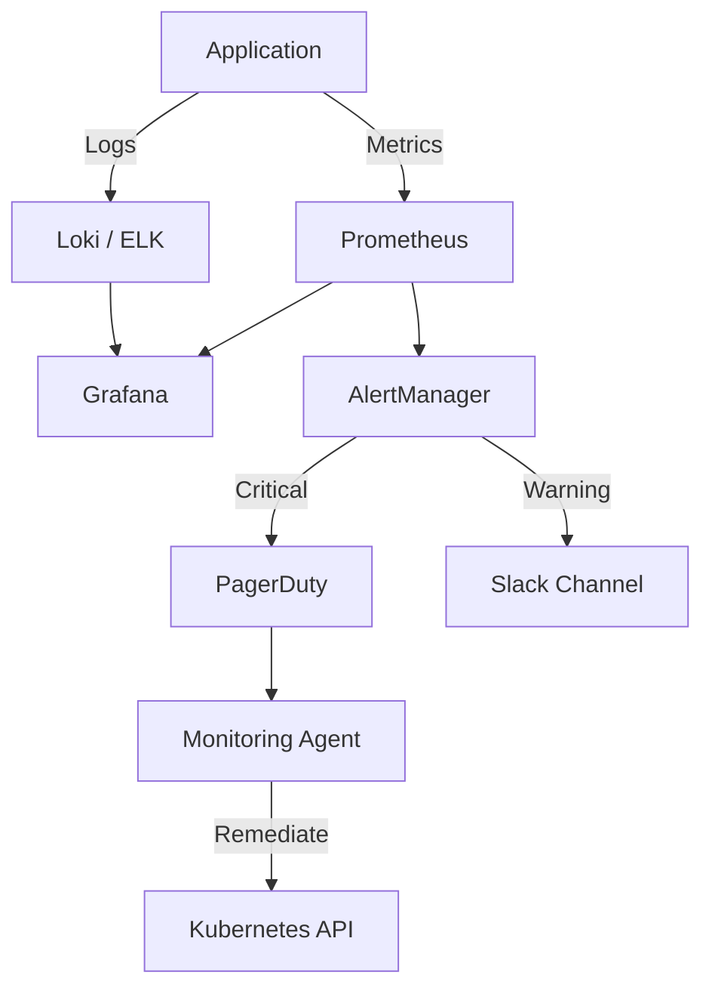

# Monitoring Agent

The pulse checker.

**Last Updated:** February 8, 2026
**Audience:** SREs, DevOps

> **Before Reading This**
>
> You should understand:
> - [Monitoring Setup](../09_operations/monitoring_setup.md)
> - [Alerting Rules](../09_operations/alerting_rules.md)
> - [Base Agent](./00_base_agent.md)

## The Watcher

The Application is live. Is it healthy? The Monitoring Agent answers that question 24/7.

It configures Prometheus scrapers, Grafana dashboards, and ELK (Elasticsearch/Logstash/Kibana) stacks. It defines SLIs (Service Level Indicators) and SLOs (Service Level Objectives).

It is not just passive. If it detects a high error rate, it can trigger the `DevOps Agent` to scale up the fleet or restart a hung service.

"You can't manage what you don't measure." — Peter Drucker. This agent measures everything.

## Core Responsibilities

### 1. Dashboard Creation
It builds visual dashboards. "Show me Request Latency p95, CPU usage, and Active Users." It generates the JSON model for Grafana.

### 2. Intelligent Alerting
It avoids "Alert Fatigue." It distinguishes between "The database is down" (Wake up the human) and "CPU is at 80%" (Log it and watch).

### 3. Log Analysis
It parses unstructured logs ("Error: connection failed") into structured metrics ("db_connection_errors_total").

## Monitoring Stack



## Tools and Configuration

```yaml
# aurora.yaml
agents:
  monitoring:
    model: claude-3-haiku-20240307  # Fast, efficient for log parsing
    temperature: 0.1
    tools:
      - query_prometheus
      - search_logs
      - update_dashboard
      - post_alert
```

## Best Practices

### "The Four Golden Signals"
The agent ensures every service tracks:
1. **Latency:** Time it takes to serve a request.
2. **Traffic:** Demand on the system.
3. **Errors:** Rate of requests that fail.
4. **Saturation:** How "full" the service is.

### "Symptoms, not Causes"
It alerts on symptoms ("User can't checkout") rather than causes ("CPU high"). Users don't care about CPU; they care about checkout.

### "Anomaly Detection"
It uses statistical baselines. "Saturday traffic is usually low. Today it's high. Alert."

## Common Failure Modes

### 1. The Metric Explosion
Creating a metric for every User ID. `requests_total{user_id="123"}`. This kills Prometheus.
*Fix:* The agent checks cardinality before adding labels.

### 2. The Silent Failure
The monitoring system itself goes down.
*Fix:* The "Dead Man's Switch" pattern. An external service pings the monitoring agent. If the ping stops, the external service sends the alert.

## Related Reading

- [Monitoring Setup](../09_operations/monitoring_setup.md)
- [DevOps Agent](./14_devops_agent.md)

## What's Next

- [Core Concepts](../04_core_concepts/index.md)
