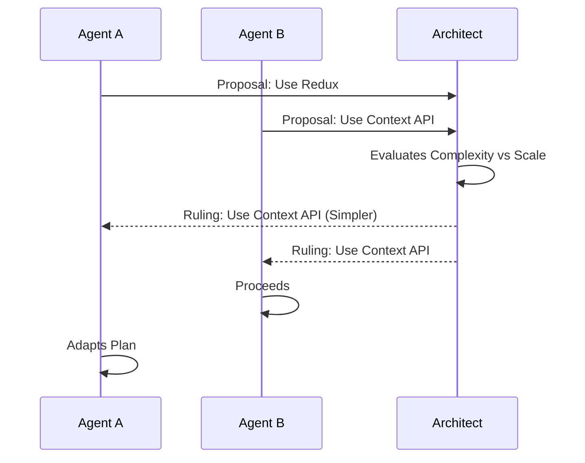

# Conflict Resolution

When agents disagree (or overwrite each other).

**Last Updated:** February 8, 2026
**Audience:** Git Gurus, Architects

> **Before Reading This**
>
> You should understand:
> - [Parallel Execution](./parallel_execution.md)
> - [Parallel Execution Flow](../21_diagrams/flows/task_execution_flow.mmd)

## The Merge Conflict

In a multi-agent system, merge conflicts are inevitable. Agent A adds a function to the bottom of `utils.py`. Agent B adds a different function to the bottom of the same file. Git explodes.

## Types of Conflicts

### 1. Syntactic Conflict (Git)
Two agents edited the same lines of code.
*Resolution:* The `Maestro Agent` sees the conflict markers `<<<< HEAD`. It spawns a specialized `Merge Agent`. This agent reads "Theirs" and "Ours" and synthesizes a "Merged" version that includes both features.

### 2. Semantic Conflict (Logic)
Agent A changed the `User.id` to a UUID. Agent B wrote code expecting `User.id` to be an Integer. The code merges fine, but crashes at runtime.
*Resolution:* Step 1 is the Type Checker (`mypy`). Step 2 is the Integration Test. When the test fails, the `Reflexion Loop` activates to align the assumptions.

### 3. Resource Conflict (Locking)
Two agents try to listen on Port 8000.
*Resolution:* The environment detects the `EADDRINUSE` error. The second agent is instructed to pick a random port or wait.

## The Consensus Protocol

When agents have a *design* conflict (e.g., "Should we use React or Vue?"), they enter a debate mode.
1. Agent A proposes React.
2. Agent B proposes Vue.
3. The `Architect Agent` acts as the Judge.
4. It evaluates pros/cons against the project requirements.
5. It issues a Binding Ruling.

## Prevention Strategies

The best conflict resolution is avoidance.
- **Componentization:** Break files into smaller pieces.
- **Explicit Interfaces:** Define contracts before coding.
- **Semver:** Version internal libraries to allow gradual migration.

## Related Reading

- [Parallel Execution](./parallel_execution.md)
- [Pattern Library](./pattern_library.md)

## What's Next

- [User Guides](../05_user_guides/index.md)
