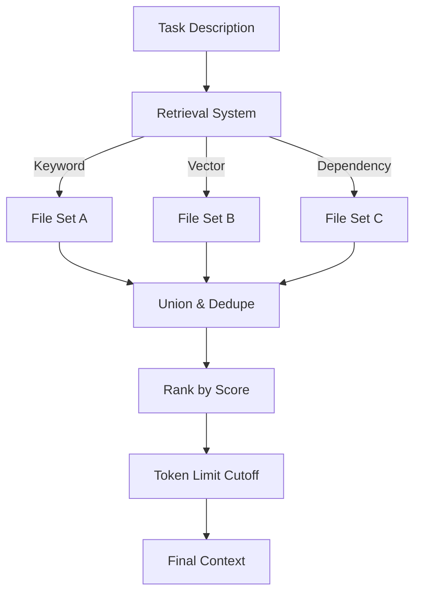

# Context Management

The art of remembering what matters.

**Last Updated:** February 14, 2026
**Audience:** AI Engineers, Architects

> **Before Reading This**
>
> You should understand:
> - [Context Optimization Research](../23_research/context_optimization.md)
> - [Short Term Memory](../02_architecture/memory_architecture.md)

## The Window of Attention

Every Large Language Model (LLM) has a finite context window. Claude 3 Opus handles 200k tokens. GPT-4 handles 128k.

While 200k tokens sounds large, a typical enterprise codebase is 2M+ tokens. We cannot feed the entire project into the agent for every request. We must select the "Working Set" of files that are relevant to the current task.

Context Management is the system that decides:
1. What to include (Signal).
2. What to exclude (Noise).
3. How to compress the included data.

## The Relevance Algorithm

When a task arrives ("Fix the login bug"), we run a multi-stage retrieval process:

1. **Keyword Match:** `grep` for "login", "auth", "session".
2. **Import Graph:** If `auth.py` is relevant, then `user_model.py` (which it imports) is likely relevant.
3. **Semantic Search:** Query the vector database for "authentication logic".
4. **Recency:** Files edited in the last 24 hours are boosted.

## Compression Techniques

We don't always need the full file content.
- **Full Read:** `src/auth/login.py` (The target file).
- **Interface Only:** `src/db/database.py` (We just need to know how to call `db.query()`, not how it connects to Postgres).
- **Summary:** `docs/architecture.md` (High level context).

## The "Lost in the Middle" Problem

LLMs tend to pay more attention to the beginning and end of the prompt. We place critical instructions and the target file at the end, and reference material in the middle.

## Context Window Validation

The `ContextWindowValidator` module (`aurora_dev/core/context_window.py`) provides runtime guards:

- **`estimate_tokens(text)`**: Estimates token count using a 4-char-per-token heuristic, with model-specific adjustments
- **`MODEL_CONTEXT_LIMITS`**: Dictionary mapping model names to their maximum context sizes
- **Smart truncation**: When content exceeds capacity, truncates from the middle (preserving start and end) to combat the "lost in the middle" problem

Maestro's `_score_agent()` uses this module to reject agents whose context window can't fit the task (80% threshold), preventing mid-execution failures.

## Related Reading

- [Context Optimization](../23_research/context_optimization.md)
- [Memory Architecture](../02_architecture/memory_architecture.md)

## What's Next

- [Cost Optimization](./cost_optimization.md)
