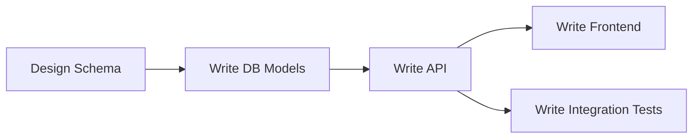

# Dependency Graphs

The invisible web that holds the project together.

**Last Updated:** February 8, 2026
**Audience:** Architects, System Designers

> **Before Reading This**
>
> You should understand:
> - [Task Decomposition](./task_decomposition.md)
> - [Orchestration Layer](../02_architecture/orchestration_layer.md)

## Order from Chaos

Starting 10 agents in parallel sounds fast. It is actually a recipe for disaster.

If the `Frontend Agent` builds the Login Form before the `Backend Agent` defines the Login API, the frontend will guess the API shape (e.g., expecting `username`). If the backend actually implements `email`, the code will break at integration time.

To prevent this, AURORA-DEV constructs a **Task Dependency Graph** (DAG).

## Types of Dependencies

### 1. Hard Dependency (Blocker)
Task B literally cannot start until Task A is done.
- *Example:* "Write Migration" (A) -> "Run Migration" (B).
- *Handling:* The Scheduler holds Task B in `PENDING` state.

### 2. Soft Dependency (Information)
Task B performs better if it knows the output of Task A, but can proceed with assumptions.
- *Example:* "Design API Spec" (A) -> "Implement UI" (B).
- *Handling:* We treat these as Hard Dependencies to minimize rework.

### 3. Resource Dependency (Lock)
Task A and Task B both modify `routes.py`.
- *Handling:* We serialize execution. A runs, then B runs. No merge conflicts allowed.

## The Scheduler Algorithm

We use a standard Topological Sort to determine execution order, but with a twist: **Dynamic Re-Prioritization**.

If Task A fails (e.g., tests fail), all dependent tasks (B, C, D) are paused. The system inserts a remediation task (A-Fix).



## Deadlock Detection

What if Task A needs Task B, and Task B needs Task A?
> "I need the API to build the UI."
> "I need the UI requirements to build the API."

The `Maestro Agent` runs a cycle detection algorithm every time a dependency is added. If a cycle is found, it intervenes by breaking one link, usually by inserting a "Spec" task in the middle.

A <-> B becomes A -> Spec -> B.

## Visualizing the Graph

You can see the current graph using the CLI:
```bash
aurora graph --status
```
This renders a TUI tree view showing what is blocked and why.

## Related Reading

- [Parallel Execution](./parallel_execution.md)
- [Conflict Resolution](./conflict_resolution.md)

## What's Next

- [Agent Assignment](./agent_assignment.md)
