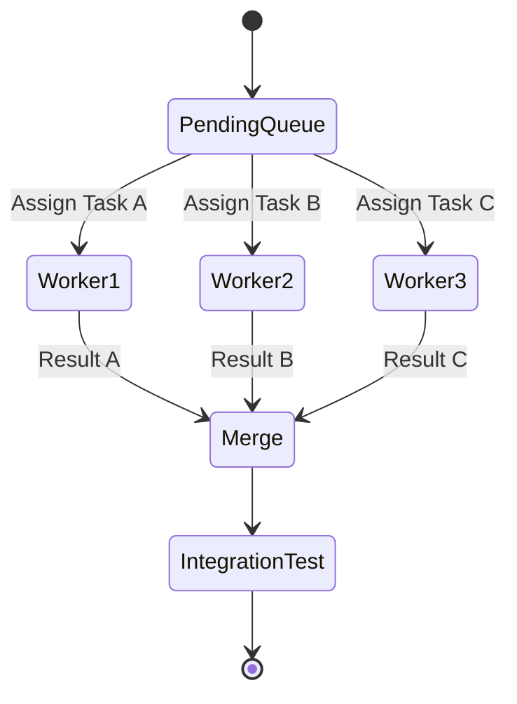

# Parallel Execution

Doing more things at the same time.

**Last Updated:** February 8, 2026
**Audience:** Performance Engineers

> **Before Reading This**
>
> You should understand:
> - [Dependency Graphs](./dependency_graphs.md)
> - [Task Decomposition](./task_decomposition.md)

## The Concurrency Model

Humans are single-threaded. We can only write one function at a time. AI Agents are infinitely scalable (bounded only by API rate limits and wallet depth).

Parallel Execution allows AURORA-DEV to implement the Frontend and Backend simultaneously, cutting development time by 50%.

## Safe Parallelism

Speed kills if not managed. To run safely in parallel, we need **Isolation**.

### 1. File Isolation
Agent A works on `auth/` while Agent B works on `payment/`. The File Locking system prevents valid write conflicts. If both agents try to edit `models.py`, one is queued.

### 2. Interface Contracts
Before branching, the `Architect Agent` defines the Interface (e.g., the API Spec).
- Agent A (Backend) implements the interface.
- Agent B (Frontend) consumes the mock interface.

They meet in the middle. If the Architect did a good job, the pieces fit.

## The Execution Pool

We maintain a dynamic pool of worker agents.

## Resource Contention

If two agents need to run `docker build` at the same time, the local machine might melt.
The `Maestro Agent` respects a `max_concurrency` setting in `aurora.yaml` (default: 4). It acts as a semaphore for CPU-intensive tasks.

## Optimistic Concurrency

For file edits, we use git branches.
- Agent A -> `feat/auth`
- Agent B -> `feat/ui`

When both are done, the `DevOps Agent` attempts a merge. If there are conflicts, the `Conflict Resolution` protocol kicks in.

## Related Reading

- [Dependency Graphs](./dependency_graphs.md)
- [Conflict Resolution](./conflict_resolution.md)

## What's Next

- [Conflict Resolution](./conflict_resolution.md)
