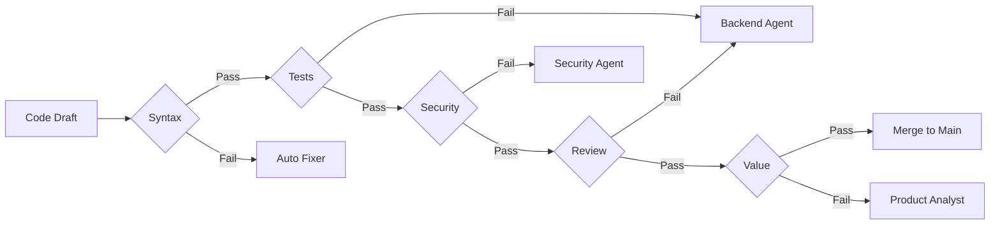

# Quality Gates

You shall not pass (unless you pass the tests).

**Last Updated:** February 8, 2026
**Audience:** QA Engineers, Team Leads

> **Before Reading This**
>
> You should understand:
> - [Test Engineer](../03_agent_specifications/10_test_engineer.md)
> - [Validator Agent](../03_agent_specifications/13_validator_agent.md)

## The Standard of Excellence

Speed is nothing without quality. AURORA-DEV implements a series of "Gates" that code must pass through to move from `Idea` to `Production`.

These gates are automated. If the gate is closed, the code bounces back to the `Backend Agent` for rework.

## The Gate Hierarchy

### Gate 1: Syntax (The Linter)
**Tool:** `ruff`, `eslint`
**Check:** Does it parse? Are variables defined?
**Strictness:** 100%. One syntax error stops the line.

### Gate 2: Correctness (Unit Tests)
**Tool:** `pytest`, `jest`
**Check:** Does `add(2, 2)` return `4`?
**Strictness:** All *new* tests must pass. Existing tests must not regress.

### Gate 3: Security (SAST)
**Tool:** `bandit`, `semgrep`
**Check:** Are there SQL injections? Hardcoded secrets?
**Strictness:** Zero tolerance for High/Critical severity issues.

### Gate 4: Maintainability (Reviewer)
**Tool:** `Code Reviewer Agent`
**Check:** Is the code complex? Is it documented?
**Strictness:** Configurable. Usually warns on complexity > 10.

### Gate 5: Value (Validator)
**Tool:** `Validator Agent`
**Check:** Does it actually solve the user's problem?
**Strictness:** Semantic check.

## Visualization

## Overriding Gates

In emergencies (e.g., a SEV-1 outage), a human can issue an `override` command to bypass the Maintainability and Value gates. Syntax and Security gates generally cannot be bypassed safely.

## Related Reading

- [Validator Agent](../03_agent_specifications/13_validator_agent.md)
- [Testing Guide](../06_developer_guides/testing_guide.md)

## What's Next

- [Parallel Execution](./parallel_execution.md)
