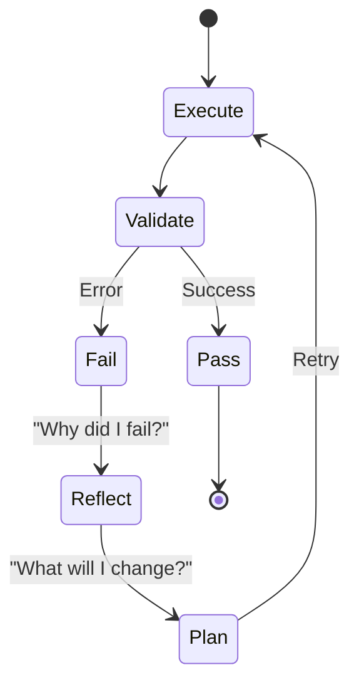

# Reflexion Loops

The engine of self-improvement.

**Last Updated:** February 14, 2026
**Audience:** AI Researchers, Developers

> **Before Reading This**
>
> You should understand:
> - [Reflexion Paper](../23_research/reflexion_paper.md)
> - [Quality Gates](./quality_gates.md)

## "Try again. Fail better."

Standard automation scripts fail once and die. Intelligent agents fail, learn, and retry.

The Reflexion Loop is the mechanism by which AURORA-DEV achieves persistence. It separates the "Doer" from the "Thinker."

## The Feedback Cycle

1. **Attempt:** The agent generates code.
2. **Validation:** The environment returns a signal.
   - `0 (Success)`
   - `1 (Error)`: `StackOverflowError at line 9`
   - `Text (Critique)`: "Variable name is ambiguous."
3. **Reflection:** The agent pauses. It does not look at the code. It looks at the *connection* between its Intent and the Error.
   > "I wanted to recurse, but I forgot the base case. That caused the stack overflow."
4. **Adjustment:** The agent modifies its plan.
5. **Retry:** It acts again.

## Episodic vs Semantic Memory

- **Episodic (Short-term):** "I just tried `x=1` and it failed. Don't do `x=1` again *in this session*."
- **Semantic (Long-term):** "In this codebase, we use `pydantic` v2, causing v1 syntax to fail. I will remember this for *all future tasks*."

The Reflexion Loop writes to the Episodic memory immediately. If a pattern repeats 3 times, the Memory Coordinator promotes it to Semantic memory.

### Semantic Retrieval Quality

The effectiveness of reflexion depends on how well past lessons surface during retrieval. Aurora-DEV uses a tiered approach:

1. **Production:** OpenAI `text-embedding-3-large` for high-quality vector search
2. **Local/Offline:** `sentence-transformers` (`all-MiniLM-L6-v2`) provides good semantic similarity without an API key
3. **Cross-Encoder Re-ranking:** After initial retrieval, `CrossEncoderReranker` (ms-marco-MiniLM) re-scores candidates against the query for precision

This ensures reflexion patterns are matched semantically (not just by keyword), even in environments without external API access.

## Limitations

We cap the loop at 5 retries.
- Retry 1-2: Syntax fixes.
- Retry 3-4: Logic/Strategy shifts.
- Retry 5: "I am stuck. Human help needed."

Infinite loops are expensive and usually indicate a fundamental misunderstanding of the problem.

## Diagram

## Related Reading

- [Reflexion Paper](../23_research/reflexion_paper.md)
- [Memory Architecture](../02_architecture/memory_architecture.md)
- [Cross-Encoder Reranker](../06_developer_guides/cross_encoder_reranker.md)

## What's Next

- [Pattern Library](./pattern_library.md)
