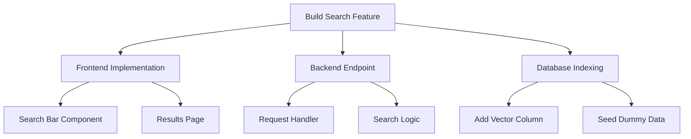

# Task Decomposition

Breaking mountains into pebbles.

**Last Updated:** February 8, 2026
**Audience:** Architects, Product Managers

> **Before Reading This**
>
> You should understand:
> - [Maestro Agent](../03_agent_specifications/01_maestro_agent.md)
> - [Agent Assignment](./agent_assignment.md)

## The Philosophy of Smallness

A large LLM is smart, but it has a limited attention span. If you ask it to "Build Google," it will fail. If you ask it to "Build a search box component," it will excel.

Task Decomposition is the process of taking a high-level `UserIntent` and recursively breaking it down until each leaf node is a `AtomicTask` that can be solved by a single agent in a single pass (typically < 10 mins).

This is not just "making a list." It is a structural engineering problem. A bad decomposition leads to circular dependencies, where Agent A waits for Agent B who waits for Agent A. A good decomposition creates a Directed Acyclic Graph (DAG) of work.

## The recursive Algo

The `Maestro Agent` uses a recursive prompting strategy:

1. **Analyze:** Look at the complexity of the description.
2. **Evaluate:** Is this solvable in one step?
   - Yes? -> Assign to Worker.
   - No? -> Split into 3-5 sub-tasks.
3. **Recurse:** For each sub-task, go to Step 1.

## Atomic Units

A task is "Atomic" when:
1. **Context-local:** It requires < 5 files to understand.
2. **Testable:** Success can be verified with a unit test or screenshot.
3. **Independent:** It doesn't require "chatting" with another agent during execution.

## Common Patterns

### Vertical Slice (Preferred)
"Implement the 'Add Comment' feature end-to-end."
- Pros: Complete feature is shippable.
- Cons: Duplicate work if multiple slices need the same button.

### Horizontal Layer (Discouraged)
"Write all the database models for the entire app."
- Pros: Consistent schema.
- Cons: Nothing works until *everything* works.

## Handling Shared Dependencies

When Task A and Task B both need a `User` component, how do we prevent them from building it twice?

The `Memory Coordinator` maintains a "Proposed Artifacts" list.
1. Task A claims `User.tsx`.
2. Task B sees the claim and adds a dependency: "Wait for Task A".
3. The Scheduler pauses Task B until Task A marks `User.tsx` as complete.

## Related Reading

- [Agent Assignment](./agent_assignment.md)
- [Dependency Graphs](./dependency_graphs.md)

## What's Next

- [Dependency Graphs](./dependency_graphs.md)
