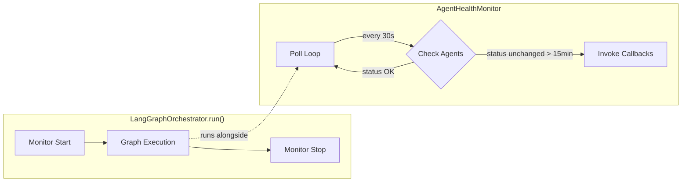

# Agent Health Monitor

Real-time detection and recovery of stuck or unresponsive agents.

**Last Updated:** February 14, 2026  
**Audience:** Developers, DevOps

> **Before Reading This**
>
> You should understand:
> - [Orchestration Layer](../02_architecture/orchestration_layer.md) - LangGraph pipeline
> - [Base Agent](../03_agent_specifications/00_base_agent.md) - Agent status lifecycle

## Overview

The `AgentHealthMonitor` (`aurora_dev/core/agent_health_monitor.py`) runs as an async background task alongside the orchestration pipeline. It polls agent statuses and detects agents that have been stuck in the same state for too long, triggering configurable recovery actions.

## Architecture



## Configuration

| Parameter | Default | Description |
|-----------|---------|-------------|
| `poll_interval_seconds` | 30 | How often to check agent status |
| `stuck_threshold_seconds` | 900 (15 min) | Time before an agent is considered stuck |

## Usage

### Basic Integration (Already Done)

The `LangGraphOrchestrator.run()` method automatically starts and stops the monitor:

```python
# In langgraph_engine.py (already integrated)
monitor = AgentHealthMonitor(
    poll_interval_seconds=30,
    stuck_threshold_seconds=900,
)
monitor.register_callback(on_stuck_handler)
await monitor.start()
try:
    result = await self._graph.ainvoke(state)
finally:
    await monitor.stop()
```

### Custom Callbacks

Register handlers for stuck agent events:

```python
def on_stuck(agent_id: str):
    """Called when an agent is detected as stuck."""
    logger.warning(f"Agent {agent_id} is stuck!")
    # Options: re-assign task, kill agent, notify human

monitor.register_callback(on_stuck)
```

### Recovery Strategies

| Strategy | Description | Use Case |
|----------|-------------|----------|
| **Log & Alert** | Log warning, send notification | Default behavior |
| **Re-assign** | Move task to another agent | Non-critical tasks |
| **Force Terminate** | Kill agent, mark task failed | Resource exhaustion |
| **Escalate** | Pause pipeline, notify human | Critical tasks |

## Detection Algorithm

```python
for agent_id, last_update in agent_status_timestamps.items():
    elapsed = now - last_update
    if elapsed > stuck_threshold:
        for callback in callbacks:
            callback(agent_id)
```

The monitor tracks each agent's last status change timestamp. An agent is "stuck" when its status hasn't changed for longer than the threshold.

## Observability

The monitor emits structured logs:

```
INFO  Agent health monitor started (poll=30s, threshold=900s)
WARN  Agent arch-12345678 detected as stuck during orchestration of project proj_abc
INFO  Agent health monitor stopped
```

## Related Reading

- [Orchestration Layer](../02_architecture/orchestration_layer.md) - Where the monitor runs
- [Budget Manager](./budget_manager.md) - Companion cost controls
- [Maestro Agent](../03_agent_specifications/01_maestro_agent.md) - Task re-assignment

## What's Next

- [Context Window Validator](./context_window_validator.md) - Token estimation
