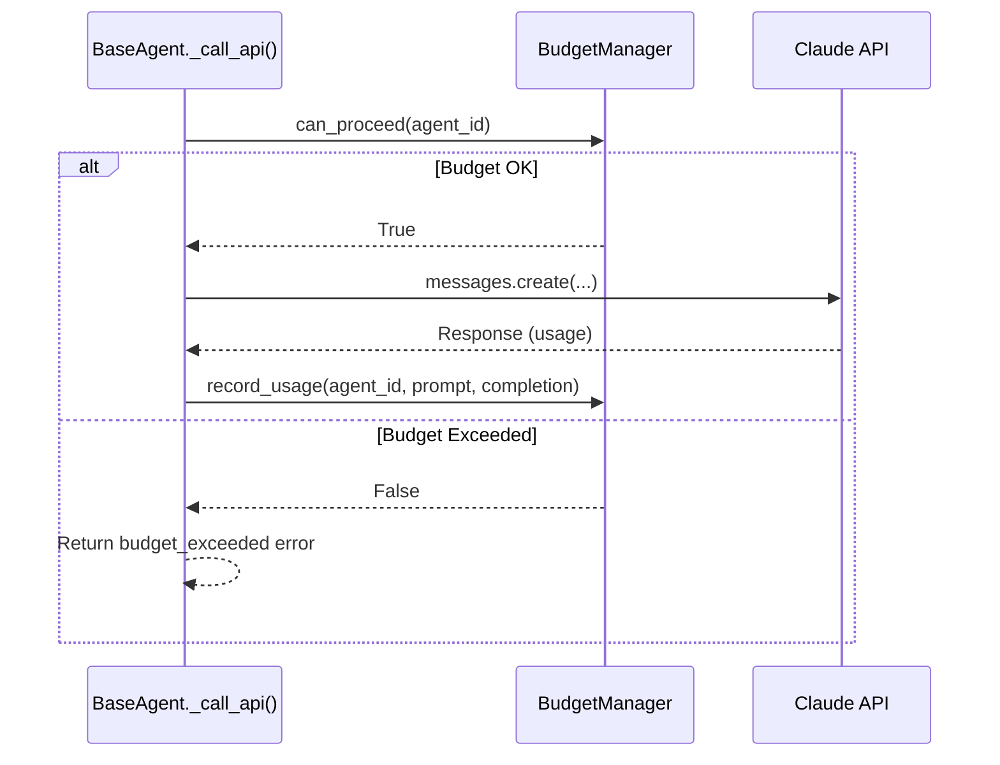

# Budget Manager

Per-agent token budget tracking and enforcement for cost control.

**Last Updated:** February 14, 2026  
**Audience:** Developers, DevOps

> **Before Reading This**
>
> You should understand:
> - [Cost Optimization](../04_core_concepts/cost_optimization.md) - Budgeting concepts
> - [Base Agent](../03_agent_specifications/00_base_agent.md) - API call flow

## Overview

The `BudgetManager` (`aurora_dev/core/budget_manager.py`) provides runtime token budget enforcement. It is instantiated as a shared singleton in `BaseAgent` and gates every Claude API call via `_call_api()`.

## Architecture



## Key Features

### Per-Agent Allocation

Each agent receives an independent token budget. The `BudgetManager` tracks cumulative usage per `agent_id`:

```python
from aurora_dev.agents.base_agent import get_budget_manager

bm = get_budget_manager()

# Configure an agent's budget
bm.set_budget(agent_id="arch-12345678", max_tokens=500_000)

# Check remaining capacity
remaining = bm.get_remaining(agent_id="arch-12345678")
```

### Cost Estimation

The manager estimates dollar costs using model-specific token rates:

| Model | Input (per 1M) | Output (per 1M) |
|-------|----------------|-----------------|
| Claude 3 Opus | $15.00 | $75.00 |
| Claude 3.5 Sonnet | $3.00 | $15.00 |
| Claude 3 Haiku | $0.25 | $1.25 |

### Hard-Stop Enforcement

When `can_proceed()` returns `False`, the API call is blocked at the `BaseAgent` layer — no network request is made. The agent receives an `AgentResponse` with `stop_reason="budget_exceeded"`.

### Usage Reporting

```python
# Get all agent usage
report = bm.get_usage_report()
for agent_id, usage in report.items():
    print(f"{agent_id}: {usage['total_tokens']:,} tokens (${usage['estimated_cost']:.2f})")
```

## Configuration

Budget limits can be set per-agent or via project-level config:

```yaml
budget:
  default_max_tokens: 1_000_000
  hard_stop: true
  alert_threshold: 0.8
  
  agent_overrides:
    maestro: 2_000_000
    architect: 1_500_000
    backend: 500_000
```

## Integration Points

- **`BaseAgent._call_api()`**: Pre-call check + post-call recording
- **`MaestroAgent.assign_task()`**: Considers budget state during agent scoring
- **Prometheus metrics**: `aurora_budget_usage_tokens` gauge per agent

## Related Reading

- [Cost Optimization](../04_core_concepts/cost_optimization.md) - Budgeting strategies
- [Base Agent](../03_agent_specifications/00_base_agent.md) - API call lifecycle
- [Agent Health Monitor](./agent_health_monitor.md) - Monitoring companion

## What's Next

- [Agent Health Monitor](./agent_health_monitor.md) - Runtime agent monitoring
