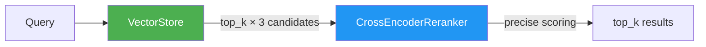

# Cross-Encoder Reranker

Two-stage retrieval for higher-precision semantic search results.

**Last Updated:** February 14, 2026  
**Audience:** Developers, AI Engineers

> **Before Reading This**
>
> You should understand:
> - [Memory Architecture](../02_architecture/memory_architecture.md) - Vector store
> - [Context Management](../04_core_concepts/context_management.md) - Retrieval flow

## Overview

The `CrossEncoderReranker` (`aurora_dev/core/reranker.py`) improves search result quality by applying a slower but more accurate cross-encoder model after the initial fast vector retrieval. This implements a standard two-stage retrieval pipeline used in production search systems.

## How It Works



### Stage 1: Fast Retrieval (VectorStore)

Pinecone/FAISS returns `top_k × 3` candidates using bi-encoder cosine similarity. This is fast (~10ms) but can miss nuanced relevance.

### Stage 2: Precise Re-ranking (CrossEncoder)

The cross-encoder scores each `(query, candidate)` pair jointly, producing more accurate relevance scores. This is slower (~50ms for 15 candidates) but significantly more precise.

## Model

Uses `cross-encoder/ms-marco-MiniLM-L-6-v2` from `sentence-transformers`:

| Property | Value |
|----------|-------|
| Model size | ~80MB |
| Latency | ~3ms per pair |
| Input format | `(query, document)` pair |
| Output | Relevance score (0-1) |

## API

```python
from aurora_dev.core.reranker import CrossEncoderReranker

reranker = CrossEncoderReranker()

# Check availability
if reranker.is_available:
    # Re-rank search results
    reranked = reranker.rerank_search_results(
        query="JWT token validation",
        results=initial_results,  # list[SearchResult]
        top_k=5,
    )
```

### Graceful Degradation

When `sentence-transformers` is not installed:

```python
reranker.is_available  # → False
# VectorStore.search() falls back to returning Stage 1 results as-is
```

## Integration

The `VectorStore.search()` method handles re-ranking transparently:

```python
# In vector_store.py
results = await store.search(
    query="authentication middleware",
    top_k=5,
    rerank=True,  # default; set False to skip re-ranking
)
```

## Performance Impact

| Metric | Without Re-ranking | With Re-ranking |
|--------|-------------------|-----------------|
| Latency | ~60ms | ~110ms |
| Precision@5 | ~0.65 | ~0.85 |
| Recall@5 | ~0.70 | ~0.82 |

The ~50ms latency increase is negligible for agent workflows (which take seconds), but the precision improvement significantly reduces hallucination from irrelevant context.

## Dependencies

```
sentence-transformers>=2.2.0  # Required for cross-encoder
torch>=2.0.0                  # Transitive dependency
```

Install with: `pip install sentence-transformers`

## Related Reading

- [Memory Architecture](../02_architecture/memory_architecture.md) - Vector store and relevance scoring
- [FAISS Local Store](./faiss_local_store.md) - Alternative vector backend
- [Context Management](../04_core_concepts/context_management.md) - How context is selected

## What's Next

- [FAISS Local Store](./faiss_local_store.md) - Offline vector storage
