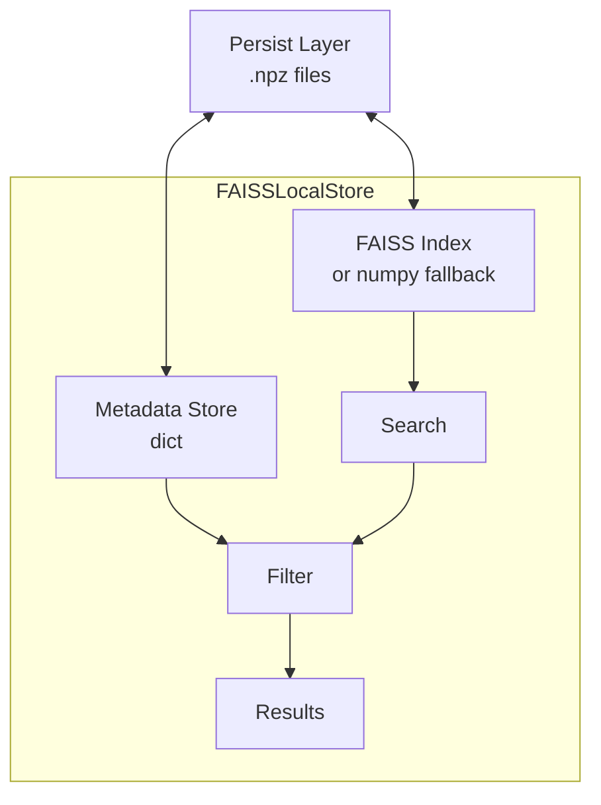

# FAISS Local Store

Lightweight local vector storage for offline development and testing.

**Last Updated:** February 14, 2026  
**Audience:** Developers

> **Before Reading This**
>
> You should understand:
> - [Memory Architecture](../02_architecture/memory_architecture.md) - Vector store role
> - [Cross-Encoder Reranker](./cross_encoder_reranker.md) - Re-ranking pipeline

## Overview

The `FAISSLocalStore` (`aurora_dev/core/faiss_store.py`) provides a Pinecone-compatible local vector store for development environments where a cloud vector database is unnecessary. It uses Facebook's FAISS library for efficient similarity search, with an automatic fallback to numpy-based brute-force when FAISS is not installed.

## When to Use

| Scenario | Recommended Store |
|----------|-------------------|
| Production with high volume | Pinecone (cloud) |
| Local development & testing | **FAISSLocalStore** |
| CI/CD pipelines | **FAISSLocalStore** |
| Air-gapped environments | **FAISSLocalStore** |

## Features

- **L2-normalized cosine similarity** for consistent scoring
- **On-disk persistence** via numpy `.npz` serialization
- **Metadata filtering** with exact-match support
- **Namespace isolation** for multi-project usage
- **Zero cloud dependencies** — works fully offline

## API

```python
from aurora_dev.core.faiss_store import FAISSLocalStore

# Initialize with dimension matching your embedding model
store = FAISSLocalStore(dimension=384, persist_path="./data/vectors")

# Add entries
store.upsert(
    id="doc-001",
    vector=[0.1, 0.2, ...],  # 384-dim embedding
    metadata={"content": "JWT validation pattern", "type": "pattern"},
    namespace="project-abc",
)

# Search
results = store.query(
    vector=query_embedding,
    top_k=5,
    namespace="project-abc",
    filter={"type": "pattern"},
)

# Persist to disk
store.save()

# Load from disk
store = FAISSLocalStore.load("./data/vectors")
```

## Architecture



## Fallback Behavior

| Dependency | Available | Behavior |
|-----------|-----------|----------|
| `faiss-cpu` | ✅ | Uses FAISS IndexFlatIP for fast inner product search |
| `faiss-cpu` | ❌ | Falls back to numpy dot product (slower for large datasets) |

For datasets under 100K vectors, the numpy fallback performance is acceptable (~10ms per query).

## Dependencies

```
# Required
numpy>=1.24.0

# Optional (recommended for >100K vectors)  
faiss-cpu>=1.7.0
```

## Related Reading

- [Memory Architecture](../02_architecture/memory_architecture.md) - Three-tier memory system
- [Cross-Encoder Reranker](./cross_encoder_reranker.md) - Post-retrieval re-ranking
- [Extending Memory](./extending_memory.md) - Adding custom stores

## What's Next

- [Codebase Explorer](./codebase_explorer.md) - Proactive code awareness
