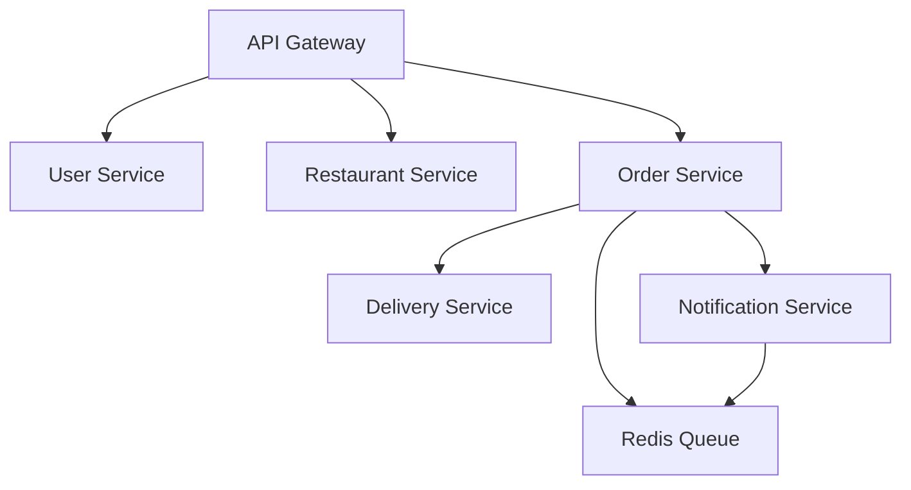

# Example: Microservices

Building microservices architecture with AURORA-DEV.

**Last Updated:** February 8, 2026  
**Audience:** All Users

## Prompt

```markdown
Build a microservices-based food delivery platform.

Services:
- User service (auth, profiles)
- Restaurant service (menus, hours)
- Order service (cart, checkout)  
- Delivery service (tracking, drivers)
- Notification service (emails, push)

Requirements:
- Service-to-service auth
- Message queue for async
- API gateway
- Kubernetes deployment
```

## Generated Architecture



## Key Files

- `k8s/` - Kubernetes manifests
- `gateway/` - Kong/Nginx configuration
- `services/` - Individual service code

## Related Reading

- [Kubernetes Deployment](../08_deployment/kubernetes_deployment.md)
