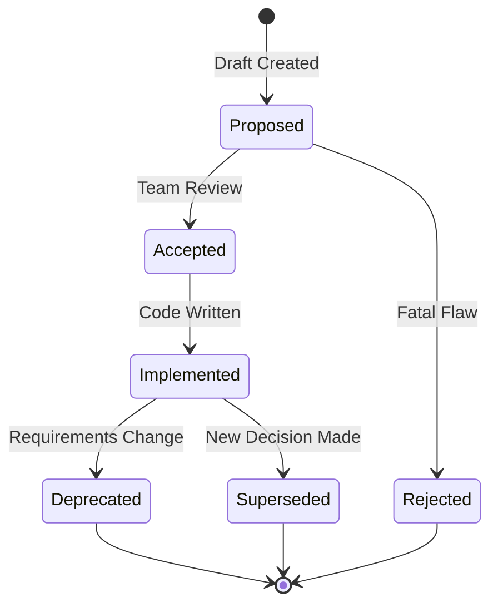

# Architecture Decision Record (ADR) Template

Documenting the "Why" behind the "What".

**Last Updated:** February 8, 2026
**Audience:** Architects, Lead Developers

> **Before Reading This**
>
> You should understand:
> - [Architect Agent](../03_agent_specifications/03_architect_agent.md)
> - [Architecture Decisions](../19_reference/architecture_decisions.md)

## Memory Loss in Software Projects

The most expensive thing in a project isn't the AWS bill; it's the lost context. Six months from now, someone will ask, "Why did we choose MongoDB for the logging service?"

If the answer is "I think Dave liked it," you have a problem. Especially since Dave left three months ago.

In AURORA-DEV, agents don't have "hunches." They have constraints and trade-offs. We force the Architect Agent to document every major technical decision using the ADR format. This creates an immutable history of technical intent. It allows future agents (and humans) to understand the boundaries of the system without re-litigating settled law.

## The ADR Lifecycle



## The Template

Save this as `docs/adr/YYYY-MM-DD-title.md`.

```markdown
# [Short Title, e.g., Use Redis Streams for Inter-Agent Comm]

**Status:** [Proposed | Accepted | Rejected | Deprecated | Superseded]  
**Date:** YYYY-MM-DD  
**Deciders:** [List of Agents/Humans involved, e.g., Architect Agent, CTO]  
**Consulted:** [List of role dependencies, e.g., DevOps Agent]

## Context and Problem Statement

[Describe the context and problem statement, e.g., "We need a way for agents to communicate asynchronously without blocking the main event loop. The current HTTP-based polling is causing high latency and unnecessary load on the database."]

**Constraints:**
- Must handle > 1000 messages/sec
- Must support at-least-once delivery
- Must be compatible with our existing Python/Node stack

## Considered Options

1. **Option 1: RabbitMQ**
   - Pros: Robust, industry standard, supports complex routing.
   - Cons: Another infrastructure piece to manage, overkill for our simple topology.
   
2. **Option 2: Kafka**
   - Pros: Infinite retention, massive scale.
   - Cons: High operational complexity, Java dependency.

3. **Option 3: Redis Streams** (Chosen)
   - Pros: We already use Redis, low latency, sufficient features (consumer groups).
   - Cons: Persistence is limited by memory (RAM), less tooling than Kafka.

## Decision Outcome

Chosen option: **Option 3: Redis Streams**

**Reasoning:**
Since we already operate a high-availability Redis cluster for caching, utilizing Streams adds zero operational overhead. The throughput requirements (1k/sec) are well within Redis capabilities. The limitation on persistence is acceptable as we move processed events to Postgres for long-term audit storage.

## Consequences

**Positive:**
- No new infrastructure to deploy.
- Latency reduced from polling (200ms) to push (2ms).
- Python `redis-py` library is mature and well-understood.

**Negative:**
- We must implement our own dead-letter handling logic (Redis doesn't have it out of the box).
- RAM usage on Redis nodes will increase by approximately 2GB.

**Risks:**
- If Redis crashes without AOF persistence, flight data could be lost. (Mitigated by enabling AOF every 1s).

## Compliance

**Security:**
- Data in transit must be encrypted (TLS).
- Redis Auth required.

**Cost:**
- Estimated increase: $20/month for larger Redis instance.
```

## Why Agents Love ADRs

Humans find documentation tedious. Agents find it essential.

When the `Maestro` agent is planning a new feature, it scans the `docs/adr/` folder. If it sees an ADR that says "We Rejected Kafka," it won't hallucinate a plan that requires Kafka. It respects the "Superseded" tag to know that an old decision is no longer valid.

This specific structured text is high-octane fuel for the LLM. It provides the *reasoning* trace (Chain of Thought) that the model needs to make aligned decisions.

## Related Reading

- [Architecture Diagram](../21_diagrams/architecture_diagram.md) - The result of these decisions
- [Research Agent](../03_agent_specifications/04_research_agent.md) - The one who proposes options

## What's Next

- [Incident Template](./incident_template.md)
