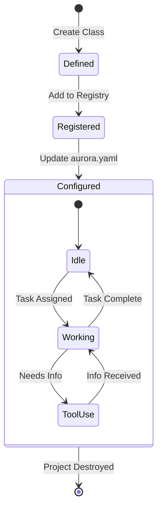

# Agent Template

How to define and configure a custom agent for AURORA-DEV.

**Last Updated:** February 8, 2026
**Audience:** Senior Developers, AI Engineers

> **Before Reading This**
>
> You should understand:
> - [Adding Agents](../06_developer_guides/adding_agents.md)
> - [Agent Configuration](../13_configuration/agent_configuration.md)

## Beyond the Standard Crew

Sometimes the standard roster (Backend, Frontend, DevOps) isn't enough. Maybe you need a `DataScientist` agent to build PyTorch models, or a `LegalCompliance` agent to check generic contracts.

Creating a custom agent is more than just giving it a name. You have to give it a personality, a toolkit, and—most importantly—boundaries. An agent without clear boundaries is a loose cannon that will try to rewrite your entire codebase when you asked it to fix a typo.

As software engineer Kent Beck said, "Optimism is an occupational hazard of programming: feedback is the treatment." We design agents to seek feedback constantly.

## Agent Definition Lifecycle

This diagram demonstrates how a custom agent is initialized and enters the workforce.



## The Template Code

Here is the boilerplate for a robust custom agent. Stick to this structure to ensure compatibility with the Maestro orchestrator.

```python
from aurora_dev.agents.base import BaseAgent
from aurora_dev.core.models import Task, Artifact
from aurora_dev.tools import FileSystemTool, WebSearchTool

class SpecializedAgent(BaseAgent):
    """
    An agent specialized in [Specific Domain].
    """
    
    # 1. Define the Role
    role = "Specialist"
    
    # 2. Define the System Prompt
    # Crucial: Be specific about what it CANNOT do.
    system_prompt = """
    You are the Specialist Agent. Your goal is to [Goal].
    
    CAPABILITIES:
    - Analyze [Specific Data]
    - Generate [Specific Output]
    - Optimize [Specific Metric]
    
    CONSTRAINTS:
    - Do NOT modify core configuration files.
    - Do NOT speak to the user directly; route through Maestro.
    - Output format must always be JSON for data tasks.
    """

    def __init__(self, **kwargs):
        super().__init__(**kwargs)
        
        # 3. Register Tools
        # distinct from capabilities; these are executable functions
        self.register_tool(FileSystemTool())
        self.register_tool(WebSearchTool())

    async def execute_task(self, task: Task) -> Artifact:
        """
        The main execution loop for this agent.
        """
        self.log_activity(f"Starting analysis on {task.title}")
        
        # A. Understand Context
        context = await self.memory.retrieve(task.context_ids)
        
        # B. Plan Approach
        plan = await self.llm.chat(
            system=self.system_prompt,
            user=f"Context: {context}\nTask: {task.description}\nCreate a step-by-step plan."
        )
        
        # C. Execute Steps (Simplified)
        result = await self.process_plan(plan)
        
        # D. Validate Output
        if not self.validate_result(result):
            raise AgentError("Output failed validation criteria")
            
        return Artifact(content=result, type="analysis")
```

## Configuration Schema

Validating the code is half the battle. You must also configure the runtime behavior in `aurora.yaml`.

```yaml
agents:
  specialist:
    enabled: true
    model: claude-3-sonnet-20240229  # Use optimized model for specific task
    temperature: 0.2                 # Low temp for analytical tasks
    context_window: 100000           # High context for reading docs
    tools:
      - read_file
      - write_file
      - run_analysis_script
    permissions:
      filesystem: ["/src/data", "/src/reports"] # Restricted access
      network: ["api.external-service.com"]
```

## Best Practices for Custom Agents

### 1. Narrow the Scope
Don't create a "GeneralHelper" agent. It will do everything poorly. Create a "RegexOptimizer" agent or a "SqlQueryTuner" agent. Specificity breeds competence.

### 2. Restrict Permissions
Notice the `permissions` block above? We restrict this agent to specific directories. If the `DataScientist` agent tries to delete your `auth` middleware, the system blocks it. This is the Principle of Least Privilege applied to AI.

### 3. Define Success Criteria
How does this agent know it is done? In the `execute_task` method, implementing `validate_result` is mandatory. For a SQL agent, this might mean "The query parses and explains without full table scans." For a poetic agent, it might mean... well, that's harder, which is why we stick to engineering.

## Related Reading

- [Base Agent](../03_agent_specifications/00_base_agent.md) - The parent class
- [Plugin Architecture](../17_advanced_topics/plugin_architecture.md) - Loading agents dynamically
- [Project Template](./project_template.md) - Where to put your agent code

## What's Next

- [Test Template](./test_template.md)
