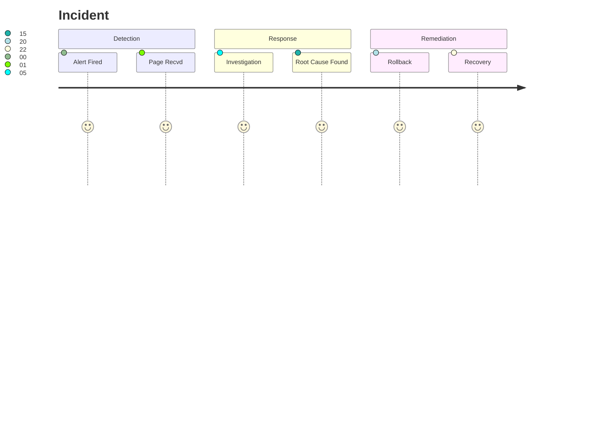

# Incident Report Template

Post-mortem structure for learning from failure.

**Last Updated:** February 8, 2026
**Audience:** Site Reliability Engineers, DevOps

> **Before Reading This**
>
> You should understand:
> - [Incident Response](../09_operations/incident_response.md)
> - [Reflexion Loops](../04_core_concepts/reflexion_loops.md)

## The Art of the Post-Mortem

Failures are inevitable. Wasted failures are unforgivable.

In AURORA-DEV, an incident isn't closed until the "Reflexion Loop" is complete. This means we don't just fix the bug; we update the system prompts, adjust the memory weighting, or modify the architecture to ensure *this specific class* of error cannot happen again.

As Etsy's John Allspaw said, "An incident is an unplanned investment in the reliability of your system." We intend to get a return on that investment.

## The Timeline Visualization

Recovering context is the hardest part of an incident. We use a standardized timeline format.



## The Template

Save as `docs/incidents/YYYY-MM-DD-incident-name.md`.

```markdown
# Incident Report: [Short Description, e.g., Production DB CPU Spike]

**Date:** YYYY-MM-DD  
**Status:** [Resolved | Monitoring | Open]  
**Severity:** [SEV-1 (Critical) | SEV-2 (Major) | SEV-3 (Minor)]  
**Lead:** [Name of Human or Agent]  
**Impact:** [Duration, number of users affected, estimated revenue loss]

## Executive Summary

At 14:00 UTC, the primary PostgreSQL writer instance reached 100% CPU utilization, causing 500 errors on the checkout endpoint for 15 minutes. The root cause was an unoptimized query generated by the `Analytics Agent` that performed a full table scan on the `events` table (150M rows). Service was restored by killing the query and disabling the `Analytics Agent`.

## Timeline (UTC)

- **14:00** - CloudWatch alarm `CPU > 90%` fires.
- **14:01** - PagerDuty alerts on-call engineer.
- **14:03** - Engineer logs in, sees slow queries in `pg_stat_statements`.
- **14:05** - Engineer identifies the `Analytics Agent` as the source.
- **14:10** - Engineer issues `aurora agent stop analytics`.
- **14:15** - CPU returns to normal levels. Incident resolved.

## Root Cause Analysis (The 5 Whys)

1. **Why did the DB CPU spike?**
   Because a complex aggregation query was running against the `events` table without an index.

2. **Why was there no index?**
   The table is partitioned by date, but the query was aggregating by `user_id` across all partitions.

3. **Why did the agent write that query?**
   The prompt for the `Analytics Agent` did not explicitly forbid cross-partition joins without date filters.

4. **Why wasn't this caught in testing?**
   The staging environment only has 10k rows, so the query ran instantly there.

5. **Why is staging data so small?**
   We don't have an automated data seeding pipeline for realistic volumes.

## Corrective Actions

### Immediate Term (Fix the bleeding)
- [x] Disabled the `Analytics Agent` from running ad-hoc queries.
- [x] Added `SET statement_timeout = '30s'` to the agent's database role.

### Medium Term (Prevent recurrence)
- [ ] Update `Analytics Agent` system prompt to require `WHERE created_at > ...` on all event queries.
- [ ] Add a database linter to the CI pipeline that flags full table scans (using `pg_hint_plan` or similar).

### Long Term (Systemic fix)
- [ ] Implement data seeding in staging to replicate 10% of production volume.
- [ ] Move analytics queries to a Read Replica or a dedicated warehouse (Snowflake/BigQuery).

## Reflexion (Agent Learning)

**Context:** The Analytics Agent thought it was helpful to provide real-time stats.
**Lesson:** Performance matters more than freshness for this use case.
**Adjustment:**
> "I will never execute aggregations on tables larger than 1M rows without an explicit date range filter. I will assume all `events` tables are partitioned by time."

## Artifacts

- [Link to Grafana Dashboard Snapshot]
- [Link to Query Plan Logs]
```

## Why We Write Them

Writing this down prevents "institutional amnesia." It also feeds back into the `Memory` system. The next time an agent tries to query the `events` table, the `Memory Coordinator` will retrieve this incident report and warn it: *"Wait! Remember Incident #404. Don't query without a date filter."*

This is how the system gets smarter. Not by magic, but by remembering pain.

## Related Reading

- [Runbook Template](./runbook_template.md) - How to fix things faster next time
- [Monitoring Setup](../09_operations/monitoring_setup.md) - How we caught it

## What's Next

- [Release Notes Template](./release_notes_template.md)
