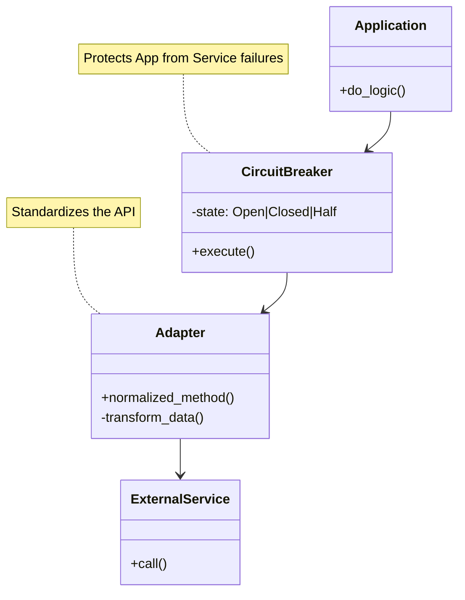

# Integration Template

Building bridges to third-party islands.

**Last Updated:** February 8, 2026
**Audience:** Developers, Partner Engineers

> **Before Reading This**
>
> You should understand:
> - [Integration Agent](../03_agent_specifications/09_integration_agent.md)
> - [Custom Integrations](../12_integration/custom_integrations.md)

## The Connecting Tissue

No app is an island. We need Stripe for payments, Twilio for SMS, Slack for notifications, and maybe a weird legacy SOAP service for inventory.

Integrations are the most fragile part of any system because you don't control the other side. They change APIs, they have downtime, they rate-limit you. 

This template provides a robust pattern for building integrations that don't crash your entire app when the external service hiccups.

## Integration Architecture

We use the Adapter Pattern wrapped in a Circuit Breaker.



## The Template Code

Save this structure in `src/backend/app/core/integrations/`.

```python
from abc import ABC, abstractmethod
from aurora_dev.core.circuit_breaker import CircuitBreaker
from aurora_dev.exceptions import IntegrationError

# 1. Defined Abstract Interface
# This ensures our app doesn't care if we switch providers.
class PaymentProvider(ABC):
    @abstractmethod
    async def charge(self, amount: int, currency: str, source: str) -> str:
        pass

# 2. Implement Specific Provider
class StripeAdapter(PaymentProvider):
    def __init__(self, api_key: str):
        self.client = stripe.Client(api_key)
        self.breaker = CircuitBreaker(failure_threshold=5, recovery_timeout=60)

    async def charge(self, amount: int, currency: str, source: str) -> str:
        # Wrap the call in the breaker
        return await self.breaker.call(self._charge_internal, amount, currency, source)

    async def _charge_internal(self, amount, currency, source):
        try:
            resp = await self.client.charges.create(
                amount=amount,
                currency=currency,
                source=source
            )
            return resp.id
        except stripe.error.CardError as e:
            # Domain-specific error mapping
            raise IntegrationError(f"Card declined: {e.user_message}")
        except stripe.error.APIConnectionError:
            # This triggers the circuit breaker
            raise

# 3. Factory Config
def get_payment_provider() -> PaymentProvider:
    if config.PAYMENT_PROVIDER == "stripe":
        return StripeAdapter(config.STRIPE_KEY)
    elif config.PAYMENT_PROVIDER == "mock":
        return MockPaymentAdapter()
    raise ValueError("Unknown provider")
```

## Documentation Requirement

Every integration implementation *must* have a companion `README.md` in its directory.

```markdown
# Stripe Integration

**Provider:** Stripe API v2024-02-01
**Auth:** Bearer Token (Secret Key)
**Webhooks:** Supported (Signature verification required)

## Configuration
ENV Vars required:
- `STRIPE_SECRET_KEY`
- `STRIPE_WEBHOOK_SECRET`

## Scope
We only use:
- PaymentIntents (Charges)
- Customers (Profiles)
- Webhooks (Events)

We DO NOT use:
- Connect (Marketplace)
- Issuing

## Testing
Use the Mock Adapter for unit tests.
Use the Stripe Sandbox keys for integration tests.
```

## Error Handling Standards

1. **Never leak implementation details.**
   Don't bubble up `stripe.error.CardError` to the frontend. Catch it, wrap it in `PaymentDeclinedError`, and bubble that up.

2. **Always log raw responses (debug only).**
   When debugging "Why did this fail?", you need the `x-request-id` header from the provider.

3. **Handle Rate Limits.**
   Implement exponential backoff. If they say "Wait 30s," wait 30s. Don't be rude.

## Security Considerations

- **Secrets:** Never commit API keys. Use `aurora.yaml` secrets injection.
- **Webhooks:** Verify signatures. Anyone can POST to your webhook endpoint. Without verification, an attacker can fake a successful payment.

## Related Reading

- [Integration Agent](../03_agent_specifications/09_integration_agent.md) - The integration builder
- [Security Model](../10_security/security_model.md) - Handling secrets
- [Circuit Breaker Pattern](../04_core_concepts/pattern_library.md) - Reliability

## What's Next

- [Research Section](../23_research/reflexion_paper.md)
