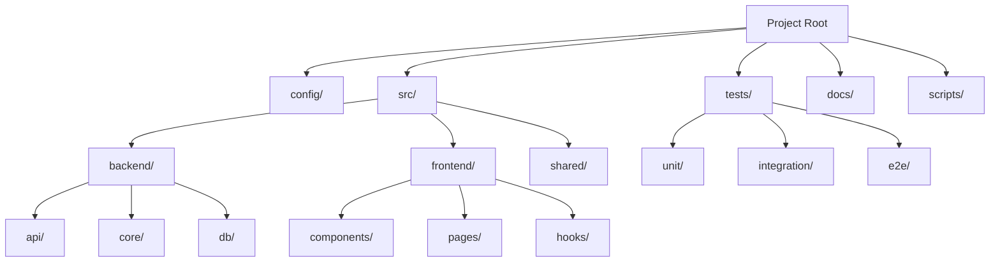

# Project Structure Template

The anatomy of a perfect AURORA-DEV project.

**Last Updated:** February 8, 2026
**Audience:** Architects, Tech Leads

> **Before Reading This**
>
> You should understand:
> - [System Overview](../02_architecture/system_overview.md)
> - [Project Types](../05_user_guides/project_types.md)

## The Philosophy of Folder Trees

"Organization is what you do before you do something, so that when you do it, it is not all mixed up." — A.A. Milne. We take this seriously. A project structure isn't just where you put files; it's a map of your intent.

In AURORA-DEV, we enforce a standardized directory structure. This isn't because we are control freaks (well, maybe a little), but because our agents rely on predictability. The `Backend Agent` needs to know exactly where to find the API routes. The `Test Engineer` needs strict separation between unit and integration tests. If you move things around randomly, the agents get confused, and cost goes up as they burn tokens searching specifically for your moved files.

## Visualizing the Structure

Here is the standard layout for a Full Stack application, our most common project type.



## The Template Manifest

When you run `aurora init`, this is what gets generated on your disk.

```markdown
# Standard Project Layout

/
├── aurora.yaml             # The brain. Defines agents, constraints, and budget.
├── docker-compose.yml      # The muscle. Runs services, DBs, and queues.
├── README.md               # The face. Explains what this thing is.
├── .gitignore              # The filter. Keeps your repo clean.
│
├── .aurora/                # System directory (Do not touch)
│   ├── memory/             # Local vector store cache
│   └── logs/               # Agent execution logs
│
├── config/                 # Environment-specific settings
│   ├── dev.yaml
│   ├── prod.yaml
│   └── secrets.example.yaml
│
├── src/
│   ├── backend/
│   │   ├── app/
│   │   │   ├── api/        # REST endpoints (Routers)
│   │   │   ├── core/       # Business logic (Services)
│   │   │   ├── db/         # Models and migrations
│   │   │   └── main.py     # Entry point
│   │   ├── pyproject.toml  # Python dependencies
│   │   └── Dockerfile
│   │
│   └── frontend/
│       ├── src/
│       │   ├── components/ # Reusable UI atoms
│       │   ├── features/   # Business domains
│       │   └── routes/     # Navigation
│       ├── package.json    # JS dependencies
│       └── Dockerfile
│
├── tests/
│   ├── unit/               # Fast, isolated tests
│   ├── integration/        # Database and API tests
│   └── e2e/                # Browser-based user flow tests
│
└── scripts/
    ├── setup.sh            # One-click dev environment
    ├── deploy.sh           # CI/CD entry point
    └── seed_db.py          # Development data generator
```

## Why This Works

### The `src` Split
We keep backend and frontend in `src/`. Is this a monorepo approach? Yes. For 95% of projects, managing two separate repositories is overhead you don't need. It complicates CI/CD and makes sharing types (like TS interfaces matching Pydantic models) harder.

### The `core` vs `api` Separation
In `backend`, notice we split `api` (routes) from `core` (logic). This is non-negotiable.
- **API** layer handles HTTP, request validation, and status codes.
- **Core** layer handles business rules and data manipulation.

This means you can trigger business logic from a CLI script or a task queue without faking an HTTP request. It’s cleaner, easier to test, and keeps controllers thin.

### The Hidden `.aurora` Directory
This folder stores the local state of your agents. It holds the "Reflexion" history—the mistakes the agents made and learned from. Delete this, and your agents get stupid again. They lose the context of *why* they chose `uvicorn` over `gunicorn` last week. Commit this logic to git? No. But back it up? Absolutely.

## Common Modifications

You aren't locked into this. If you are building a Microservices architecture, you essentially duplicate the `backend/` structure for each service inside a `services/` directory.

If you are building a pure CLI tool, delete `frontend/` and rename `backend/` to `cli/`. The `aurora.yaml` file has a `project_structure` key where you can tell the Architect Agent about these deviations so it doesn't try to "fix" your intentional changes.

## Related Reading

- [Project Types](../05_user_guides/project_types.md) - Choosing the right starting point
- [Agent Configuration](../13_configuration/agent_configuration.md) - Tuning the agents for this structure
- [Backup Procedures](../09_operations/backup_procedures.md) - Saving the `.aurora` state

## What's Next

- [Agent Template](./agent_template.md)
