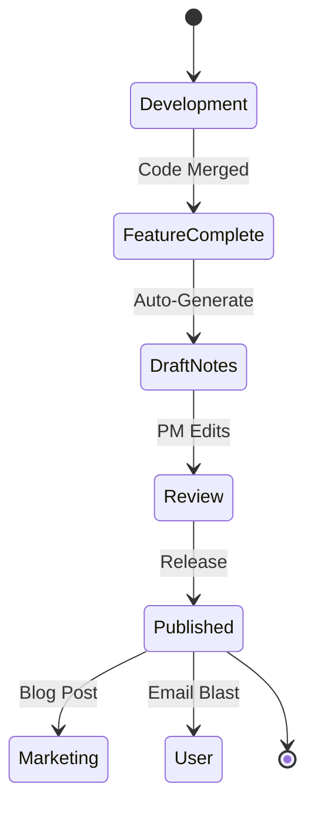

# Release Notes Template

Communicating value to users, not just code to machines.

**Last Updated:** February 8, 2026
**Audience:** Product Managers, Technical Writers

> **Before Reading This**
>
> You should understand:
> - [Changelog](../19_reference/changelog.md)
> - [Version Compatibility](../19_reference/version_compatibility.md)

## The Release Note Manifest

Nobody reads commit logs. Users don't care that you "refactored the `AbstractFactory` to use `DependencyInjection`." They care that the login page loads 50% faster or that the dark mode button finally works.

AURORA-DEV encourages a "value-first" approach to release notes. We generate these automatically using the `Documentation Agent`, which reads the Git diffs and summarizes them into human-readable stories. But it needs a template to know how to structure that story.

## The Lifecycle of a Release



## The Template

Save as `docs/releases/vX.Y.Z.md`.

```markdown
# Release v2.1.0: "The Speed Update"

**Date:** YYYY-MM-DD
**Type:** [Major | Minor | Patch]

## 🚀 Highlights

### ⚡ faster-search-algorithm (Issue #1024)
We completely rewrote the vector search engine. Previously, searches took ~300ms. Now, they take ~50ms.
- **Why it matters:** Your chat interactions will feel instantaneous.
- **How to use it:** No action needed. It's automatic.

### 🛡️ active-directory-integration (Issue #999)
Enterprise customers can now log in using their corporate Active Directory credentials.
- **Why it matters:** No more managing separate passwords for AURORA.
- **How to use it:** Go to Settings -> Auth -> Enable AD.

## 🐛 Bug Fixes

- **Fixed:** Memory leak in the `WebSocket` connection that caused crashes after 24 hours.
- **Fixed:** The "Export to PDF" button was invisible in Dark Mode. (Sorry about that!)
- **Fixed:** Agents no longer hallucinate nonexistent file paths on Windows.

## ⚠️ Breaking Changes

> **Critical Warning for API Users:**
> The `/api/v1/search` endpoint now requires a `top_k` parameter. Default is 10.

If you rely on our REST API directly, please update your client libraries:
```bash
pip install aurora-dev==2.1.0
```

## 📈 Performance Improvements

- Database connection pooling is now enabled by default.
- Docker image size reduced from 1.2GB to 450MB (switched to Alpine Linux).

## 🔮 What's Next?

We are working on **Voice Mode**. Imagine talking to your agents while driving. Coming in v2.2.

## Credits

Big thanks to our community contributors:
- @chessman for the Alpine migration
- @neo for the matrix simulation fix
```

## Writing Great Notes

### 1. Group by Impact, Not Component
Don't list "Backend", "Frontend", "Database". Users don't think in tiers. Group by "New Features", "Fixes", "Performance".

### 2. Use Emojis (Tastefully)
They act as visual anchors. 🚀 for features, 🐛 for bugs, ⚠️ for breaking changes. It makes the document skimmable.

### 3. Credit the Humans
Software is built by people. Acknowledging contributors (external or internal) builds community loyalty. Even if the contributor was an AI agent, credit the human who prompted it!

### 4. Provide the "Why"
Every bullet point should answer "So what?"
- *Bad:* "Updated React to v18."
- *Good:* "Updated to React v18, which enables concurrent rendering for smoother animations."

## Automation Integration

The `Documentation Agent` uses this template. When you run `aurora release generate`, it pulls closed issues from GitHub/Jira, categorizes them using LLM analysis, and fills in this markdown structure. You just need to polish the "Highlights" section.

## Related Reading

- [Changelog](../19_reference/changelog.md) - The raw list
- [Documentation Agent](../03_agent_specifications/15_documentation_agent.md) - The author
- [CI/CD Pipelines](../08_deployment/ci_cd_pipelines.md) - The publisher

## What's Next

- [Integration Template](./integration_template.md)
