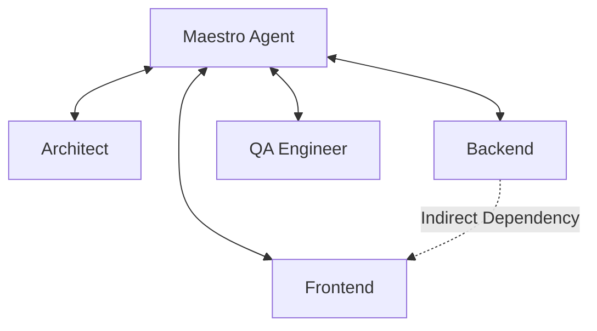

# Multi-Agent Systems (MAS)

Moving from "Chatbot" to "Digital Interaction".

**Last Updated:** February 8, 2026
**Audience:** AI Researchers, System Architects

> **Before Reading This**
>
> You should understand:
> - [Orchestration Layer](../02_architecture/orchestration_layer.md)
> - [Agent Configuration](../13_configuration/agent_configuration.md)

## The Hierarchy of Competence

A single GPT-4 instance is a polymath. It knows Python, poetry, and biology. But knowledge is not workflow. In a real engineering team, you don't ask the CTO to center a div, and you don't ask the junior frontend dev to design the database sharding strategy.

AURORA-DEV is built on the premise of **Role-Playing Specialization**. By assigning a specific persona ("You are a QA Engineer") to an LLM instance, we narrow the search space of its responses. This reduces hallucinations and improves adherence to best practices for that specific domain.

As Marvin Minsky proposed in "The Society of Mind," intelligence emerges from the interaction of smaller, non-intelligent (or less intelligent) agents.

## Network Topology

We utilize a **Centralized Orchestrator** topology (Star Network), centered on the `Maestro Agent`.

Direct peer-to-peer communication (Mesh Network) was tested in v1.0 but rejected. Agents tended to get into infinite conversation loops ("After you", "No, after you"). The Maestro breaks these loops by serving as the authoritative decision-maker.

## Cognitive Load Balancing

A massive context window (200k tokens) is a blessing and a curse. If you dump the entire repository into a single agent's context, it suffers from "Lost in the Middle" phenomenon (Liu et al., 2023). It forgets the nuance of the requirement at line 50.

MAS solves this via **Context Partitioning**.
- The `Backend Agent` only sees `src/backend` and the API spec.
- The `Frontend Agent` only sees `src/frontend` and the Mock API response.

This creates "clean rooms" for thought. It forces agents to communicate via defined interfaces (specs), just like human teams. If the backend changes the API response shape without updating the spec, the frontend breaks—and the `Integration Agent` catches it. This mirrors real-world integration friction, which is exactly what we want to detect.

## Conflict and Consensus

What happens when the `Architect` wants Microservices but the `DevOps` agent says we only have budget for a Monolith?

In a single-agent system, the model just agrees with itself. In MAS, we model **Adversarial Collaboration**. The agents have conflicting system prompts:
- Architect: "Maximize scalability."
- DevOps: "Minimize complexity and cost."
- Security: "Minimize attack surface."

The Maestro Agent acts as the judge, synthesizing these viewpoints into a final decision. This dialectic process often yields better solutions than any single agent could derive alone.

## Challenges

**Latency:** Communication overhead is real. 4 agents discussing a problem takes 4x longer than 1 agent solving it.
**Cost:** Every "handshake" message consumes tokens.
**Alignment:** Ensuring all agents are working towards the same `user_goal` requires strict prompt engineering.

## Future Research

We are exploring **Dynamic Swarms**: allowing the Maestro to spawn temporary sub-agents (e.g., "I need 5 Research Agents to read these 50 PDF files in parallel") and then terminate them.

## Related Reading

- [Prompt Engineering](./prompt_engineering.md)
- [Agent Swarms](../17_advanced_topics/agent_swarms.md)

## What's Next

- [Prompt Engineering](./prompt_engineering.md)
