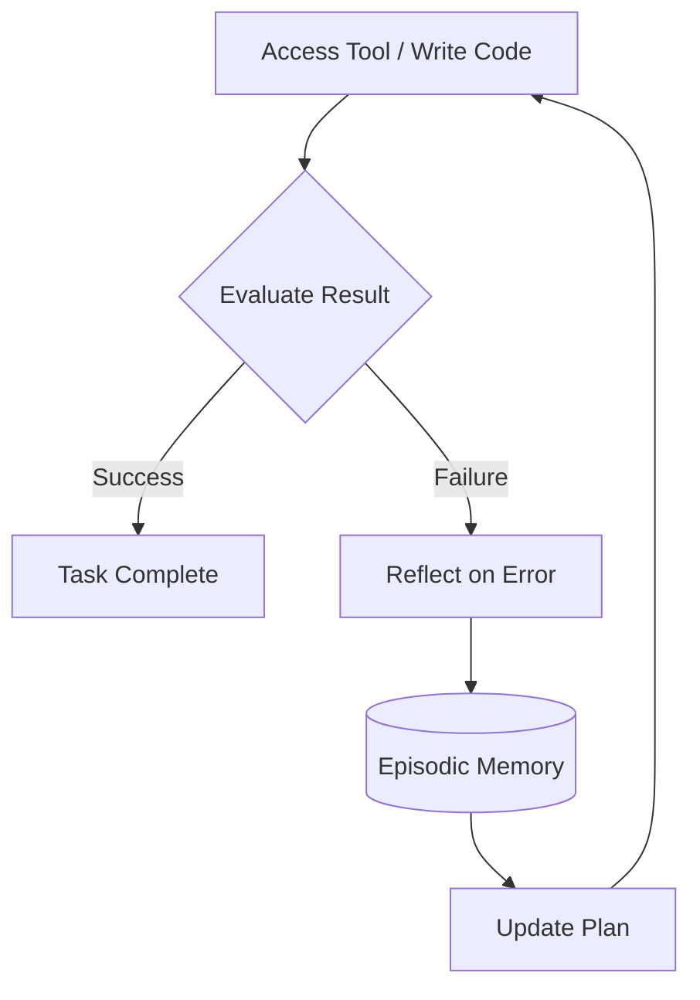

# Reflexion: Self-Correction in Autonomous Agents

The feedback loop that separates "smart" from "stuck".

**Last Updated:** February 8, 2026
**Audience:** AI Researchers, System Architects

> **Before Reading This**
>
> You should understand:
> - [Reflexion Loop Flow](../21_diagrams/flows/reflexion_loop_flow.mmd)
> - [Agent Lifecycle](../21_diagrams/sequences/agent_lifecycle.mmd)

## The Problem with One-Shot Generation

Large Language Models (LLMs) are stochastic. Ask them to write a sorting algorithm, and 9 times out of 10, they will give you a perfect QuickSort. The 10th time, they might invent a syntax that doesn't exist.

In a standard RAG (Retrieval-Augmented Generation) system, if the model fails, the system fails. The user gets a syntax error, sighs, and fixes it themselves.

But AURORA-DEV agents are autonomous. There is no user to sigh and fix it. If the `Backend Agent` generates bad code, the `Test Engineer` will fail. If the system stops there, we haven't built an autonomous engineer; we've built a very expensive random number generator.

## Implementing Reflexion

Reflexion (Shinn et al., 2023) is the process of asking an agent to critique its own past actions. It’s not just "retrying"; it’s retrying with *memory of the failure*.

In AURORA-DEV, we implement a modified Reflexion loop:

1. **act**: The agent generates code.
2. **evaluate**: The environment (compiler, linter, test runner) provides feedback.
3. **self-reflect**: The agent analyzes the feedback and verbally reasons about *why* it failed.
4. **store**: This reasoning is stored in Short-Term Memory.
5. **repeat**: The agent tries again, conditioned on the reflection.

## Concrete Example

**Task:** Write a Python function to parse a CSV.
**Attempt 1:** Agent uses `pandas.read_csv`.
**Feedback:** `ModuleNotFoundError: No module named 'pandas'`. (The environment is restricted).

**Without Reflexion:** The agent might try `import pandas as pd` again, thinking it was a fluke.
**With Reflexion:**
> "I attempted to use pandas, but it is not installed in this environment. I must use the built-in `csv` module instead. Plan: rewrite using `csv.DictReader`."

## The "Memory" of Failure

We persist these reflexions. If an agent struggles with a specific dependency issue in Project A, and then encounters a similar task in Project B, the `Memory Coordinator` retrieves the "Reflexion Pattern".

*"Warning: In previous tasks involving CSV parsing, `pandas` was unavailable. Prefer standard library."*

This is how the system achieves **Transfer Learning** without weight updates. We don't fine-tune the model; we fine-tune the context.

## Limitation and Costs

Reflexion is expensive. It doubles or triples the token usage for complex tasks. It also increases latency. A "thinking" agent takes longer than a "guessing" agent.

To mitigate this, we use a tiered approach:
- **Fast Path:** Try the solution.
- **Slow Path:** If it fails, enter Reflexion.

We also cap the recursion depth. If an agent fails 5 times, we assume the task is impossible or the agent is in a semantic rut, and we escalate to a human (or a smarter model like Opus).

## Future Research

We are investigating **"Social Reflexion"**: allowing the `Architect Agent` to critique the `Backend Agent`'s reflection. "You thought the error was syntax, but actually, you misunderstood the requirement."

## Related Reading

- [Multi-Agent Systems](./multi_agent_systems.md)
- [Memory Architecture](../02_architecture/memory_architecture.md)

## References

- Shinn, N., et al. (2023). "Reflexion: Language Agents with Verbal Reinforcement Learning". arXiv:2303.11366
